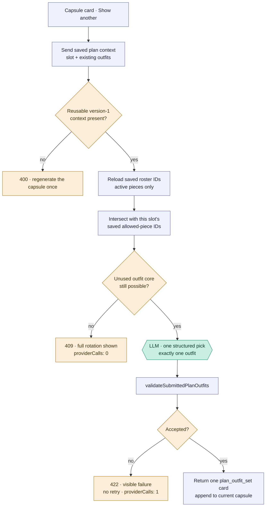
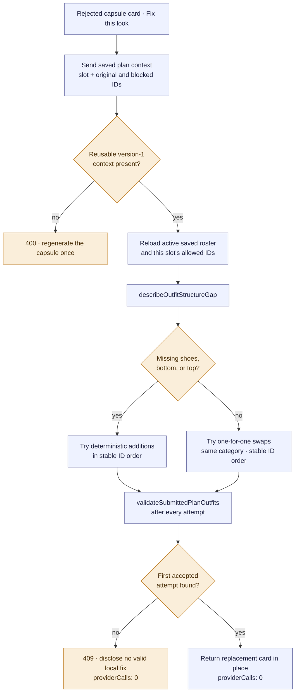

# Capsule follow-ons — expand one slot and repair one outfit

Two explicit card actions continue an already-built capsule without reopening the freeform tool
loop. Both reuse the capsule roster and normalized slot context saved on the original cards, reload
the pieces from the database, and pass any proposed result through the same plan validator used
by `submit_plan_outfits`.

**Status:** Current behavior, traced 2026-08-24 at
`ea2a6976ca32e74993caa26c95fd81158d4ada3b`; recovery ownership amended 2026-08-25.

The two actions deliberately have different execution boundaries:

- **Show another** makes one bounded text-model call and never retries it.
- **Fix this look** makes no model call. Code tries a structural addition or a same-category swap
  and returns the first result accepted by the plan validator.

As elsewhere in the atlas, rectangles are app code, hexagons are model calls, and diamonds are
decisions.

## Show another capsule outfit — `/expand-capsule`

### Pipeline map

| Stage | Current owner | Contract |
|---|---|---|
| Source and context | `useCapsuleExpansion` in `StylistChat.jsx`; `normalizedCapsuleExpansionContext` in `routes/ai.js` | The card supplies versioned plan context, the requested slot, and existing capsule outfits. |
| Eligibility | `/expand-capsule` route in `routes/ai.js` | Only still-active saved-roster pieces that remain in the slot's saved `allowedIds` may be used. The route does not search the wider wardrobe. |
| Capacity | `capsuleExpansionCoreKey`; saved slot `coreCapacity`, with `capsuleExpansionCoreCapacity` as a fallback | A new top-bottom pair or dress must remain. Exhaustion stops before the provider boundary. |
| Composition | `capsuleExpansionSystemPrompt` and `askStylistStructuredWithUsage` | One strict-schema response, one outfit, no tool loop, no retry. |
| Validation | `validateSubmittedPlanOutfits` | Reconstruct a one-slot pending plan and apply normal structure, slot, ownership, repetition, weather, activity, register, and dependency checks. |
| Disposition | `/expand-capsule` route | Accept one card, or return the first failure visibly. It does not repair or silently broaden the roster. |
| Response and persistence | `/expand-capsule`; `useCapsuleExpansion` | The response is marked `plan_outfit_set` / `composedBy: model`, carries the original plan context, and is appended to the current capsule in the browser. |

`capsuleExpansionCoreCapacity` is a route-local fallback calculation. The saved slot capacity is
preferred. Its relationship to the fuller `capsuleOutfitCoreCapacity` contract is an architecture
census question, not a reason to change behavior in this documentation pass.

## Fix one rejected capsule outfit — `/repair-capsule-look`

### Pipeline map

| Stage | Current owner | Contract |
|---|---|---|
| Source and context | Capsule repair action in `StylistChat.jsx`; `normalizedCapsuleExpansionContext` in `routes/ai.js` | The rejected card supplies original IDs, any specifically blocked IDs, its slot, sibling accepted looks, and saved plan context. |
| Eligibility | `/repair-capsule-look` route | Candidates are limited to still-active members of the slot's saved gate-passing roster. |
| Diagnosis | `describeOutfitStructureGap` in `outfitSetPlanner.js` | Missing shoes, bottom, or top is treated as an addition problem; other failures become substitution attempts. |
| Repair | `/repair-capsule-look` route + shared `validatedComplete` / `validatedSubstitute` | Add one missing category, or swap a blocked/original piece with another allowed piece from the same wardrobe category. Candidate order is deterministic and remains route policy. |
| Validation | `validateSubmittedPlanOutfits` | Every attempted card is checked against the real one-slot pending plan and its held sibling outfits. |
| Disposition and fallback | `/repair-capsule-look` route | Return the first accepted repair. If none exists, disclose the local shortfall. There is no billed fallback and no wider-wardrobe search. |
| Response | `/repair-capsule-look`; capsule repair handler in `StylistChat.jsx` | The card is replaced in place, marked `plan_outfit_set` / `composedBy: engine`, and includes a short engine note naming the addition or swap. |

The 2026-08-25 ownership change does not alter the model-call sequence or widen the saved roster.
The shared primitive calls `validateSubmittedPlanOutfits` immediately after each exact mutation and
cannot return the mutation as recovered unless it passes. Exhaustion uses
`discloseRecoveryShortfall`, surfaced in response debug alongside the existing human 409 message.

## Shared boundary and deliberate differences

| Question | Expansion | Repair |
|---|---|---|
| May use the wider wardrobe? | No | No |
| Model calls | Exactly one after local capacity checks | Zero |
| Composition source | Structured model selection | Deterministic add/swap search |
| Validator | `validateSubmittedPlanOutfits` | `validateSubmittedPlanOutfits` |
| Automatic retry | None | Not applicable; local candidates are enumerated |
| Failure shown to the user | Invalid one-call result or exhausted rotation | No valid addition/single swap in saved roster |

The versioned card state is a capability boundary. Legacy cards without it do not guess at lost
roster or slot decisions; they ask for one regenerated capsule.
