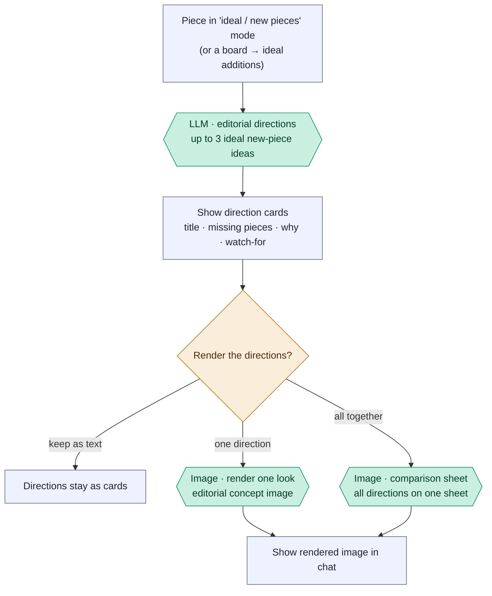

# Editorial ideal additions — "shop the gap"

From a selected garment, this suggests **ideal *new* pieces** to buy — things you
don't own that would elevate the item — then optionally renders them as editorial
images. Unlike the composition flows (which only use owned pieces), this one is
deliberately aspirational. It's a **preview → render** pipeline: one text-model
call produces up to three directions, and you can then render one look, or render
all of them onto a single comparison sheet.

Reading convention (see [use-my-wardrobe.md](use-my-wardrobe.md)): rectangles are
the app's own code, `LLM ·` hexagons are the text model, `Image ·` hexagons are
the image model (GPT-4o), diamonds are decisions.

## Overview (PM altitude)

Three takeaways for a PM:

- **This is the only flow that invents pieces you don't own.** Every other flow
  composes from the wardrobe; here the text model is explicitly told to propose
  *conceptual missing pieces* (and not to re-suggest things you already have).
- **One text call, then optional rendering.** The directions are text first
  (cheap, fast). Rendering is a separate, opt-in step — and there are two ways to
  render: one look at a time, or a single sheet with all directions side by side.
- **The renders are conditional GPT-4o.** Both image steps fall back to a local
  collage / placeholder when `PHOTO_PRESERVING_VISUALS` is on or there's no API key
  — the same pattern as [saved-outfit variants](saved-outfit-variants.md).

## The three endpoints

| Step | Endpoint | Model |
| --- | --- | --- |
| Directions preview | `/editorial-directions-preview` | text (Claude) |
| Render one look | `/editorial-render-one` | image (GPT-4o, conditional) |
| Comparison sheet | `/generate-ideal-additions-preview-sheet` | image (GPT-4o, conditional) |

### Stage map

| Stage | What happens | Where |
| --- | --- | --- |
| A | Piece in "ideal / new pieces" mode, or a board → ideal additions | `StylistChat.jsx:3256` (`shouldGenerateEditorialVisuals`), `:3021` |
| P | Generate up to 3 directions | `routes/ai.js:3256` → `askStylist(EDITORIAL_NEW_PIECES_SYSTEM)` |
| D | Render direction cards | frontend |
| E | Render one direction | `routes/ai.js:3353` → `createEditorialConceptImage` (`core.js:3224`) |
| S | Render all as a sheet | `routes/ai.js:3067` → `createIdealAdditionsComparisonSheetImage` (`core.js:2447`) |

## Engineer notes

- **Directions are text, with a local fallback.** `askStylist` with
  `EDITORIAL_NEW_PIECES_SYSTEM` returns `{ directions: [...] }` — each has a title,
  `missingPieces`, reason, watchFor, and a `visualPrompt`. If the model returns
  none, `buildIdealOnlyCompletionsForPiece` fills locally. Results are run through
  `dedupeAndDifferentiateEditorialDirections` and capped at 3 (`ai.js:3320`).
- **Anchor + anti-duplication.** The selected garment stays central
  (`idealAdditionAnchorConstraint`), and the prompt forbids suggesting pieces that
  replace the anchor or duplicate wardrobe basics you already own (`ai.js:3308`).
- **Seed look (taste DNA).** If a rendered wardrobe board is passed as `seedLook`,
  its image + piece list are fed in as the "visual and styling DNA" to push the
  ideal additions beyond that saved look (`ai.js:3287`).
- **Both renders are conditional** (`createEditorialConceptImage`, `core.js:3224`;
  `createIdealAdditionsComparisonSheetImage`, `core.js:2447`): GPT-4o
  `image_generation` by default; `photoPreservingVisualsEnabled()` → local collage;
  no `OPENAI_API_KEY` → a `sharp` placeholder / error. `render-one` renders a single
  direction; the sheet renders all directions with the garment as the one shared
  reference photo.
- **Related but distinct** from the selected-piece composer's "ideal" branch
  (which composes *outfit* directions mixing owned + missing pieces). This flow is
  the pure *new-pieces* editorial one — `shouldGenerateEditorialVisuals` vs
  `shouldGenerateOutfits` picks between them on the frontend (`StylistChat.jsx:3256`).
