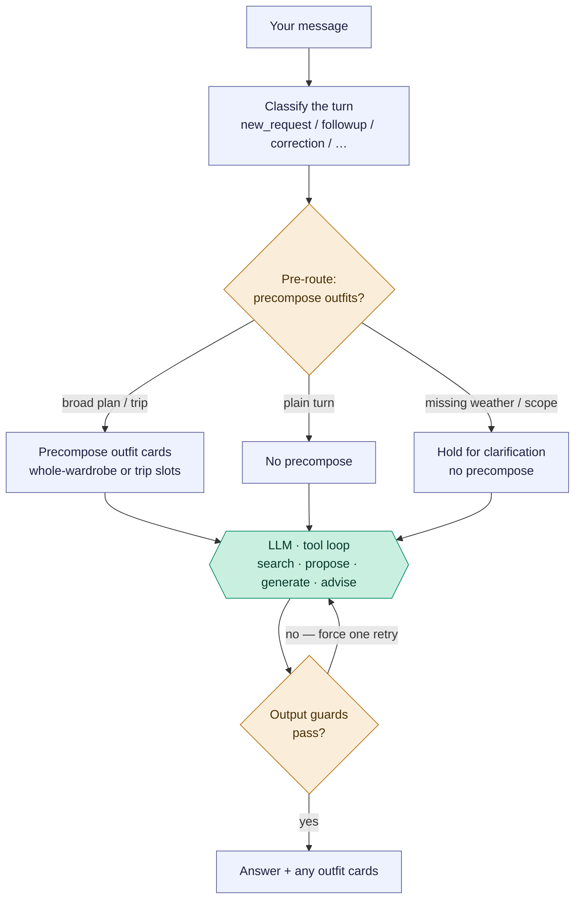
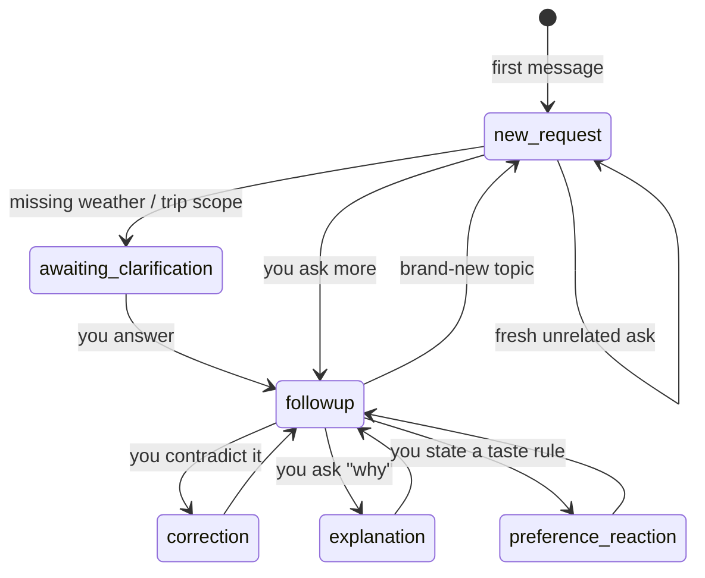

# Freeform stylist chat — `/ask`

The open chat box. Unlike the composition flows (which are linear pipelines),
this one is a **router**: each message is classified, the app decides whether to
pre-build outfits, the model runs a tool loop, and deterministic guards can
override the model before you see an answer. The model sits in the *middle*,
fenced by app logic on both sides.

Reading convention (see [use-my-wardrobe.md](use-my-wardrobe.md)): rectangles are
the app's own code, the hexagon labelled `LLM ·` is the model, diamonds are
decisions. There is exactly **one** model step here — everything around it is the
app deciding what to feed the model and whether to accept its answer.

## Pipeline overview (PM altitude)

The whole flow is four layers. The tables below list **every way** to reach each
state — that precision is why they're tables, not more boxes.

## Layer 0 — Turn classification

Every message is tagged with a *conversation mode* from its text plus whether the
thread has history (`classifyChatTurn`, `src/components/StylistChat.jsx:3590`;
server fallback `styling-engine/core.js:3404`). This sets the "CONVERSATION
CONTROLLER" directive in the system prompt.

| Mode | Reached when | Cross-turn? |
| --- | --- | --- |
| `new_request` | a fresh ask, or no thread history | starts a turn |
| `followup` | a follow-up about the current thread | yes |
| `correction` | you challenge / contradict a prior answer | yes |
| `explanation` | you ask "why did you…" | yes |
| `preference_reaction` | you state a taste preference to adapt to | yes |

## Layer 1 — App pre-routing

Deterministic, *before* the model. Decides whether to pre-build outfit cards for
the turn (`maybePrecomposeStructuredOutfitsForAsk`, `routes/ai.js:1207`;
`maybePrecomposeStructuredFollowupForAsk`, `routes/ai.js:1320`).

| State | Triggers | Result |
| --- | --- | --- |
| Broad-planning precompose | `new_request`, no active piece/outfit, no existing outfits, text matches "outfits/pack/capsule…" + "suggest/plan/wear…" (and *not* show/why/evaluate) | precompose whole-wardrobe cards |
| Travel/packing precompose | travel request **and** weather known **and** scope clear | precompose trip-slot outfits |
| Follow-up replan | `followup` **and** the thread already has outfits | refine the current set |
| Travel-weather blocker | travel request **with no weather** | no precompose; prompt forces "ask for weather first" |
| Trip-scope hold | multi-day trip, too few stated use-cases | no precompose; model must ask scope |
| None (plain turn) | anything else | straight to the model |

## Layer 2 — Model tool loop

Model-driven, up to 7 iterations (`askStylistWithTools`,
`styling-engine/provider.js:504`). The model chooses what to do:

| Action | What it means |
| --- | --- |
| *(no tool)* | conversational advice / evaluation prose |
| `search_wardrobe` (± `visual`) | look up real owned pieces |
| `propose_outfit` | render a verified outfit card ("show me") |
| `generate_outfits` | compose fresh cards from scratch |
| `get_garment_details` / `get_last_outfit_evaluation` / `get_current_image_inventory` | retrieve info |
| `store_user_correction` | persist a taste correction |

## Layer 3 — Output guards

Deterministic post-checks on the model's final text. Each can force **one** retry
with a correction message before you see anything (`applyFreeformOutputChecks`,
`styling-engine/provider.js:116`). This is where the app overrides the model.

| Guard | Fires when | Forces |
| --- | --- | --- |
| `destinationClarification` | travel answer without a destination | ask where you're going |
| `tripScopeClarification` | trip scope still ambiguous | ask what the trip covers |
| `outfitProse` | model wrote an outfit as prose | redo via `propose_outfit` tool |
| `outfitCount` | wrong number of outfits | retry with the right count |
| `zeroResultContradiction` | recommended pieces despite a zero-result search | retry honestly |

**Cross-cutting inputs** that drive all four layers: `activeContext.type` (piece /
outfit / whole-wardrobe), the conversation mode, whether the thread already holds
outfits, message keywords (show·why·evaluate vs plan·pack·suggest, travel words,
multi-day, named destination), and weather source (text heuristic vs a live
forecast when a location is known).

## Conversation state across turns

Most routing is re-derived per message, but three things genuinely span turns: the
conversation mode (defined *by* history), the current outfit set (persists and
gets refined), and pending clarification (this turn asks → next turn answers = a
"waiting" state). This diagram shows the *typical* movement between Layer-0 modes —
classification is per-message, so these are common paths, not hard-coded edges.

## Engineer notes

- **Entry:** `POST /api/ai/ask` (`routes/ai.js:3460`). The turn's `conversationMode`
  is classified client-side by `classifyChatTurn` and passed in the body.
- **Pre-route order:** `maybePrecomposeStructuredOutfitsForAsk` runs first (only
  for `new_request`); if it returns null, `maybePrecomposeStructuredFollowupForAsk`
  handles follow-ups that already have an outfit set. Precompose reuses the
  whole-wardrobe visual composer / local trip-slot builder — so a "plan me a
  trip" chat quietly runs the same machinery as [Use my wardrobe](use-my-wardrobe.md).
- **The model call is `askStylistWithTools`** with the tools in
  `styling-engine/tools.js` and the `STYLIST_SYSTEM` prompt assembled in
  `buildStylistConversationPayload` (`styling-engine/core.js:3469`), which injects
  the conversation-mode directive, occasion/climate profiles, established weather,
  and thread context.
- **The loop caps at 7 iterations.** Tool calls (search, details, etc.) feed
  results back and continue; a plain text answer exits — unless a Layer-3 guard
  blocks it, which pushes a correction message and re-runs the model once per
  guard type.
- **`propose_outfit` vs `generate_outfits`:** `propose_outfit` renders a card from
  *verified* piece IDs (the model must `search_wardrobe` first); `generate_outfits`
  composes fresh cards from scratch. The `outfitProse` guard exists to force the
  model into `propose_outfit` when it tries to describe an outfit in prose instead.
- **Diagnostics:** each turn logs gate exclusions / proposal validation via
  `persistFreeformGenerationRun` (`routes/ai.js`), mirroring the composer's debug.
