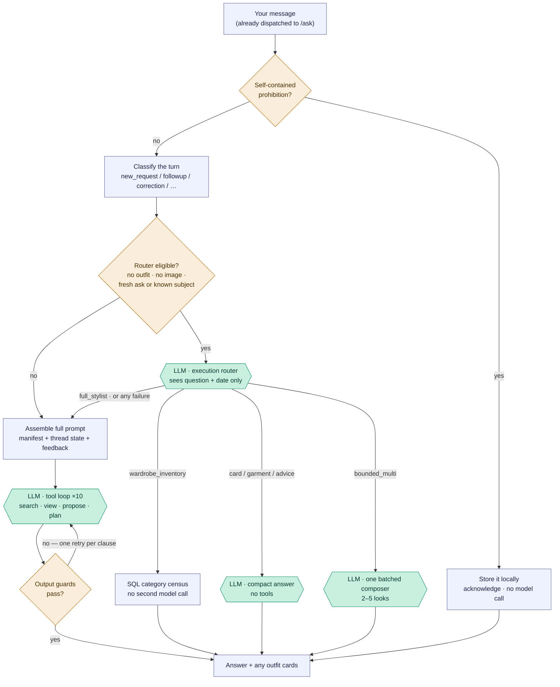
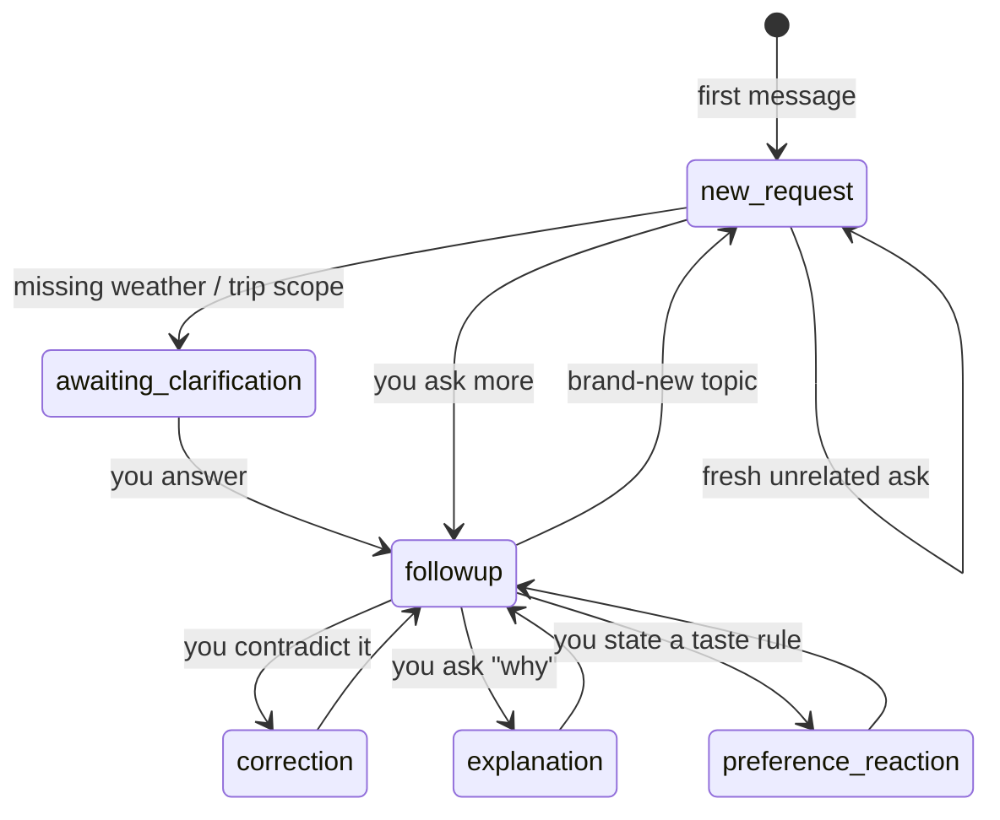
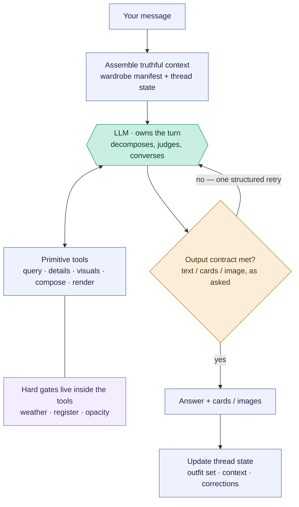

# Freeform stylist chat — `/ask`

The open chat box. Unlike the composition flows (which are linear pipelines),
this one is a **router**: each message is classified, the app decides whether to
pre-build outfits, the model runs a tool loop, and deterministic guards can
override the model before you see an answer. The model sits in the *middle*,
fenced by app logic on both sides.

Reading convention (see [use-my-wardrobe.md](use-my-wardrobe.md)): rectangles are
the app's own code, the hexagon labelled `LLM ·` is the model, diamonds are
decisions.

> **[amended 2026-08-20] Two things this document used to get wrong at the top.**
>
> **There is no longer exactly one model step.** A turn can make a routing call, a
> compact answer call, and up to ten tool-loop iterations. Which of those it makes
> is Layer 1's decision and is invisible to the user.
>
> **Reaching `/ask` at all is a decision made before this document starts.** The
> chat box dispatches to eleven different endpoints from a 13-way client-side
> `if/else` on transient React state; ordinary typed text is the *last* branch.
> Attach a photo and the same sentence goes to `/outfit-feedback` instead, which
> has no tools, no retrieval and no cards. That seam is owned by
> [message-lifecycle.md](../message-lifecycle.md) — **read it first if you are
> asking why a message behaved differently than you expected.** This document
> begins one layer down, once the turn is already inside `/ask`.

## Pipeline overview (PM altitude)



The whole flow is four layers. The tables below list **every way** to reach each
state — that precision is why they're tables, not more boxes.

Note what the diagram now shows that the old one did not: **four of the six exits
never reach the tool loop**, and the cheapest exit makes no model call at all.
Layer 1 is no longer "pre-routing"; it is the cost boundary of the whole feature.

## Layer 0 — Turn classification

Every message is tagged with a *conversation mode* from its text plus whether the
thread has history. This sets the "CONVERSATION CONTROLLER" directive in the
system prompt.

**[corrected 2026-08-20] It is classified twice, by two different classifiers,
and they can disagree.**

| | Where | Reads | Consumed by |
| --- | --- | --- | --- |
| Client | `classifyChatTurn`, [`StylistChat.jsx:551`](../../src/components/StylistChat.jsx#L551) | the text + `hasThreadMemory` | sent in the body as `conversationMode` |
| Server | `resolveStylistConversationMode`, [`core.js:3794`](../../styling-engine/core.js#L3794) | the text + `hasThreadContext` / `hasGeneratedContext`, with the client value as `requestedMode` | the prompt's turn directive |

The server's version is richer — it distinguishes correction from
preference_reaction on real thread context, and only calls a turn `followup` when
the text actually refers to something. **But Layer 1's eligibility test reads
`req.body.conversationMode`, the raw client value** ([`routes/ai.js:4003`](../../routes/ai.js#L4003)),
while the prompt reads the resolved one. So routing is decided by the coarse
classifier and behaviour by the fine one, and a turn can be routed as a follow-up
while being prompted as a new request.

The coarse classifier's last rule is the consequential one: **any message in a
thread that has memory becomes `followup`**, whatever it says.

| Mode | Reached when | Cross-turn? |
| --- | --- | --- |
| `new_request` | a fresh ask, or no thread history | starts a turn |
| `followup` | a follow-up about the current thread | yes |
| `correction` | you challenge / contradict a prior answer | yes |
| `explanation` | you ask "why did you…" | yes |
| `preference_reaction` | you state a taste preference to adapt to | yes |

## Layer 1 — App pre-routing (retired, spec 14)

> **Status 2026-07-16 (spec 14):** the broad-planning, travel precompose, and
> follow-up replan pre-routes — along with the deterministic engine composer
> they called (`composeOutfitSet`) — are **permanently deleted**, not just
> flag-disabled. `shouldEngageAskPrecompose`, `followupPrerouteEnabled`,
> `maybePrecomposeStructuredOutfitsForAsk`, `maybePrecomposeStructuredFollowupForAsk`,
> and `planFreeformUseCases` no longer exist; `WARDROBE_PLAN_PREROUTE` /
> `WARDROBE_BROAD_PLAN_PREROUTE` / `WARDROBE_FOLLOWUP_PREROUTE` have no effect.
> Every planning turn reaches the model + `plan_outfit_set`, which now always
> composes via the model-mode workbench (`buildPlanSlotWorkbench` +
> `submit_plan_outfits`) — there is no more engine-mode fallback
> (`WARDROBE_PLAN_COMPOSE=engine` no longer does anything either). Git history
> is the rollback path if a regression surfaces; see
> docs/freeform-rearchitecture-handoff.md's spec 14 entry.

There is no general deterministic keyword pre-routing layer; the sole narrow saved-photo wear-
mechanics correction is recorded below. Normally `POST /api/ai/ask` builds `toolContext` and goes
straight to Layer 2. **Default behaviour since 2026-08-19 (flags removed):** a fresh request with no active piece, outfit or image
first reaches a compact model-owned execution router. It sees only the request, date and timezone.
It may directly select the narrow same-context 2–5-look profile; every other classification,
failure or incomplete bounded composition falls through to Layer 2 unchanged. The direct profile
does not assemble the wardrobe-manifest controller payload; the existing nested visual composer
still receives its photograph roster and Style Constitution. See
`docs/freeform-bounded-execution-spec.md` Phase 2.

**[corrected 2026-08-19]** Successful direct routing is an early model-call return, not an early
state return. Before responding, `/ask` persists normalized established context and the generated
`current_outfit_set` through `boundedConversationStateFromToolContext` and
`saveStylistConversationState`. The browser sends the actual chat thread ID on every `/ask` branch,
so server recovery and follow-up meaning do not rely on a client echo.

The direct bounded profile is also ineligible after any valid card has already been created during
the turn. This prevents a hybrid tool sequence from replacing an earlier `propose_outfit` card when
`generate_outfits` writes its batch. Shared time-of-day guidance requires physically adequate
arrival/departure coverage; around 55°F, a sleeveless vest over a light or short-sleeved base is not
narrated as sufficient warmth.

**[2026-08-19] One batched search, and broadening owned by code.** `search_wardrobe`'s `category`
argument takes an array and its thumbnail budget is per category, so one call can retrieve every
category an outfit needs without losing photographs. The tool description now says so; previously
nothing did, which is why the gallery run spent a provider round-trip per category.

A request that finds nothing no longer returns an empty list. It climbs a fixed relaxation ladder —
free text, then soft descriptive filters (`color`, `pattern_type`, `silhouette`, `fabric_weight`,
`fabric_category`, `neckline`), then occasion tag confidence — and returns the closest active pieces
with a `retrieval` entry naming what it relaxed. **Category, active status and owner or request
exclusions are never relaxed at any rung.** A request that found something is never second-guessed:
"enough" is the stylist's judgment.

The entry also names any category that is still empty after broadening, which is a real wardrobe
shortfall the model may report as a gap. It appears **only when there is a compromise to report**, so
an ordinary successful search returns the piece list unchanged. Climbing rungs does not inflate
`searchCalls`, and a narrow query that found nothing is still recorded against the false-claim guard
even when broadening then finds other pieces.

See [freeform-batched-discovery-spec.md](../freeform-batched-discovery-spec.md).

**[2026-08-19] An accepted card has authority over the prose that comments on it.** Once a card is
accepted this turn, the card is the product and the closing reply is commentary. Live turns showed
the commentary drifting from what it commented on: a follow-up called the loafers the grounding
finishing piece while the card's own prose called the earrings its single finishing detail, and a
sparse composition repeated its accepted card, contradicted itself about a piece it had not used, and
narrated each lookup on the way.

`applyAcceptedCardAuthority` drops a closing paragraph when it shows the turn's working, or when it
cites a garment ID that is on no accepted card — the reliable signal for reintroducing a rejected
candidate. Withheld, never retried: a retry would buy a paid round-trip to fix commentary on a card
the user can already see. If nothing survives, the reply is generated locally rather than left blank
beside the cards. `closingProseWithheld` records that it fired.

Deliberately mechanical. It does not judge whether prose is good and does not compare wording between
two prose fields — that is semantic work, and this guard is not allowed to grow into a rules engine.
Turns with no accepted card are untouched, because there the prose *is* the answer. Requested wear
mechanics are handled at the source instead: the shared composer prompt requires them in the outfit's
`styling_instructions`, since prose commenting on a card may not be its only record.

**[amended 2026-08-19] Declaration is required by its consumers, not by every turn.** `declare_intent`
is required before `propose_outfit`, `generate_outfits` or `render_preview`, which stay blocked until
the turn declares `cards` or `image`. It is **not** required to answer in prose: an explanation,
comparison, critique, garment question or recalled detail needs no declaration. Declaring
`want:'text'` merely to answer bought a whole extra provider round-trip — measured at $0.0134 against
a follow-up turn that costs about $0.04, and observed twice on turns that produced no cards at all.

The delivery guard was adjusted with it. Its second clause read a missing declaration plus
outfit-ish question phrasing as a skipped ceremony; with declaration optional, absent declaration is
the normal state of a prose answer, so that clause would have fired on exactly the conversational
turns this makes cheap — spending a retry to save a round-trip. Prose that actually lays out an
unproposed outfit is still caught, from the answer rather than the question. No new prose detector
was added.

**[default since 2026-08-19] Compact answer profiles.** The same model-owned router can finish exact inventory,
verified-card explanation, resolved garment-fact, or wardrobe-independent education turns before
the full tool loop. Garment-fact answers rehydrate only the resolved pieces and, through
`compactGarmentVisualEvidence`, attach their saved worn/hanger images with a four-image ceiling.
This lets direct visible garment behavior correct missing or weak tags without loading a wardrobe
roster. The response debug payload reports `compactVisualImages`; unresolved identity, composition,
or discovery still falls through to Layer 2.

**[corrected 2026-08-19]** The router receives a presence-only count when resolved subjects have
saved photos. It may therefore send a question about the visibly shown result of a tuck or analogous
wear mechanic to `garment_fact`; it still receives neither garment identity nor image data itself.
Broad critique and visual-fit questions without saved evidence remain in Layer 2. Regardless of
profile, photographs establish visible behavior but not exact fiber composition, and feasibility is
not automatic styling approval.

**[corrected again 2026-08-19]** `thread_1787121042557` showed that model-only selection still sent
the exact saved-photo tuck question into Layer 2. After exact-name resolution and confirmation that
the one subject has a saved photograph, tuck/untuck request shapes now deterministically select
`garment_fact`. This narrow exception does not interpret garment semantics or cover pairing and
broad fit critique. Its answer directly judges the visible garment-and-body interaction when the
photo supports that judgment. It may recommend an unseen alternative as likely stronger, but must
not call it proven, invent a hidden cause, diagnose the wearer’s body, or generalize a body rule.
When proposing an unseen alternative, it tests the simplest adjacent configuration first (for a
full tuck, fully untucked) rather than inventing a partial or elaborate tuck without evidence.
Compact saved images use Anthropic-compatible base64 source blocks. Unlike ordinary ambiguous
router failures, a failure inside this deterministic narrow route is returned as an error rather
than silently launching the full-manifest stylist and multiplying the cost.

**[HISTORICAL — removed 2026-08-19, never default-on] Qualified coverage.** The profile below is
**no longer in the code**. It was removed from the router enum, schema and prompt, and its execution
branch and helpers were deleted. Coverage questions now route to `full_stylist` until they are
rebuilt as a use case of shared batched discovery — see
[freeform-batched-discovery-spec.md](../freeform-batched-discovery-spec.md), which carries the
acceptance cases this arc paid to learn. The description is kept because the evidence contract it
describes is inherited, not discarded. It never ran for a user: `WARDROBE_FREEFORM_COMPACT_ANSWERS`
was default-off throughout.

A router result with generic category and constraint
dimensions bypasses the tool loop. Code supplies every active piece of the requested kind as a
compact text census. A first bounded judge selects candidates without photographs; when an
observable or mixed constraint materially benefits from sight, a second bounded judge receives only
that candidate set plus at most four saved images. Material alone does not prove weather protection.
The router also supplies garment kind: ordinary “jackets” maps to the centralized jacket/coat family,
so cardigans sharing the outerwear storage category are not audited. Practical weight is judged from
tags plus available photographs; user-facing prose never exposes database fields or IDs.
The router represents arbitrary qualifiers as semantic dimension/target pairs plus usage context.
The bounded answer is a required structured classification (primary, plausible, backup, unknown),
then code validates IDs against the census and renders garment names. Future questions reuse this
evidence contract instead of adding a new application branch for every property.
Constraints mark whether their target is observable, latent or mixed; result rows declare evidence
basis. Code downgrades visual-only claims about latent performance, uses the router’s explicit
minimum (duration alone defaults to one), sanitizes model strings, and bounds final output length.
Evidence basis is dimension-specific, preventing a strong fact for one qualifier from laundering a
weak inference for another.

**[final status, 2026-08-19 — architecture abandoned]** Five versions each moved the same problem
rather than solving it. In `thread_1787128659041` the staged path improved contextual recall but
still dropped deserving unpictured candidates before refinement, cost 19,384 input / 2,867 output
across three calls, and rendered truncated evidence machinery — more expensive than the single-judge
path it replaced. The decision was not another revision: an arbitrary coverage question combines
physical fact, owner experience, wrong metadata, visual judgment, contextual styling judgment and
quantity requirements, which is the whole stylist problem. Building a generic coverage pipeline was
becoming a second stylist architecture, so coverage becomes a use case of batched discovery instead.

## Layer 2 — Model tool loop

Model-driven, up to **10** iterations
([`askStylistWithTools`, provider.js:1212](../../styling-engine/provider.js#L1212)).
The disciplined flow — declare, search, view supports, view layers, propose ×N —
legitimately needs 6–8; the old cap of 7 left no margin for one corrective bounce
and live turns died with zero cards. The model chooses what to do:

| Action | What it means |
| --- | --- |
| *(no tool)* | conversational advice / evaluation prose |
| `declare_intent` | declare `cards` / `image`; required *by its consumers*, not by every turn |
| `search_wardrobe` (± `visual`) | look up real owned pieces; `category` takes an array, so one call covers every slot |
| `view_pieces` | cheap verification: thumbnails + truth lines for exact IDs |
| `get_garment_details` / `get_last_outfit_evaluation` / `get_current_image_inventory` | retrieve info |
| `wardrobe_coverage` | coverage/gap census |
| `propose_outfit` | render a verified outfit card ("show me") |
| `generate_outfits` | compose fresh cards from scratch |
| `suggest_slot_swaps` | one-slot alternatives against an existing card |
| `plan_outfit_set` → `submit_plan_outfits` | multi-slot plans (trip, work-week, capsule, event set) via the model-mode workbench |
| `render_preview` | render an image from an existing card only after the turn declares `want:"image"` |
| `store_user_correction` | persist a taste correction |

**All 14 schemas are offered on every turn, byte-identically.**
`stylistToolsForTurn` ([provider.js:757](../../styling-engine/provider.js#L757))
deliberately does not vary tool descriptions by turn mode: Anthropic's cached
prefix is ordered tools → system → messages, so one varying byte in a schema
invalidates the manifest sitting behind it — measured at ~35k tokens of warm
prefix thrown away when a thread went from new request to follow-up. Per-turn
policy belongs below the cache breakpoint, in the conversation controller.

Returning *fewer* tools is a different thing and stays: once an atomic composer
has finished (`atomicMultiLookCompleted`, `capsuleAtomicCompleted`,
`slotSwapCompleted`) the function returns `[]`, which is how a turn is ended.

**Prose written beside tool calls is part of the answer.** The model writes its
intro and per-look framing in the same assistant messages as its `propose_outfit`
calls, because the prompt asks it to. The loop collects that narration rather than
returning only the final tool-free message — discarding it once shipped a reply
that was a bare `---` followed by notes about looks that had been thrown away.

**[default since 2026-08-19] Bounded same-context batches.** A new request for 2–5 fresh looks that share one
occasion, activity and weather context uses `generate_outfits` once. That tool invokes the existing
photograph-aware whole-wardrobe composer and returns the complete batch as the terminal paid step;
deterministic code supplies the short introduction and any shortfall disclosure. Named location
and resolved date are used for weather before roster construction, with the source recorded. The
nested call's token usage is added to the parent turn. A
validation shortfall is disclosed after that pass rather than reopening the serial
search/`propose_outfit` loop. One-look, multi-context, selected-piece and revision flows are not
changed. See `docs/freeform-bounded-execution-spec.md`.

The bounded tool call itself declares the card contract, so this profile does not call
`declare_intent` first. An ordinary new “what should I wear?” defaults to two options and enters
this path directly; an explicit one/best/pick-one request retains targeted search plus one card,
and an explicit count wins. Composer `reason`, `watchFor`, and `stylingInstructions` are locally
checked against their final IDs; deliberation or discarded-ID prose is withheld without another
paid iteration.

## Layer 3 — Output guards

Deterministic post-checks on the model's final text, run **before** citations are
stripped so every clause sees the `(ID 196)` markers it needs. First failing clause
wins; each clause gets **one** retry
([`applyFreeformOutputChecks`, provider.js:132](../../styling-engine/provider.js#L132)).
This is where the app overrides the model.

**[corrected 2026-08-20] The full clause list.** This table previously listed five
clauses, one of which (`tripScopeClarification`) had been retired in spec 21 Part 3
and three of which had never been added.

| Guard | Fires when | Forces |
| --- | --- | --- |
| `zeroResultContradiction` | recommended pieces despite a zero-result search | retry honestly |
| `unverifiedCitation` | cited a piece ID never retrieved this turn | retry with verified IDs |
| `cardProseInconsistent` | a card's own words don't describe the card | explain the piece or drop it |
| `destinationClarification` | travel answer without a destination | ask where you're going |
| `cardsNotDelivered` | declared `cards`, delivered none, asked nothing | deliver or ask |
| `imageNotDelivered` | declared `want:'image'`, never called `render_preview` | render or ask |
| `outfitCount` | asked for N cards, produced fewer | propose the remainder |
| `outfitProse` | prose lays out an outfit that never went through `propose_outfit` | redo via the tool |

`tripScopeClarification` is gone: the model repeatedly demonstrated the judgment
the clause distrusted, with no misfire evidence.

**A retry replaces the answer, and supersedes the prose that earned it.**
`supersedeNarrationOnRetry` clears accumulated narration on a blocked turn —
without it, a guard that rejected a claim would still ship the claim above its own
correction, having already spent its one retry.

**Three transforms then run in a fixed order**, and the order is load-bearing:

1. `applyAcceptedCardAuthority` — an accepted card is the product; the closing
   paragraph is commentary, and is dropped when it shows the turn's working or
   cites a garment on no accepted card. Withheld, never retried.
2. `discloseUnresolvedFreeformChecks` — re-runs the predicates and **tells the
   user** what is still failing after the retry, instead of silently shipping it.
3. `stripPieceIdCitations` — last, at the response boundary in `routes/ai.js`.

The `outfitCount` retry is intentionally bypassed after a bounded capsule or bounded same-context
batch has completed; those flows deliver accepted cards plus explicit gap language within their
one-composition-call budget.

The bounded introduction is deterministic and count-aware: one direction, two directions, or the
actual numeric count. Its shortfall sentence agrees grammatically with the number of ready cards.

**Cross-cutting inputs** that drive all four layers: `activeContext.type` (piece /
outfit / whole-wardrobe), the conversation mode, whether the thread already holds
outfits, message keywords (show·why·evaluate vs plan·pack·suggest, travel words,
multi-day, named destination), and weather source (text heuristic vs a live
forecast when a location is known).

## Conversation state across turns

Most routing is re-derived per message, but three things genuinely span turns: the
conversation mode (defined *by* history), the current outfit set (persists and
gets refined), and pending clarification (this turn asks → next turn answers = a
"waiting" state). This diagram shows the *typical* movement between Layer-0 modes —
classification is per-message, so these are common paths, not hard-coded edges.



## Engineer notes

- **Entry:** `POST /api/ai/ask` ([`routes/ai.js:3902`](../../routes/ai.js#L3902)) — but only for
  turns the client dispatcher sent here; see [message-lifecycle.md](../message-lifecycle.md).
  `conversationMode` arrives from the client and is re-resolved server-side (Layer 0).
- **The free exit runs first.** `detectExplicitProhibition` resolves a self-contained prohibition
  locally, files it via `storeUserCorrection`, and returns `isLocalAcknowledgment: true` with **no
  model call**. It exists because a live turn once spent five provider iterations to store one
  sentence.
- **The client posts its entire wardrobe array on every turn.** `req.body.pieces` is read in exactly
  one place — resolving card thumbnails for generated-outfit reference sheets. Everything else the
  server reads from SQLite itself.
- **Optional execution router:** `routeFreeformExecutionProfile` (`styling-engine/provider.js`)
  makes one compact structured call before `buildStylistConversationPayload`, within its eligibility
  boundary (fresh request, verified card set, or resolved garment subject). A successful `bounded_multi` result calls `generate_outfits`
  directly and returns; otherwise the full path below remains authoritative.
- **Compact text profiles (default since 2026-08-19):** the same router may select an existing-card explanation,
  verified garment-fact answer, or wardrobe-independent general styling answer. Each receives one
  no-tools answer call and returns before the manifest is assembled. Card and garment paths receive
  only their verified IDs/facts; general advice receives no wardrobe or thread payload. Missing or
  ambiguous context falls through to the full path.
- **Bounded full-stylist history (default since 2026-08-19):** only prior conversation prose is capped: four recent
  exchanges/eight messages, 12,000 characters total and 3,500 per message. Structured thread
  state, current verified cards, durable feedback memory and the wardrobe manifest remain on their
  existing authoritative paths. The duplicate current question is removed before bounding; no
  summarization call is added. Run diagnostics store only counts and characters removed.
- **Prompt/tool ownership (2026-08-19):** `freeformToolRoutingInstruction` keeps only relationships
  spanning several tools. Each `STYLIST_TOOLS` description owns its own eligibility, arguments and
  mechanical result; `buildStylistConversationDirective` is the single volatile owner of the turn's
  mode behavior. The stable cached Style Constitution/profile/manifest prefix is unchanged. See
  `docs/freeform-prompt-ownership.md`.
- **Deferred tools — REMOVED 2026-08-19.** The Anthropic BM25 tool-search experiment is gone from the
  code. It reduced visible schema size without touching the cost driver, and its provider-specific
  machinery would have constrained batched discovery. See `docs/freeform-deferred-tools-spec.md`
  (historical) and `docs/freeform-batched-discovery-spec.md`.
- **No pre-route (spec 14):** the handler builds `toolContext` directly from
  the request body and goes straight to the model — planning turns rely
  entirely on the model calling `plan_outfit_set` itself.
- **The model call is `askStylistWithTools`** with the tools in
  `styling-engine/tools.js` and the `STYLIST_SYSTEM` prompt assembled in
  `buildStylistConversationPayload` ([`styling-engine/core.js:3877`](../../styling-engine/core.js#L3877)), which injects
  the conversation-mode directive, occasion/climate profiles, established weather,
  and thread context.
- **The loop caps at 10 iterations.** Tool calls (search, details, etc.) feed
  results back and continue; a plain text answer exits — unless a Layer-3 guard
  blocks it, which pushes a correction message and re-runs the model once per
  guard type.
- **Resolved weather survives follow-ups as physics, not prose.** Thread state stores a normalized
  `weather_profile` separately from human-facing season/weather strings. A new explicit weather
  statement wins; otherwise the restored booleans and numeric range own gates.
- **`propose_outfit` vs `generate_outfits`:** `propose_outfit` renders a card from
  *verified* piece IDs (the model must `search_wardrobe` first); `generate_outfits`
  composes fresh cards from scratch. The `outfitProse` guard exists to force the
  model into `propose_outfit` when it tries to describe an outfit in prose instead.
- **`plan_outfit_set` vs image rendering:** `plan_outfit_set` creates cards and
  stores them as the current outfit set; it must not be followed by
  `render_preview` unless the user separately asks for an image. `render_preview`
  is tool-gated by declared image intent, so a cards-only planning turn cannot
  accidentally spend an image render.
- **Whole-wardrobe session memory:** `plan_outfit_set` does not write
  `whole_wardrobe_sessions`. The "Use my wardrobe" memory counter is touched by
  the visual composer path (`generate_outfits` / whole-wardrobe composer) and
  by legacy precompose when explicitly re-enabled, not by a plain model-called
  set plan.
- **Diagnostics:** each turn writes one `freeform_generation_runs` row via
  `persistFreeformGenerationRun` ([`routes/ai.js:573`](../../routes/ai.js#L573)) — iterations, token
  counts with cache read/write splits, gate exclusions, proposal validation failures, history
  diagnostics. It runs on **both** the success and the error path (a turn that dies mid-way has
  already paid for what it did), and swallows its own errors so it can never turn a provider failure
  into a 500.
- **[gap, 2026-08-20] `executionProfile` is not persisted.** It is set on the diagnostics object and
  returned to the browser in `debug`, where the thread payload keeps it — but it is **not a column**
  in `freeform_generation_runs`, so no query over the diagnostics table can see which profile ran.
  It is also only set on the two branches that *take*: a turn that fell through to the full stylist
  records no profile at all. Reconstructing a misroute means reading the thread's stored `debug`.

---

# Proposed architecture — from router to stylist

> **2026-08-19 cost amendment — HISTORICAL, implementation removed.** The tiered index is no longer
> in the code; its principle is inherited by batched discovery. It described two separable levels of
> “knows the wardrobe”: the full stylist receiving every
> active piece's exact ID/name/category and brief visual identity, but retrieves full garment truth
> only when the turn needs it. Exact piece questions expand through view/details, composition through
> search, broad category counts through index headings, and qualified coverage through
> `wardrobe_coverage`; sparse or uncertain lookups broaden
> before declaring a gap. This expands rather than reverses the philosophy below: the model retains
> whole-closet identity awareness and open-ended judgment, while code supplies detailed truth on
> demand. The index is not a shortlist, and recently-shown memory cannot hide a piece. See
> [freeform-tiered-discovery-spec.md](../freeform-tiered-discovery-spec.md).
>
> **Exact-count fast completion, 2026-08-19.** The model router may
> classify an exact active inventory count/breakdown as `wardrobe_inventory`; code reads category
> counts and returns immediately. This removes the full-stylist and `declare_intent` calls observed
> in `thread_1787116405571`. “Enough?”, gap, qualification and styling questions are not eligible.

> **Router eligibility, 2026-08-19.** The compact router runs only when the turn carries context a
> compact profile can use: a fresh request, a verified current outfit set, or a resolved garment
> subject. Corrections and follow-ups carrying none of those go straight to the full stylist rather
> than paying a router call before it. Accepted miss: general advice and inventory counts need no
> context, so those questions asked mid-thread in a card-less, subject-less conversation fall
> through. Measured before widening, not argued — see the handoff.

> **Sparse-composition live status, 2026-08-19.** `thread_1787128902650` confirmed that tiered
> discovery can broaden a failed anchor lookup and preserve a strong wardrobe-aware result, but the
> sequential loop took nine provider iterations and five searches (60,532 cache creation / 212,147
> cache read). The next step batches broadened anchor and support-category retrieval before one
> composition submission. Search narration must not reach the final answer, and explicit wear
> mechanics must be present in the accepted card's `stylingInstructions`.

> **Status: in progress (2026-07).** Migration steps shipped so far: **1** —
> wardrobe manifest + structured thread state (#37); **3** — retrieval rule:
> pieces must be verified this turn, layers visually seen (#38); **4** —
> model-declared intent via a `declare_intent` tool, with the guards' phrasing
> regexes demoted to undeclared-turn fallbacks (#39) — **amended 2026-08-19: the
> undeclared-turn phrasing fallback is removed, because declaration is no longer
> required on every turn (see "Declaration is required by its consumers" below)**; **5** — the guards
> collapsed into one turn-contract validator with three clauses (truth /
> context / delivery) and a single per-clause retry budget; delivery is checked
> against the declared want (`cardsNotDelivered`), and the legacy travel
> clarification clauses are kept as explicit retire-candidates pending live
> evidence; **2** (done after 3–5 once live results showed the rails were too
> expensive to follow) — the primitives: `view_pieces` (cheap batch thumbnails
> + truth lines — the designed way to satisfy the verification gates),
> `render_preview` (in-chat outfit render via the conditional image pipeline,
> so want:"image" is now satisfiable and contract-checked), `wardrobe_coverage`
> (exact grouped counts), and the `opacity` truth field (tagger → db → manifest
> / piece text / search results; existing pieces backfill on retag). Step 6
> (demote precompose) remains. The "current implementation" sections above
> predate the migration — cross-check against the code as steps land.

## The problem

The goal of freeform chat is a real conversation with a stylist who knows the
wardrobe — where tomorrow's question ("what pieces am I missing for a boho
outfit?", "how can I layer tank tops?") works without anyone having anticipated
it. The current architecture cannot get there, because **anticipation is its
control flow**: intent lives in ~6 independent keyword vocabularies (client turn
classifier, client editorial regex, server broad-planning and travel patterns,
the server ideal-mode regex, and five output-guard regexes). Every new kind of
question needs a new vocabulary entry, forever, and any two vocabularies can
drift apart (they already have — see the routing note in
[selected-piece-composer.md](selected-piece-composer.md)).

The evidence from this atlas points one way: the chat behaves where the model
*delegates to engines* (precompose → composer, `propose_outfit` → verified
cards) and misbehaves where routing guessed wrong or a capability was missing.

## The inversion

Current design: **deterministic code decides what happens; the model fills in
the words.** Target design: **the model owns the conversation and decides what
happens; deterministic code guarantees truth and form.**

The model brings the two things that cannot be enumerated in code — fashion
knowledge (what "boho" means) and conversational judgment (what this user is
asking for right now). The app brings the two things the model cannot be
trusted to freelance — **garment truth** (what the pieces actually are) and
**output form** (cards are cards, images are images). Today those
responsibilities are partially swapped: regexes attempt judgment, and garment
truth is optional at recommendation time.

## Target shape



Note what disappeared relative to the current pipeline diagram: the pre-route
decision and the five bespoke guards. Routing moved *into* the hexagon; truth
moved *into* the tools; form became one generic contract check.

## The five pillars

1. **Thick, truthful context.** The stylist "knows the wardrobe" by reading it,
   not searching for it. The full wardrobe manifest already rides in the system
   prompt (`CURRENT WARDROBE TRUTH`, `core.js:3740`) — make it the centerpiece:
   compact per-piece truth (attributes + confidence), plus structured **thread
   state** (current outfit set, established weather/occasion/destination, pinned
   pieces, saved corrections). At ~224 pieces this fits comfortably and caches.
   Most questions then need *zero* tool round-trips to reason about coverage.
2. **Tools as primitives, not pre-scripted flows.** Keep the engines
   (`generate_outfits`, `propose_outfit`) but add the missing query surface:
   aggregate/coverage queries ("count relaxed bottoms rated for city"), cheap
   batch visual fetch, and a `render_preview` that wraps the existing image
   renderers. Open-ended questions decompose into these primitives plus model
   judgment — no router ever needs to have seen the phrasing.
3. **Hard gates live in the data layer, not the conversation layer.** This is
   the settled lesson of the app's gate history: `search_wardrobe`'s
   compose-intent filtering, the register ceiling, weather gates — and new
   truth fields like opacity/lining — belong inside the tools, where they make
   it *impossible* for the model to be handed garbage. Gates guarantee the
   floor; the model supplies the taste. A recommendation may only name a piece
   retrieved this turn; base-layer suggestions require visual verification.
4. **One structural output contract instead of five lexical guards.** Outfit
   content travels only via typed tool calls; prose is for conversation. The
   check becomes generic: *does the response satisfy the declared want (text /
   cards / image)?* Each existing guard retires as its upstream cause is fixed —
   `zeroResultContradiction` dies when recommendations must cite retrieved IDs;
   `outfitProse` becomes schema validation; the clarification guards become the
   model's own judgment, informed by thread state.
5. **Model-initiated engines replace pre-routing.** Precompose exists because
   the design didn't trust the model to call `generate_outfits` at the right
   moment. In the target the model invokes the same engine when *it* judges the
   turn to be a planning request. Precompose may survive as a latency
   optimization — but it stops being load-bearing for correctness.

## The generalization test

Neither of these strings appears anywhere in code — both must work:

- *"What pieces am I missing to create a boho outfit?"* — model interprets
  "boho" from its own fashion knowledge → scans the in-prompt manifest → names
  what qualifies, what's absent → optionally hands off to
  [editorial ideal additions](editorial-ideal-additions.md) for shop-the-gap
  directions. No routing entry required.
- *"How can I layer tank tops?"* — model pulls the actual tanks from the
  manifest → verifies fabric weight / silhouette / opacity via detail + visual
  primitives → gives layering advice citing real owned pieces → optionally one
  `propose_outfit` card as an example. No routing entry required.

## What we trade away

- **Latency/cost:** more tool round-trips on some turns; mitigated by the
  in-prompt manifest (most turns become zero-round-trip) and prompt caching.
- **Route determinism:** "this phrasing always does X" is no longer testable.
  Instead, test *invariants* — gates, contracts, "named pieces were retrieved
  this turn" — which is the shape `test/aiEndpointContracts.test.js` already has.
- **Model dependence:** this leans on a strong model. The current architecture
  was a rational hedge when it was built; the guards should be dismantled *as*
  their upstream causes are fixed, never before.

## Migration path (each step ships alone)

1. **Context first:** strengthen the wardrobe manifest (attributes +
   confidence) and add structured thread state to the payload.
2. **Primitives:** coverage/aggregate query, batch visual fetch,
   `render_preview`; add the opacity/lining truth field to the tagger.
3. **Retrieval rule:** recommendations may only cite pieces retrieved this
   turn; base-layer/skin-contact advice requires `visual: true`.
4. **Intent declaration:** the model declares the turn's `want`
   (text/cards/image) — client regex classification becomes advisory, then dies.
5. **Contract check:** collapse the five guards into the one generic
   "want satisfied + schema valid" validator.
6. **Demote precompose** to an optimization once model-initiated
   `generate_outfits` proves equivalent on the planning cases.

What deliberately does **not** change: the composer engines and their gates, the
no-repair-in-advisor-mode decision, `store_user_correction` and its recall, and
the card contract (`propose_outfit` with verified IDs) — those are the parts the
atlas showed to be working.

## Step 6 resolution — the planning engine (designed 2026-07-12, not yet built)

Live trip tests settled step 6 with evidence in both directions: the model CAN
self-compose planning turns, but the trip precompose produces something the
model cannot — the **plan**: slot coverage and cross-outfit piece-reuse
analysis ("Packing reuse: 12 distinct pieces"). So precompose isn't demoted
wholesale; its planning capability is generalized and moved behind the model.

**What the trip planner actually is:** multi-outfit composition under *shared
constraints* — outfits that aren't independent because they share an objective.
That capability generalizes:

| Scenario | Slots | Shared constraint |
| --- | --- | --- |
| Trip packing | day / evening / hike / coast | maximize piece reuse |
| Capsule building | use-cases | hard piece budget |
| Work week | days | no-repeat tops, per-slot register |
| Event weekend | rehearsal / ceremony / brunch | escalating register, shared shoes |
| Carry-on week | days | piece budget + laundry cycle |
| New-piece integration | occasions | shared anchor across all outfits |
| Versatility audit | — | pure reuse optimization |

**The structure — planner as a tool, not a pre-route:**

```
plan_outfit_set({
  slots: [ { label, occasion, activity, count, register?, location?, date? } ],
  date_range: { start?, end? },          // plan default; slot.date overrides per slot
  constraints: {
    reuse: 'maximize' | 'diversify' | 'none',   // signed dial — see shape validation below
    no_repeat: [category], allow_repeat: [category],
    piece_budget,
    shared_anchor_ids                    // anchors are exempt from no_repeat
  }
})
// slot array order is meaningful: it is the wearing sequence
```

- **The model decomposes** the request into slots in the tool arguments — this
  is judgment ("mainly wineries, hiking, *maybe* the coast" → 3 winery + 1
  dinner + 1 hike + 1 optional coast), and doing it natively retires the
  separate `planFreeformUseCases` LLM call and its fragile JSON scraping
  (observed failing live: "Expected double-quoted property name").
- **The engine composes**: the existing gated slot composition + reuse
  optimization (`buildLocalTripSlotOutfits` generalized into
  `composeOutfitSet`), returning cards *plus plan lines* (coverage, reuse
  report) in the shape the client already renders for trip cards.
- **Per-slot live weather** (added 2026-07-12 after the coastal-microclimate
  miss: a 60°F coast day was composed for inland Paso Robles heat): each slot
  resolves its own weather via `getWeatherProfileForPlan({ dateRange,
  location })` in `styling-engine/weather.js` — Open-Meteo, geocoded free-text
  locations, cached, multi-day aggregation that already supports
  hot-days/cool-nights swings. Both weather functions were built in the spec-4
  live-weather work (a33347d); `getCurrentWeatherProfile` got attached then
  (search gating, propose gates) while the plan variant shipped with tests but
  its product consumer never landed — this step is that consumer. Slot
  location defaults to
  the trip destination; the model supplies overrides ("drive to the Coast" →
  a coastal town). User-stated weather still wins when given for a slot; the
  forecast fills the gaps and catches microclimates. The plan lines should
  state the per-slot weather used, so the user can correct it conversationally.
- **The keyword pre-routes retire on evidence**: `isTravelOrPackingRequest` and
  `isBroadOutfitPlanningText` become a legacy fast path, removed once
  diagnostics show the model calls `plan_outfit_set` reliably on planning
  turns — the same evidence-gated retirement rule as the context clauses.

### Shape validation — the contract walked through more than one use case

Done 2026-07-12 before building, so the schema isn't shaped around trips
alone. Each scenario stress-tests a different dimension; four contract
changes fell out (already folded into the block above).

| Scenario | What it stress-tests | Verdict / change |
| --- | --- | --- |
| Trip packing ("5 days Paso Robles, wineries + hike") | fuzzy slots in a date range, per-slot location weather, reuse maximization | baseline — covered |
| Work week ("outfits for Mon–Fri, Thursday client-facing") | slots that ARE dates; **reuse inverted** — at home, repeats are the failure, not the win; per-slot register | added `slot.date` (Monday's forecast ≠ Thursday's; a range average is wrong); `reuse` became a signed dial (`maximize` for packing, `diversify` for weeks) with per-category `no_repeat` / `allow_repeat` (tops shouldn't repeat, shoes may) |
| Event weekend (rehearsal / ceremony / brunch) | mixed objective: suitcase reuse AND marquee distinctness; register escalation | per-category reuse covers it (repeat shoes and layers, never the ceremony dress); `slot.register` carries the escalation — **built 2026-07-13** (`tripOutfitRegisterEscalationScore`: a `dressy`/`formal` slot demotes denim, casual jackets, tees, sneakers and rewards a dress/tailored + heels) after a live wedding-ceremony miss composed it in denim + a leather zip |
| Capsule building ("10-piece summer capsule") | objective inversion: piece budget is primary, outfits are the proof; no dates at all | `date_range` optional ✓, season-level weather; the plan report must lead with the piece roster + combination count → **report sections are objective-driven**, not hardcoded to "Packing reuse: N" |
| New-piece integration ("4 outfits around the white pants") | one piece pinned everywhere while supports vary | `shared_anchor_ids` ✓ + explicit rule: anchors are exempt from `no_repeat` (otherwise the two constraints contradict) |
| Carry-on / laundry cycle ("2 weeks, laundry mid-trip") | wear-count budgets and a reset point in the sequence | deferred to v2 — but "slot array order = wearing sequence" is declared now so a reset marker can slot in later without reshaping |
| Versatility audit ("which 8 pieces work hardest?") | slotless pure optimization — no occasions to compose for | out of scope for `plan_outfit_set`; if it ever ships it's a `wardrobe_coverage` extension, not a planning call |

**Deferred to v2 (recorded, not designed):** slot-level avoid-lists ("no white
at the wedding" — feedback memory and conversation handle it today),
wear-count budgets with laundry resets, slotless optimization.

Build order when picked up: (1) extract `composeOutfitSet` from the trip-slot
builder — **SHIPPED 2026-07-13** (`styling-engine/outfitSetPlanner.js`; both
pre-route call sites now import it), (2) expose the tool + record cards with
slot labels/coverage lines — **SHIPPED 2026-07-13** (`plan_outfit_set` in
tools.js: declared-intent gate, cards recorded with source `plan_outfit_set`
+ source lock, plan lines returned to the model, `planOutfitSetCalls`
diagnostic; the client renders both planned-set sources through the trip
presentation), (3) wire per-slot weather via `getWeatherProfileForPlan` —
**SHIPPED 2026-07-13** (each slot resolves its own forecast from `slot.location`
+ `slot.date` or the plan `date_range`; the tool schema gained per-slot
`location`/`date` and plan-level `location`/`date_range`; user-stated per-slot
`weather` wins over the forecast; a live forecast is authoritative in
`tripSlotFitScore` so a slot's inherited hot season text can't re-inject heat
into a cool coast slot; plan lines now carry a `Weather used: <slot> — <label>`
line so the user can correct it conversationally), (4) implement the reuse dial +
per-category repeat rules with the anchor exemption — **SHIPPED 2026-07-13**
(`constraints` on the tool: signed `reuse` dial `maximize`/`diversify`/`none`,
per-category `no_repeat`/`allow_repeat` mapped to category groups, and
`shared_anchor_ids` hard-pinned via `buildWholeWardrobeCandidateOutfits`'s
`requiredPieceId` and exempt from `no_repeat`; `normalizePlanConstraints`
parses them), (5) objective-driven
plan report — **SHIPPED 2026-07-13** (`buildPlanReport` picks the report by
objective: a `piece_budget` leads with the piece roster + combination count and
flags over/under budget; a `diversify`/`no_repeat` plan leads with the repeat
schedule ("every look is distinct" being the win); everything else keeps the
packing-reuse headline), (6) prompt — **SHIPPED 2026-07-13** (a "Planning a
Coordinated Multi-Outfit Set" bullet in `STYLIST_SYSTEM`: on the initial
planning turn the model calls `plan_outfit_set` instead of hand-composing, YOU
decompose into slots, set per-slot `location`/`date` for microclimates and
specific days, and choose `constraints` from the objective; the returned cards
become the Current outfit set that `propose_outfit` then revises; reinforced
2026-07-13 after a live miss — an at-home multi-day plan with no place named
must route to `plan_outfit_set` on the calendar season, NOT stall on a weather
question, so the planning instinct beats the weather-clarification reflex),
(7) run both paths in parallel with diagnostics — **SHIPPED 2026-07-13**
(`recordPlanPathDiagnostics` writes per-turn `planKeywordMatched` /
`planPrerouteComposed` / `planModelCalled` and a single `planPathOutcome`
— `both` / `model_only` / `preroute_only` / `planning_uncomposed` /
`not_planning` — into the debug block; a steady stream of `model_only` on
turns the regex missed is the evidence step 8 needs), (8) retire the keyword
pre-route — **SHIPPED 2026-07-13** (the broad-planning, non-travel pre-route is
retired by default via `shouldEngageAskPrecompose`: work-week / capsule / event
turns now fall through to the model + `plan_outfit_set`; live evidence showed
those turns self-route `model_only` and the pre-route only produced weaker,
unconstrained sets — the capsule lost its budget/roster entirely. The TRAVEL
pre-route is now retired too: a real Paso Robles trip self-routed `model_only`
with its own hiking slot + per-slot coastal location, weather resolved live from
`location`. `shouldEngageAskPrecompose` returns false for both branches by
default; `WARDROBE_PLAN_PREROUTE=on` restores the whole legacy path as a
reversible fallback. **The 8-step plan is complete.**).

> **[HISTORICAL — do not act on the next three paragraphs.]** They are the
> 2026-07-13 build log, written in the present tense about code that was deleted
> three days later. `maybePrecomposeStructuredFollowupForAsk`, `planFreeformUseCases`
> and `composeOutfitSet` **no longer exist** — see Layer 1 and the "Resolved (spec 14)"
> note that closes this section. Kept for the reasoning, not the instructions.

**Caveat (2026-07-13 architecture review): step 8 retired the NEW-REQUEST
pre-routes only.** The follow-up replan path
(`maybePrecomposeStructuredFollowupForAsk`) is not gated by
`shouldEngageAskPrecompose` or the flag — on any `followup`-classified turn
whose thread already holds an outfit set, it still front-runs the model via
`planFreeformUseCases` + an unconstrained `composeOutfitSet` (no reuse dial,
no constraints). Because `classifyChatTurn` labels nearly every post-first
turn `followup` (the deliberate spec-10 ruling), this is the last
keyword-era front-runner and it sits on the highest-traffic path; it can
replace a model-planned, constraint-carrying set with a constraint-free one.
Retiring it is the top item in
[../freeform-rearchitecture-handoff.md](../freeform-rearchitecture-handoff.md)'s
remaining work — same evidence-gated play as step 8.

**Resolved (spec 14, 2026-07-16):** the follow-up pre-route was retired by
default (2026-07-14) and then deleted outright, along with the
new-request pre-routes, `planFreeformUseCases`, and `composeOutfitSet` itself
(the engine composer both pre-routes and the legacy `WARDROBE_PLAN_COMPOSE=engine`
tool branch called). See "Layer 1" above and the handoff doc's spec 14 entry —
this whole caveat and the build-log above it are now historical.
