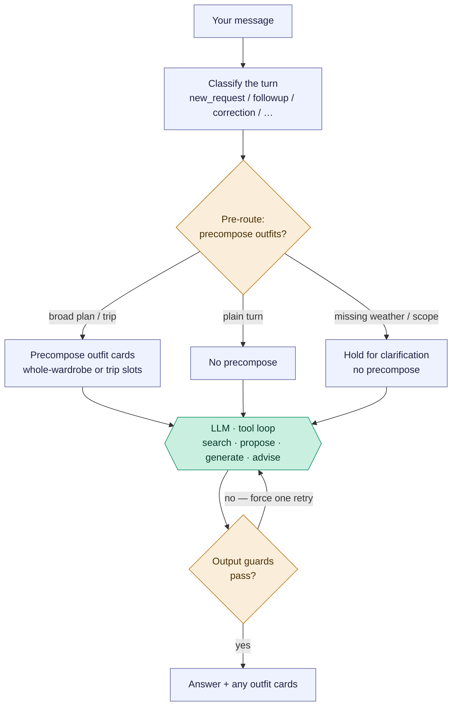
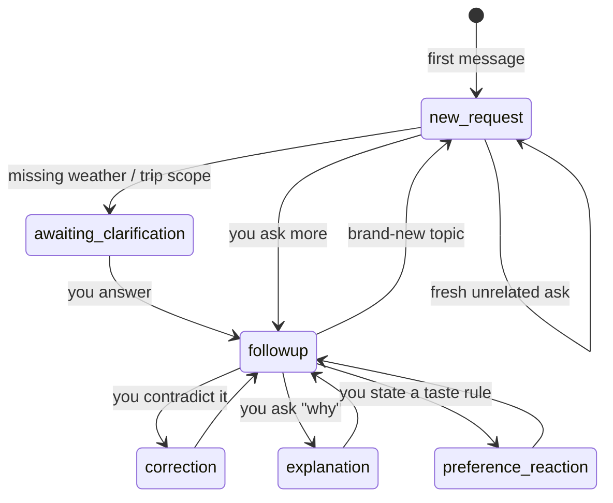
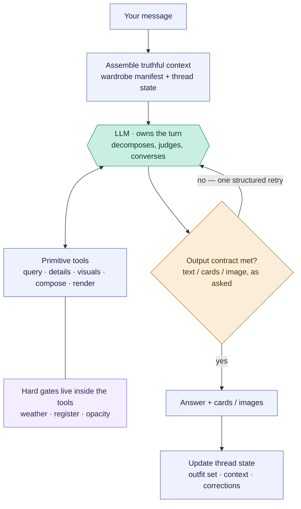

# Freeform stylist chat — `/ask`

The open chat box. Unlike the composition flows (which are linear pipelines),
this one is a **router**: each message is classified, the app decides whether to
pre-build outfits, the model runs a tool loop, and deterministic guards can
override the model before you see an answer. The model sits in the *middle*,
fenced by app logic on both sides.

Reading convention (see [use-my-wardrobe.md](use-my-wardrobe.md)): rectangles are
the app's own code, the hexagon labelled `LLM ·` is the model, diamonds are
decisions. There is exactly **one** model step here — everything around it is the
app deciding what to feed the model and whether to accept its answer.

## Pipeline overview (PM altitude)



The whole flow is four layers. The tables below list **every way** to reach each
state — that precision is why they're tables, not more boxes.

## Layer 0 — Turn classification

Every message is tagged with a *conversation mode* from its text plus whether the
thread has history (`classifyChatTurn`, `src/components/StylistChat.jsx:3590`;
server fallback `styling-engine/core.js:3404`). This sets the "CONVERSATION
CONTROLLER" directive in the system prompt.

| Mode | Reached when | Cross-turn? |
| --- | --- | --- |
| `new_request` | a fresh ask, or no thread history | starts a turn |
| `followup` | a follow-up about the current thread | yes |
| `correction` | you challenge / contradict a prior answer | yes |
| `explanation` | you ask "why did you…" | yes |
| `preference_reaction` | you state a taste preference to adapt to | yes |

## Layer 1 — App pre-routing (retired, spec 14)

> **Status 2026-07-16 (spec 14):** the broad-planning, travel precompose, and
> follow-up replan pre-routes — along with the deterministic engine composer
> they called (`composeOutfitSet`) — are **permanently deleted**, not just
> flag-disabled. `shouldEngageAskPrecompose`, `followupPrerouteEnabled`,
> `maybePrecomposeStructuredOutfitsForAsk`, `maybePrecomposeStructuredFollowupForAsk`,
> and `planFreeformUseCases` no longer exist; `WARDROBE_PLAN_PREROUTE` /
> `WARDROBE_BROAD_PLAN_PREROUTE` / `WARDROBE_FOLLOWUP_PREROUTE` have no effect.
> Every planning turn reaches the model + `plan_outfit_set`, which now always
> composes via the model-mode workbench (`buildPlanSlotWorkbench` +
> `submit_plan_outfits`) — there is no more engine-mode fallback
> (`WARDROBE_PLAN_COMPOSE=engine` no longer does anything either). Git history
> is the rollback path if a regression surfaces; see
> docs/freeform-rearchitecture-handoff.md's spec 14 entry.

There is no deterministic keyword pre-routing layer. Normally `POST /api/ai/ask` builds
`toolContext` and goes straight to Layer 2. **Flagged 2026-08-18:** with
both `WARDROBE_FREEFORM_ATOMIC_MULTILOOK=true` and
`WARDROBE_FREEFORM_EXECUTION_ROUTER=true`, a fresh request with no active piece, outfit or image
first reaches a compact model-owned execution router. It sees only the request, date and timezone.
It may directly select the narrow same-context 2–5-look profile; every other classification,
failure or incomplete bounded composition falls through to Layer 2 unchanged. The direct profile
does not assemble the wardrobe-manifest controller payload; the existing nested visual composer
still receives its photograph roster and Style Constitution. See
`docs/freeform-bounded-execution-spec.md` Phase 2.

**[corrected 2026-08-19]** Successful direct routing is an early model-call return, not an early
state return. Before responding, `/ask` persists normalized established context and the generated
`current_outfit_set` through `boundedConversationStateFromToolContext` and
`saveStylistConversationState`. The browser sends the actual chat thread ID on every `/ask` branch,
so server recovery and follow-up meaning do not rely on a client echo.

The direct bounded profile is also ineligible after any valid card has already been created during
the turn. This prevents a hybrid tool sequence from replacing an earlier `propose_outfit` card when
`generate_outfits` writes its batch. Shared time-of-day guidance requires physically adequate
arrival/departure coverage; around 55°F, a sleeveless vest over a light or short-sleeved base is not
narrated as sufficient warmth.

## Layer 2 — Model tool loop

Model-driven, up to 7 iterations (`askStylistWithTools`,
`styling-engine/provider.js:504`). The model chooses what to do:

| Action | What it means |
| --- | --- |
| *(no tool)* | conversational advice / evaluation prose |
| `search_wardrobe` (± `visual`) | look up real owned pieces |
| `propose_outfit` | render a verified outfit card ("show me") |
| `generate_outfits` | compose fresh cards from scratch |
| `plan_outfit_set` | compose coordinated multi-slot plans (trip, work-week, capsule, event set) from the deterministic planner |
| `render_preview` | render an image from an existing card only after the turn declares `want:"image"` |
| `get_garment_details` / `get_last_outfit_evaluation` / `get_current_image_inventory` | retrieve info |
| `store_user_correction` | persist a taste correction |

**[flagged, 2026-08-18] Bounded same-context batches.** When
`WARDROBE_FREEFORM_ATOMIC_MULTILOOK=true`, a new request for 2–5 fresh looks that share one
occasion, activity and weather context uses `generate_outfits` once. That tool invokes the existing
photograph-aware whole-wardrobe composer and returns the complete batch as the terminal paid step;
deterministic code supplies the short introduction and any shortfall disclosure. Named location
and resolved date are used for weather before roster construction, with the source recorded. The
nested call's token usage is added to the parent turn. A
validation shortfall is disclosed after that pass rather than reopening the serial
search/`propose_outfit` loop. One-look, multi-context, selected-piece and revision flows are not
changed. See `docs/freeform-bounded-execution-spec.md`.

The bounded tool call itself declares the card contract, so this profile does not call
`declare_intent` first. An ordinary new “what should I wear?” defaults to two options and enters
this path directly; an explicit one/best/pick-one request retains targeted search plus one card,
and an explicit count wins. Composer `reason`, `watchFor`, and `stylingInstructions` are locally
checked against their final IDs; deliberation or discarded-ID prose is withheld without another
paid iteration.

## Layer 3 — Output guards

Deterministic post-checks on the model's final text. Each can force **one** retry
with a correction message before you see anything (`applyFreeformOutputChecks`,
`styling-engine/provider.js:116`). This is where the app overrides the model.

| Guard | Fires when | Forces |
| --- | --- | --- |
| `destinationClarification` | travel answer without a destination | ask where you're going |
| `tripScopeClarification` | trip scope still ambiguous | ask what the trip covers |
| `outfitProse` | model wrote an outfit as prose | redo via `propose_outfit` tool |
| `outfitCount` | wrong number of outfits | retry with the right count |
| `zeroResultContradiction` | recommended pieces despite a zero-result search | retry honestly |

The `outfitCount` retry is intentionally bypassed after a bounded capsule or bounded same-context
batch has completed; those flows deliver accepted cards plus explicit gap language within their
one-composition-call budget.

The bounded introduction is deterministic and count-aware: one direction, two directions, or the
actual numeric count. Its shortfall sentence agrees grammatically with the number of ready cards.

**Cross-cutting inputs** that drive all four layers: `activeContext.type` (piece /
outfit / whole-wardrobe), the conversation mode, whether the thread already holds
outfits, message keywords (show·why·evaluate vs plan·pack·suggest, travel words,
multi-day, named destination), and weather source (text heuristic vs a live
forecast when a location is known).

## Conversation state across turns

Most routing is re-derived per message, but three things genuinely span turns: the
conversation mode (defined *by* history), the current outfit set (persists and
gets refined), and pending clarification (this turn asks → next turn answers = a
"waiting" state). This diagram shows the *typical* movement between Layer-0 modes —
classification is per-message, so these are common paths, not hard-coded edges.



## Engineer notes

- **Entry:** `POST /api/ai/ask` (`routes/ai.js`). The turn's `conversationMode`
  is classified client-side by `classifyChatTurn` and passed in the body.
- **Optional execution router:** `routeFreeformExecutionProfile` (`styling-engine/provider.js`)
  makes one compact structured call before `buildStylistConversationPayload` only under the Phase
  2 flag and eligibility boundary. A successful `bounded_multi` result calls `generate_outfits`
  directly and returns; otherwise the full path below remains authoritative.
- **No pre-route (spec 14):** the handler builds `toolContext` directly from
  the request body and goes straight to the model — planning turns rely
  entirely on the model calling `plan_outfit_set` itself.
- **The model call is `askStylistWithTools`** with the tools in
  `styling-engine/tools.js` and the `STYLIST_SYSTEM` prompt assembled in
  `buildStylistConversationPayload` (`styling-engine/core.js:3469`), which injects
  the conversation-mode directive, occasion/climate profiles, established weather,
  and thread context.
- **The loop caps at 7 iterations.** Tool calls (search, details, etc.) feed
  results back and continue; a plain text answer exits — unless a Layer-3 guard
  blocks it, which pushes a correction message and re-runs the model once per
  guard type.
- **`propose_outfit` vs `generate_outfits`:** `propose_outfit` renders a card from
  *verified* piece IDs (the model must `search_wardrobe` first); `generate_outfits`
  composes fresh cards from scratch. The `outfitProse` guard exists to force the
  model into `propose_outfit` when it tries to describe an outfit in prose instead.
- **`plan_outfit_set` vs image rendering:** `plan_outfit_set` creates cards and
  stores them as the current outfit set; it must not be followed by
  `render_preview` unless the user separately asks for an image. `render_preview`
  is tool-gated by declared image intent, so a cards-only planning turn cannot
  accidentally spend an image render.
- **Whole-wardrobe session memory:** `plan_outfit_set` does not write
  `whole_wardrobe_sessions`. The "Use my wardrobe" memory counter is touched by
  the visual composer path (`generate_outfits` / whole-wardrobe composer) and
  by legacy precompose when explicitly re-enabled, not by a plain model-called
  set plan.
- **Diagnostics:** each turn logs gate exclusions / proposal validation via
  `persistFreeformGenerationRun` (`routes/ai.js`), mirroring the composer's debug.

---

# Proposed architecture — from router to stylist

> **Status: in progress (2026-07).** Migration steps shipped so far: **1** —
> wardrobe manifest + structured thread state (#37); **3** — retrieval rule:
> pieces must be verified this turn, layers visually seen (#38); **4** —
> model-declared intent via a `declare_intent` tool, with the guards' phrasing
> regexes demoted to undeclared-turn fallbacks (#39); **5** — the guards
> collapsed into one turn-contract validator with three clauses (truth /
> context / delivery) and a single per-clause retry budget; delivery is checked
> against the declared want (`cardsNotDelivered`), and the legacy travel
> clarification clauses are kept as explicit retire-candidates pending live
> evidence; **2** (done after 3–5 once live results showed the rails were too
> expensive to follow) — the primitives: `view_pieces` (cheap batch thumbnails
> + truth lines — the designed way to satisfy the verification gates),
> `render_preview` (in-chat outfit render via the conditional image pipeline,
> so want:"image" is now satisfiable and contract-checked), `wardrobe_coverage`
> (exact grouped counts), and the `opacity` truth field (tagger → db → manifest
> / piece text / search results; existing pieces backfill on retag). Step 6
> (demote precompose) remains. The "current implementation" sections above
> predate the migration — cross-check against the code as steps land.

## The problem

The goal of freeform chat is a real conversation with a stylist who knows the
wardrobe — where tomorrow's question ("what pieces am I missing for a boho
outfit?", "how can I layer tank tops?") works without anyone having anticipated
it. The current architecture cannot get there, because **anticipation is its
control flow**: intent lives in ~6 independent keyword vocabularies (client turn
classifier, client editorial regex, server broad-planning and travel patterns,
the server ideal-mode regex, and five output-guard regexes). Every new kind of
question needs a new vocabulary entry, forever, and any two vocabularies can
drift apart (they already have — see the routing note in
[selected-piece-composer.md](selected-piece-composer.md)).

The evidence from this atlas points one way: the chat behaves where the model
*delegates to engines* (precompose → composer, `propose_outfit` → verified
cards) and misbehaves where routing guessed wrong or a capability was missing.

## The inversion

Current design: **deterministic code decides what happens; the model fills in
the words.** Target design: **the model owns the conversation and decides what
happens; deterministic code guarantees truth and form.**

The model brings the two things that cannot be enumerated in code — fashion
knowledge (what "boho" means) and conversational judgment (what this user is
asking for right now). The app brings the two things the model cannot be
trusted to freelance — **garment truth** (what the pieces actually are) and
**output form** (cards are cards, images are images). Today those
responsibilities are partially swapped: regexes attempt judgment, and garment
truth is optional at recommendation time.

## Target shape



Note what disappeared relative to the current pipeline diagram: the pre-route
decision and the five bespoke guards. Routing moved *into* the hexagon; truth
moved *into* the tools; form became one generic contract check.

## The five pillars

1. **Thick, truthful context.** The stylist "knows the wardrobe" by reading it,
   not searching for it. The full wardrobe manifest already rides in the system
   prompt (`CURRENT WARDROBE TRUTH`, `core.js:3740`) — make it the centerpiece:
   compact per-piece truth (attributes + confidence), plus structured **thread
   state** (current outfit set, established weather/occasion/destination, pinned
   pieces, saved corrections). At ~224 pieces this fits comfortably and caches.
   Most questions then need *zero* tool round-trips to reason about coverage.
2. **Tools as primitives, not pre-scripted flows.** Keep the engines
   (`generate_outfits`, `propose_outfit`) but add the missing query surface:
   aggregate/coverage queries ("count relaxed bottoms rated for city"), cheap
   batch visual fetch, and a `render_preview` that wraps the existing image
   renderers. Open-ended questions decompose into these primitives plus model
   judgment — no router ever needs to have seen the phrasing.
3. **Hard gates live in the data layer, not the conversation layer.** This is
   the settled lesson of the app's gate history: `search_wardrobe`'s
   compose-intent filtering, the register ceiling, weather gates — and new
   truth fields like opacity/lining — belong inside the tools, where they make
   it *impossible* for the model to be handed garbage. Gates guarantee the
   floor; the model supplies the taste. A recommendation may only name a piece
   retrieved this turn; base-layer suggestions require visual verification.
4. **One structural output contract instead of five lexical guards.** Outfit
   content travels only via typed tool calls; prose is for conversation. The
   check becomes generic: *does the response satisfy the declared want (text /
   cards / image)?* Each existing guard retires as its upstream cause is fixed —
   `zeroResultContradiction` dies when recommendations must cite retrieved IDs;
   `outfitProse` becomes schema validation; the clarification guards become the
   model's own judgment, informed by thread state.
5. **Model-initiated engines replace pre-routing.** Precompose exists because
   the design didn't trust the model to call `generate_outfits` at the right
   moment. In the target the model invokes the same engine when *it* judges the
   turn to be a planning request. Precompose may survive as a latency
   optimization — but it stops being load-bearing for correctness.

## The generalization test

Neither of these strings appears anywhere in code — both must work:

- *"What pieces am I missing to create a boho outfit?"* — model interprets
  "boho" from its own fashion knowledge → scans the in-prompt manifest → names
  what qualifies, what's absent → optionally hands off to
  [editorial ideal additions](editorial-ideal-additions.md) for shop-the-gap
  directions. No routing entry required.
- *"How can I layer tank tops?"* — model pulls the actual tanks from the
  manifest → verifies fabric weight / silhouette / opacity via detail + visual
  primitives → gives layering advice citing real owned pieces → optionally one
  `propose_outfit` card as an example. No routing entry required.

## What we trade away

- **Latency/cost:** more tool round-trips on some turns; mitigated by the
  in-prompt manifest (most turns become zero-round-trip) and prompt caching.
- **Route determinism:** "this phrasing always does X" is no longer testable.
  Instead, test *invariants* — gates, contracts, "named pieces were retrieved
  this turn" — which is the shape `test/aiEndpointContracts.test.js` already has.
- **Model dependence:** this leans on a strong model. The current architecture
  was a rational hedge when it was built; the guards should be dismantled *as*
  their upstream causes are fixed, never before.

## Migration path (each step ships alone)

1. **Context first:** strengthen the wardrobe manifest (attributes +
   confidence) and add structured thread state to the payload.
2. **Primitives:** coverage/aggregate query, batch visual fetch,
   `render_preview`; add the opacity/lining truth field to the tagger.
3. **Retrieval rule:** recommendations may only cite pieces retrieved this
   turn; base-layer/skin-contact advice requires `visual: true`.
4. **Intent declaration:** the model declares the turn's `want`
   (text/cards/image) — client regex classification becomes advisory, then dies.
5. **Contract check:** collapse the five guards into the one generic
   "want satisfied + schema valid" validator.
6. **Demote precompose** to an optimization once model-initiated
   `generate_outfits` proves equivalent on the planning cases.

What deliberately does **not** change: the composer engines and their gates, the
no-repair-in-advisor-mode decision, `store_user_correction` and its recall, and
the card contract (`propose_outfit` with verified IDs) — those are the parts the
atlas showed to be working.

## Step 6 resolution — the planning engine (designed 2026-07-12, not yet built)

Live trip tests settled step 6 with evidence in both directions: the model CAN
self-compose planning turns, but the trip precompose produces something the
model cannot — the **plan**: slot coverage and cross-outfit piece-reuse
analysis ("Packing reuse: 12 distinct pieces"). So precompose isn't demoted
wholesale; its planning capability is generalized and moved behind the model.

**What the trip planner actually is:** multi-outfit composition under *shared
constraints* — outfits that aren't independent because they share an objective.
That capability generalizes:

| Scenario | Slots | Shared constraint |
| --- | --- | --- |
| Trip packing | day / evening / hike / coast | maximize piece reuse |
| Capsule building | use-cases | hard piece budget |
| Work week | days | no-repeat tops, per-slot register |
| Event weekend | rehearsal / ceremony / brunch | escalating register, shared shoes |
| Carry-on week | days | piece budget + laundry cycle |
| New-piece integration | occasions | shared anchor across all outfits |
| Versatility audit | — | pure reuse optimization |

**The structure — planner as a tool, not a pre-route:**

```
plan_outfit_set({
  slots: [ { label, occasion, activity, count, register?, location?, date? } ],
  date_range: { start?, end? },          // plan default; slot.date overrides per slot
  constraints: {
    reuse: 'maximize' | 'diversify' | 'none',   // signed dial — see shape validation below
    no_repeat: [category], allow_repeat: [category],
    piece_budget,
    shared_anchor_ids                    // anchors are exempt from no_repeat
  }
})
// slot array order is meaningful: it is the wearing sequence
```

- **The model decomposes** the request into slots in the tool arguments — this
  is judgment ("mainly wineries, hiking, *maybe* the coast" → 3 winery + 1
  dinner + 1 hike + 1 optional coast), and doing it natively retires the
  separate `planFreeformUseCases` LLM call and its fragile JSON scraping
  (observed failing live: "Expected double-quoted property name").
- **The engine composes**: the existing gated slot composition + reuse
  optimization (`buildLocalTripSlotOutfits` generalized into
  `composeOutfitSet`), returning cards *plus plan lines* (coverage, reuse
  report) in the shape the client already renders for trip cards.
- **Per-slot live weather** (added 2026-07-12 after the coastal-microclimate
  miss: a 60°F coast day was composed for inland Paso Robles heat): each slot
  resolves its own weather via `getWeatherProfileForPlan({ dateRange,
  location })` in `styling-engine/weather.js` — Open-Meteo, geocoded free-text
  locations, cached, multi-day aggregation that already supports
  hot-days/cool-nights swings. Both weather functions were built in the spec-4
  live-weather work (a33347d); `getCurrentWeatherProfile` got attached then
  (search gating, propose gates) while the plan variant shipped with tests but
  its product consumer never landed — this step is that consumer. Slot
  location defaults to
  the trip destination; the model supplies overrides ("drive to the Coast" →
  a coastal town). User-stated weather still wins when given for a slot; the
  forecast fills the gaps and catches microclimates. The plan lines should
  state the per-slot weather used, so the user can correct it conversationally.
- **The keyword pre-routes retire on evidence**: `isTravelOrPackingRequest` and
  `isBroadOutfitPlanningText` become a legacy fast path, removed once
  diagnostics show the model calls `plan_outfit_set` reliably on planning
  turns — the same evidence-gated retirement rule as the context clauses.

### Shape validation — the contract walked through more than one use case

Done 2026-07-12 before building, so the schema isn't shaped around trips
alone. Each scenario stress-tests a different dimension; four contract
changes fell out (already folded into the block above).

| Scenario | What it stress-tests | Verdict / change |
| --- | --- | --- |
| Trip packing ("5 days Paso Robles, wineries + hike") | fuzzy slots in a date range, per-slot location weather, reuse maximization | baseline — covered |
| Work week ("outfits for Mon–Fri, Thursday client-facing") | slots that ARE dates; **reuse inverted** — at home, repeats are the failure, not the win; per-slot register | added `slot.date` (Monday's forecast ≠ Thursday's; a range average is wrong); `reuse` became a signed dial (`maximize` for packing, `diversify` for weeks) with per-category `no_repeat` / `allow_repeat` (tops shouldn't repeat, shoes may) |
| Event weekend (rehearsal / ceremony / brunch) | mixed objective: suitcase reuse AND marquee distinctness; register escalation | per-category reuse covers it (repeat shoes and layers, never the ceremony dress); `slot.register` carries the escalation — **built 2026-07-13** (`tripOutfitRegisterEscalationScore`: a `dressy`/`formal` slot demotes denim, casual jackets, tees, sneakers and rewards a dress/tailored + heels) after a live wedding-ceremony miss composed it in denim + a leather zip |
| Capsule building ("10-piece summer capsule") | objective inversion: piece budget is primary, outfits are the proof; no dates at all | `date_range` optional ✓, season-level weather; the plan report must lead with the piece roster + combination count → **report sections are objective-driven**, not hardcoded to "Packing reuse: N" |
| New-piece integration ("4 outfits around the white pants") | one piece pinned everywhere while supports vary | `shared_anchor_ids` ✓ + explicit rule: anchors are exempt from `no_repeat` (otherwise the two constraints contradict) |
| Carry-on / laundry cycle ("2 weeks, laundry mid-trip") | wear-count budgets and a reset point in the sequence | deferred to v2 — but "slot array order = wearing sequence" is declared now so a reset marker can slot in later without reshaping |
| Versatility audit ("which 8 pieces work hardest?") | slotless pure optimization — no occasions to compose for | out of scope for `plan_outfit_set`; if it ever ships it's a `wardrobe_coverage` extension, not a planning call |

**Deferred to v2 (recorded, not designed):** slot-level avoid-lists ("no white
at the wedding" — feedback memory and conversation handle it today),
wear-count budgets with laundry resets, slotless optimization.

Build order when picked up: (1) extract `composeOutfitSet` from the trip-slot
builder — **SHIPPED 2026-07-13** (`styling-engine/outfitSetPlanner.js`; both
pre-route call sites now import it), (2) expose the tool + record cards with
slot labels/coverage lines — **SHIPPED 2026-07-13** (`plan_outfit_set` in
tools.js: declared-intent gate, cards recorded with source `plan_outfit_set`
+ source lock, plan lines returned to the model, `planOutfitSetCalls`
diagnostic; the client renders both planned-set sources through the trip
presentation), (3) wire per-slot weather via `getWeatherProfileForPlan` —
**SHIPPED 2026-07-13** (each slot resolves its own forecast from `slot.location`
+ `slot.date` or the plan `date_range`; the tool schema gained per-slot
`location`/`date` and plan-level `location`/`date_range`; user-stated per-slot
`weather` wins over the forecast; a live forecast is authoritative in
`tripSlotFitScore` so a slot's inherited hot season text can't re-inject heat
into a cool coast slot; plan lines now carry a `Weather used: <slot> — <label>`
line so the user can correct it conversationally), (4) implement the reuse dial +
per-category repeat rules with the anchor exemption — **SHIPPED 2026-07-13**
(`constraints` on the tool: signed `reuse` dial `maximize`/`diversify`/`none`,
per-category `no_repeat`/`allow_repeat` mapped to category groups, and
`shared_anchor_ids` hard-pinned via `buildWholeWardrobeCandidateOutfits`'s
`requiredPieceId` and exempt from `no_repeat`; `normalizePlanConstraints`
parses them), (5) objective-driven
plan report — **SHIPPED 2026-07-13** (`buildPlanReport` picks the report by
objective: a `piece_budget` leads with the piece roster + combination count and
flags over/under budget; a `diversify`/`no_repeat` plan leads with the repeat
schedule ("every look is distinct" being the win); everything else keeps the
packing-reuse headline), (6) prompt — **SHIPPED 2026-07-13** (a "Planning a
Coordinated Multi-Outfit Set" bullet in `STYLIST_SYSTEM`: on the initial
planning turn the model calls `plan_outfit_set` instead of hand-composing, YOU
decompose into slots, set per-slot `location`/`date` for microclimates and
specific days, and choose `constraints` from the objective; the returned cards
become the Current outfit set that `propose_outfit` then revises; reinforced
2026-07-13 after a live miss — an at-home multi-day plan with no place named
must route to `plan_outfit_set` on the calendar season, NOT stall on a weather
question, so the planning instinct beats the weather-clarification reflex),
(7) run both paths in parallel with diagnostics — **SHIPPED 2026-07-13**
(`recordPlanPathDiagnostics` writes per-turn `planKeywordMatched` /
`planPrerouteComposed` / `planModelCalled` and a single `planPathOutcome`
— `both` / `model_only` / `preroute_only` / `planning_uncomposed` /
`not_planning` — into the debug block; a steady stream of `model_only` on
turns the regex missed is the evidence step 8 needs), (8) retire the keyword
pre-route — **SHIPPED 2026-07-13** (the broad-planning, non-travel pre-route is
retired by default via `shouldEngageAskPrecompose`: work-week / capsule / event
turns now fall through to the model + `plan_outfit_set`; live evidence showed
those turns self-route `model_only` and the pre-route only produced weaker,
unconstrained sets — the capsule lost its budget/roster entirely. The TRAVEL
pre-route is now retired too: a real Paso Robles trip self-routed `model_only`
with its own hiking slot + per-slot coastal location, weather resolved live from
`location`. `shouldEngageAskPrecompose` returns false for both branches by
default; `WARDROBE_PLAN_PREROUTE=on` restores the whole legacy path as a
reversible fallback. **The 8-step plan is complete.**).

**Caveat (2026-07-13 architecture review): step 8 retired the NEW-REQUEST
pre-routes only.** The follow-up replan path
(`maybePrecomposeStructuredFollowupForAsk`) is not gated by
`shouldEngageAskPrecompose` or the flag — on any `followup`-classified turn
whose thread already holds an outfit set, it still front-runs the model via
`planFreeformUseCases` + an unconstrained `composeOutfitSet` (no reuse dial,
no constraints). Because `classifyChatTurn` labels nearly every post-first
turn `followup` (the deliberate spec-10 ruling), this is the last
keyword-era front-runner and it sits on the highest-traffic path; it can
replace a model-planned, constraint-carrying set with a constraint-free one.
Retiring it is the top item in
[../freeform-rearchitecture-handoff.md](../freeform-rearchitecture-handoff.md)'s
remaining work — same evidence-gated play as step 8.

**Resolved (spec 14, 2026-07-16):** the follow-up pre-route was retired by
default (2026-07-14) and then deleted outright, along with the
new-request pre-routes, `planFreeformUseCases`, and `composeOutfitSet` itself
(the engine composer both pre-routes and the legacy `WARDROBE_PLAN_COMPOSE=engine`
tool branch called). See "Layer 1" above and the handoff doc's spec 14 entry —
this whole caveat and the build-log above it are now historical.
