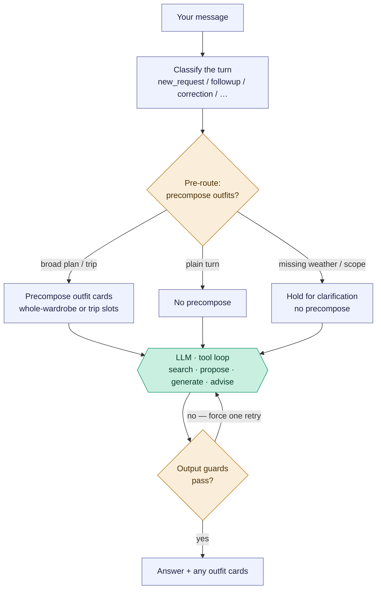
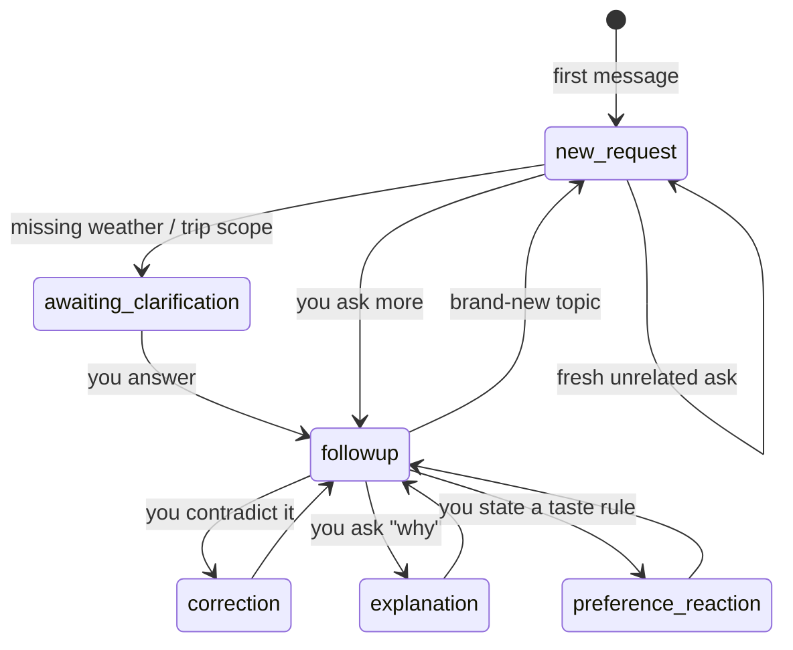
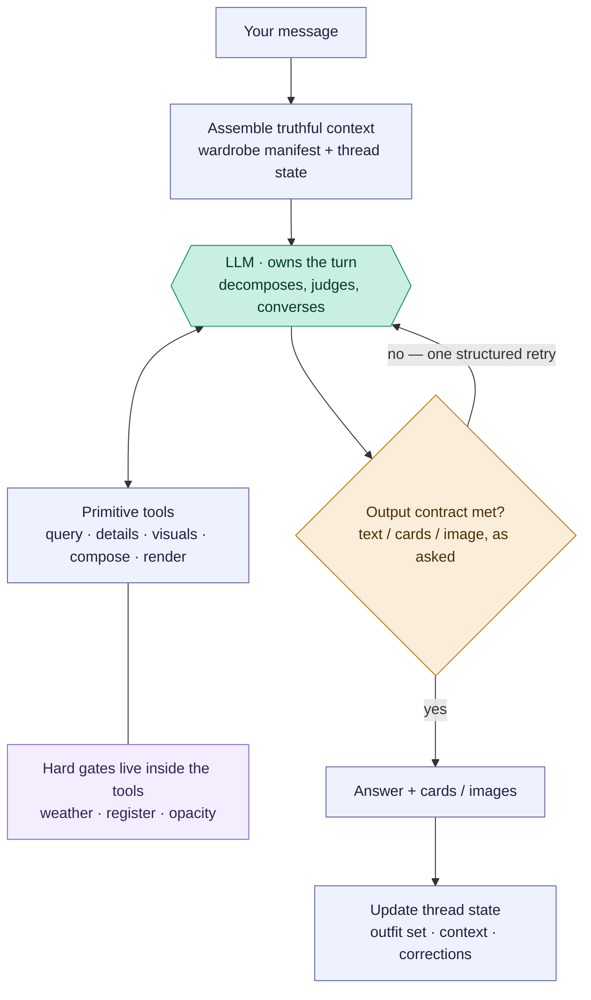

# Freeform stylist chat — `/ask`

The open chat box. Unlike the composition flows (which are linear pipelines),
this one is a **router**: each message is classified, the app decides whether to
pre-build outfits, the model runs a tool loop, and deterministic guards can
override the model before you see an answer. The model sits in the *middle*,
fenced by app logic on both sides.

Reading convention (see [use-my-wardrobe.md](use-my-wardrobe.md)): rectangles are
the app's own code, the hexagon labelled `LLM ·` is the model, diamonds are
decisions. There is exactly **one** model step here — everything around it is the
app deciding what to feed the model and whether to accept its answer.

## Pipeline overview (PM altitude)

The whole flow is four layers. The tables below list **every way** to reach each
state — that precision is why they're tables, not more boxes.

## Layer 0 — Turn classification

Every message is tagged with a *conversation mode* from its text plus whether the
thread has history (`classifyChatTurn`, `src/components/StylistChat.jsx:3590`;
server fallback `styling-engine/core.js:3404`). This sets the "CONVERSATION
CONTROLLER" directive in the system prompt.

| Mode | Reached when | Cross-turn? |
| --- | --- | --- |
| `new_request` | a fresh ask, or no thread history | starts a turn |
| `followup` | a follow-up about the current thread | yes |
| `correction` | you challenge / contradict a prior answer | yes |
| `explanation` | you ask "why did you…" | yes |
| `preference_reaction` | you state a taste preference to adapt to | yes |

## Layer 1 — App pre-routing

Deterministic, *before* the model. Decides whether to pre-build outfit cards for
the turn (`maybePrecomposeStructuredOutfitsForAsk`, `routes/ai.js:1207`;
`maybePrecomposeStructuredFollowupForAsk`, `routes/ai.js:1320`).

| State | Triggers | Result |
| --- | --- | --- |
| Broad-planning precompose | `new_request`, no active piece/outfit, no existing outfits, text matches "outfits/pack/capsule…" + "suggest/plan/wear…" (and *not* show/why/evaluate) | precompose whole-wardrobe cards |
| Travel/packing precompose | travel request **and** weather known **and** scope clear | precompose trip-slot outfits |
| Follow-up replan | `followup` **and** the thread already has outfits | refine the current set |
| Travel-weather blocker | travel request **with no weather** | no precompose; prompt forces "ask for weather first" |
| Trip-scope hold | multi-day trip, too few stated use-cases | no precompose; model must ask scope |
| None (plain turn) | anything else | straight to the model |

## Layer 2 — Model tool loop

Model-driven, up to 7 iterations (`askStylistWithTools`,
`styling-engine/provider.js:504`). The model chooses what to do:

| Action | What it means |
| --- | --- |
| *(no tool)* | conversational advice / evaluation prose |
| `search_wardrobe` (± `visual`) | look up real owned pieces |
| `propose_outfit` | render a verified outfit card ("show me") |
| `generate_outfits` | compose fresh cards from scratch |
| `get_garment_details` / `get_last_outfit_evaluation` / `get_current_image_inventory` | retrieve info |
| `store_user_correction` | persist a taste correction |

## Layer 3 — Output guards

Deterministic post-checks on the model's final text. Each can force **one** retry
with a correction message before you see anything (`applyFreeformOutputChecks`,
`styling-engine/provider.js:116`). This is where the app overrides the model.

| Guard | Fires when | Forces |
| --- | --- | --- |
| `destinationClarification` | travel answer without a destination | ask where you're going |
| `tripScopeClarification` | trip scope still ambiguous | ask what the trip covers |
| `outfitProse` | model wrote an outfit as prose | redo via `propose_outfit` tool |
| `outfitCount` | wrong number of outfits | retry with the right count |
| `zeroResultContradiction` | recommended pieces despite a zero-result search | retry honestly |

**Cross-cutting inputs** that drive all four layers: `activeContext.type` (piece /
outfit / whole-wardrobe), the conversation mode, whether the thread already holds
outfits, message keywords (show·why·evaluate vs plan·pack·suggest, travel words,
multi-day, named destination), and weather source (text heuristic vs a live
forecast when a location is known).

## Conversation state across turns

Most routing is re-derived per message, but three things genuinely span turns: the
conversation mode (defined *by* history), the current outfit set (persists and
gets refined), and pending clarification (this turn asks → next turn answers = a
"waiting" state). This diagram shows the *typical* movement between Layer-0 modes —
classification is per-message, so these are common paths, not hard-coded edges.

## Engineer notes

- **Entry:** `POST /api/ai/ask` (`routes/ai.js:3460`). The turn's `conversationMode`
  is classified client-side by `classifyChatTurn` and passed in the body.
- **Pre-route order:** `maybePrecomposeStructuredOutfitsForAsk` runs first (only
  for `new_request`); if it returns null, `maybePrecomposeStructuredFollowupForAsk`
  handles follow-ups that already have an outfit set. Precompose reuses the
  whole-wardrobe visual composer / local trip-slot builder — so a "plan me a
  trip" chat quietly runs the same machinery as [Use my wardrobe](use-my-wardrobe.md).
- **The model call is `askStylistWithTools`** with the tools in
  `styling-engine/tools.js` and the `STYLIST_SYSTEM` prompt assembled in
  `buildStylistConversationPayload` (`styling-engine/core.js:3469`), which injects
  the conversation-mode directive, occasion/climate profiles, established weather,
  and thread context.
- **The loop caps at 7 iterations.** Tool calls (search, details, etc.) feed
  results back and continue; a plain text answer exits — unless a Layer-3 guard
  blocks it, which pushes a correction message and re-runs the model once per
  guard type.
- **`propose_outfit` vs `generate_outfits`:** `propose_outfit` renders a card from
  *verified* piece IDs (the model must `search_wardrobe` first); `generate_outfits`
  composes fresh cards from scratch. The `outfitProse` guard exists to force the
  model into `propose_outfit` when it tries to describe an outfit in prose instead.
- **Diagnostics:** each turn logs gate exclusions / proposal validation via
  `persistFreeformGenerationRun` (`routes/ai.js`), mirroring the composer's debug.

---

# Proposed architecture — from router to stylist

> **Status: in progress (2026-07).** Migration steps shipped so far: **1** —
> wardrobe manifest + structured thread state (#37); **3** — retrieval rule:
> pieces must be verified this turn, layers visually seen (#38); **4** —
> model-declared intent via a `declare_intent` tool, with the guards' phrasing
> regexes demoted to undeclared-turn fallbacks. Step 2 (query/visual primitives
> + opacity tag field) is deliberately postponed; steps 5–6 remain. The
> "current implementation" sections above predate the migration — cross-check
> against the code as steps land.

## The problem

The goal of freeform chat is a real conversation with a stylist who knows the
wardrobe — where tomorrow's question ("what pieces am I missing for a boho
outfit?", "how can I layer tank tops?") works without anyone having anticipated
it. The current architecture cannot get there, because **anticipation is its
control flow**: intent lives in ~6 independent keyword vocabularies (client turn
classifier, client editorial regex, server broad-planning and travel patterns,
the server ideal-mode regex, and five output-guard regexes). Every new kind of
question needs a new vocabulary entry, forever, and any two vocabularies can
drift apart (they already have — see the routing note in
[selected-piece-composer.md](selected-piece-composer.md)).

The evidence from this atlas points one way: the chat behaves where the model
*delegates to engines* (precompose → composer, `propose_outfit` → verified
cards) and misbehaves where routing guessed wrong or a capability was missing.

## The inversion

Current design: **deterministic code decides what happens; the model fills in
the words.** Target design: **the model owns the conversation and decides what
happens; deterministic code guarantees truth and form.**

The model brings the two things that cannot be enumerated in code — fashion
knowledge (what "boho" means) and conversational judgment (what this user is
asking for right now). The app brings the two things the model cannot be
trusted to freelance — **garment truth** (what the pieces actually are) and
**output form** (cards are cards, images are images). Today those
responsibilities are partially swapped: regexes attempt judgment, and garment
truth is optional at recommendation time.

## Target shape

Note what disappeared relative to the current pipeline diagram: the pre-route
decision and the five bespoke guards. Routing moved *into* the hexagon; truth
moved *into* the tools; form became one generic contract check.

## The five pillars

1. **Thick, truthful context.** The stylist "knows the wardrobe" by reading it,
   not searching for it. The full wardrobe manifest already rides in the system
   prompt (`CURRENT WARDROBE TRUTH`, `core.js:3740`) — make it the centerpiece:
   compact per-piece truth (attributes + confidence), plus structured **thread
   state** (current outfit set, established weather/occasion/destination, pinned
   pieces, saved corrections). At ~224 pieces this fits comfortably and caches.
   Most questions then need *zero* tool round-trips to reason about coverage.
2. **Tools as primitives, not pre-scripted flows.** Keep the engines
   (`generate_outfits`, `propose_outfit`) but add the missing query surface:
   aggregate/coverage queries ("count relaxed bottoms rated for city"), cheap
   batch visual fetch, and a `render_preview` that wraps the existing image
   renderers. Open-ended questions decompose into these primitives plus model
   judgment — no router ever needs to have seen the phrasing.
3. **Hard gates live in the data layer, not the conversation layer.** This is
   the settled lesson of the app's gate history: `search_wardrobe`'s
   compose-intent filtering, the register ceiling, weather gates — and new
   truth fields like opacity/lining — belong inside the tools, where they make
   it *impossible* for the model to be handed garbage. Gates guarantee the
   floor; the model supplies the taste. A recommendation may only name a piece
   retrieved this turn; base-layer suggestions require visual verification.
4. **One structural output contract instead of five lexical guards.** Outfit
   content travels only via typed tool calls; prose is for conversation. The
   check becomes generic: *does the response satisfy the declared want (text /
   cards / image)?* Each existing guard retires as its upstream cause is fixed —
   `zeroResultContradiction` dies when recommendations must cite retrieved IDs;
   `outfitProse` becomes schema validation; the clarification guards become the
   model's own judgment, informed by thread state.
5. **Model-initiated engines replace pre-routing.** Precompose exists because
   the design didn't trust the model to call `generate_outfits` at the right
   moment. In the target the model invokes the same engine when *it* judges the
   turn to be a planning request. Precompose may survive as a latency
   optimization — but it stops being load-bearing for correctness.

## The generalization test

Neither of these strings appears anywhere in code — both must work:

- *"What pieces am I missing to create a boho outfit?"* — model interprets
  "boho" from its own fashion knowledge → scans the in-prompt manifest → names
  what qualifies, what's absent → optionally hands off to
  [editorial ideal additions](editorial-ideal-additions.md) for shop-the-gap
  directions. No routing entry required.
- *"How can I layer tank tops?"* — model pulls the actual tanks from the
  manifest → verifies fabric weight / silhouette / opacity via detail + visual
  primitives → gives layering advice citing real owned pieces → optionally one
  `propose_outfit` card as an example. No routing entry required.

## What we trade away

- **Latency/cost:** more tool round-trips on some turns; mitigated by the
  in-prompt manifest (most turns become zero-round-trip) and prompt caching.
- **Route determinism:** "this phrasing always does X" is no longer testable.
  Instead, test *invariants* — gates, contracts, "named pieces were retrieved
  this turn" — which is the shape `test/aiEndpointContracts.test.js` already has.
- **Model dependence:** this leans on a strong model. The current architecture
  was a rational hedge when it was built; the guards should be dismantled *as*
  their upstream causes are fixed, never before.

## Migration path (each step ships alone)

1. **Context first:** strengthen the wardrobe manifest (attributes +
   confidence) and add structured thread state to the payload.
2. **Primitives:** coverage/aggregate query, batch visual fetch,
   `render_preview`; add the opacity/lining truth field to the tagger.
3. **Retrieval rule:** recommendations may only cite pieces retrieved this
   turn; base-layer/skin-contact advice requires `visual: true`.
4. **Intent declaration:** the model declares the turn's `want`
   (text/cards/image) — client regex classification becomes advisory, then dies.
5. **Contract check:** collapse the five guards into the one generic
   "want satisfied + schema valid" validator.
6. **Demote precompose** to an optimization once model-initiated
   `generate_outfits` proves equivalent on the planning cases.

What deliberately does **not** change: the composer engines and their gates, the
no-repair-in-advisor-mode decision, `store_user_correction` and its recall, and
the card contract (`propose_outfit` with verified IDs) — those are the parts the
atlas showed to be working.
