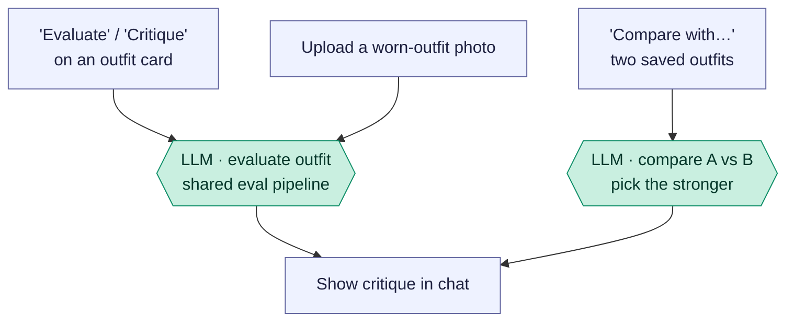

# Outfit evaluation — "Evaluate", "Critique", photo feedback & compare

The stylist's critique flows. Three entry points, all **text-model** calls that
judge an outfit (using its photo and linked garment images as vision input):
evaluate/critique a saved or generated outfit, get feedback on an **uploaded
photo**, or **compare two** saved outfits. No images are generated here — the
model reads images and returns prose.

Reading convention (see [use-my-wardrobe.md](use-my-wardrobe.md)): rectangles are
the app's own code, `LLM ·` hexagons are the text model (Claude), diamonds are
decisions.

## Overview (PM altitude)

Takeaways:

- **Evaluate and photo-feedback share one pipeline.** Whether the outfit is a
  saved/generated one (card button) or a freshly uploaded photo, both run through
  the same `evaluateOutfitThroughSharedPipeline` — the difference is just where the
  image comes from.
- **Compare is its own call.** "Compare two outfits" loads both outfits' photos +
  linked pieces and asks the model to make a call — it's built to *not* hedge
  ("do not give a vague 'both are nice' answer").
- **Vision in, prose out.** All three send images to the model for judgment but
  return only text — no image generation, so they're fast and cheap relative to
  the render flows.

## The three endpoints

| Action | Endpoint | Entry |
| --- | --- | --- |
| Evaluate / critique an outfit | `/evaluate-wardrobe-outfit` | "Evaluate" card button; "Critique" in the Lookbook |
| Feedback on an uploaded photo | `/outfit-feedback` | upload a worn-outfit photo |
| Compare two outfits | `/compare-outfits` | "Compare with…" on a saved outfit |

### Stage map

| Stage | What happens | Where |
| --- | --- | --- |
| A | "Evaluate outfit" / "Critique" | `StylistChat.jsx:2323` / `OutfitLookbook.jsx:1775` → `POST /evaluate-wardrobe-outfit` (`routes/ai.js:3176`) |
| B | Upload a worn-outfit photo | `POST /outfit-feedback` (`routes/ai.js:3226`) |
| C | "Compare with…" | `POST /compare-outfits` (`routes/ai.js:3387`) |
| P | Shared critique | `evaluateOutfitThroughSharedPipeline` (`styling-engine/core.js:2685`) |
| Q | Head-to-head | `askStylist(COMPARE_OUTFITS_SYSTEM)` |

Engineer notes:

- **Shared pipeline** (`evaluateOutfitThroughSharedPipeline`, `core.js:2685`):
  gathers up to 5 garment reference images + the outfit photo (saved, generated,
  or uploaded), and runs the critique. `evaluate-wardrobe-outfit` resolves a saved
  outfit's linked pieces first (`buildSavedOutfitEvaluationContext`); `outfit-feedback`
  passes `allowPhotoOnly` and the active-wardrobe text so the model can identify
  likely owned garments from the photo.
- **`responseMode`** on evaluate controls depth — `full` for the structured
  critique template, `followup` for a short conversational reply (this is the same
  mode the freeform chat uses; see [freeform-stylist-chat.md](freeform-stylist-chat.md)).
- **Compare** (`routes/ai.js:3387`) attaches both outfit photos and their linked
  (or likely) pieces, plus confirmed-outfit taste memory, and uses
  `COMPARE_OUTFITS_SYSTEM`. Returns `{ feedback }` prose.
- **Uploaded photos persist, owned by the thread** — **amended 2026-08-20.** They used to be
  deleted in a `finally` block right after the model call, which made this endpoint the only
  thing that ever saw the garment: an uploaded piece has no `pieces` row and no lookbook entry,
  so every later turn in the same thread was blind to it, and the chat thumbnail fell back to a
  browser `blob:` URL that died on reload. `outfit-feedback` now keeps the file and returns its
  filename as `photo`; the client stores that on the message as `uploadedPhoto`. Retention is
  thread-scoped — `DELETE /chat-threads/:id` (`routes/crud.js`) unlinks each `uploadedPhoto` its
  messages cite, skipping any file still referenced by a `pieces` row, an `outfits` row, or
  another thread. A failed critique still unlinks, since nothing will hold a reference.
- **[open] Follow-up turns still do not reach the saved photo.** The client picks the endpoint by
  "is a file attached to this message" (`StylistChat.jsx`, the `fileToSend` branch), so message 1
  reaches `/outfit-feedback` and every later turn goes to `/ask`, which has no access to the
  upload. Persisting the file is the precondition for fixing that; the routing decision is not
  made yet.
