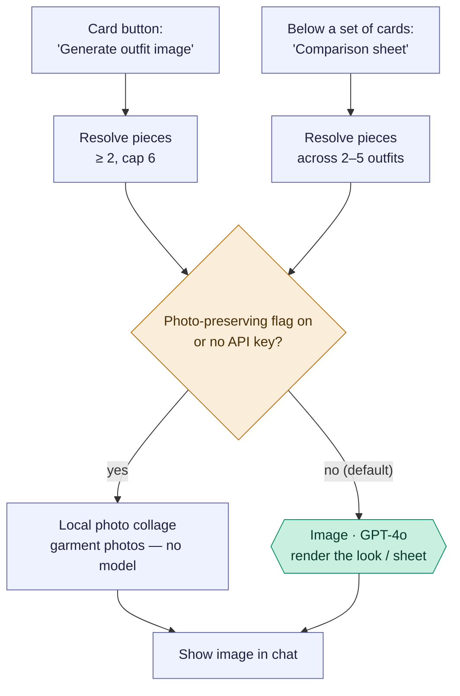

# Outfit image renders — "Generate image" & "Comparison sheet"

Two ways to turn outfit *cards* into a rendered image: **Generate outfit image**
(one full look) on a single card, and **Comparison sheet** (several looks side by
side) below a set of cards. Both are the same conditional pattern as the other
image flows — GPT-4o by default, a local photo collage as fallback.

Reading convention (see [use-my-wardrobe.md](use-my-wardrobe.md)): rectangles are
the app's own code, `Image ·` hexagons are the image model (GPT-4o), diamonds are
decisions.

## Overview (PM altitude)

Takeaways:

- **Two entry points, one render pattern.** A single card renders **one full-outfit
  look**; the sheet renders **2–5 outfits on one contact sheet** for quick
  comparison. Different render function, same conditional-GPT-4o structure.
- **Conditional model, like the rest.** Both fall back to a local collage (no
  model) when `PHOTO_PRESERVING_VISUALS` is on or there's no API key — same as
  [saved-outfit variants](saved-outfit-variants.md).
- **These sit on top of the composition flows.** The cards come from
  [Use my wardrobe](use-my-wardrobe.md), freeform chat, etc.; rendering is an
  opt-in action layered on any outfit card.

## The two endpoints

| Action | Endpoint | Renders |
| --- | --- | --- |
| Generate outfit image | `/generate-wardrobe-outfit-image` | one full-outfit look |
| Comparison sheet | `/generate-wardrobe-outfit-comparison-sheet` | 2–5 outfits on one sheet |

### Stage map

| Stage | What happens | Where |
| --- | --- | --- |
| A | "Generate outfit image" on a card | `StylistChat.jsx:2807` → `POST /api/ai/generate-wardrobe-outfit-image` (`routes/ai.js:2990`) |
| C | "Comparison sheet" below a set | `StylistChat.jsx:2857` → `POST /api/ai/generate-wardrobe-outfit-comparison-sheet` (`routes/ai.js:3021`) |
| B/D | Resolve pieces from the outfit(s) | ≥ 2 pieces required |
| E/F/G | Render | `createWholeWardrobeOutfitImage` (`core.js:2199`) / `createWholeWardrobeComparisonSheetImage` (`core.js:2289`) |

Engineer notes:

- **Single render** (`createWholeWardrobeOutfitImage`, `core.js:2199`): up to 6
  pieces; GPT-4o `image_generation` fed the garment reference photos, or a
  `createPhotoPreservingCollageImage` collage when the flag/key dictates.
- **Sheet render** (`createWholeWardrobeComparisonSheetImage`, `core.js:2289`):
  takes 2–5 normalized outfits (each ≥ 2 saved pieces, deduped, capped at 6
  pieces; ≤ 30 distinct pieces total), and lays them out as one preview sheet —
  explicitly labelled "use individual Generate outfit image buttons for final
  renders." Same conditional path.
- Both return a `board` with an `imageUrl`; the frontend renders it inline in the
  chat thread.
