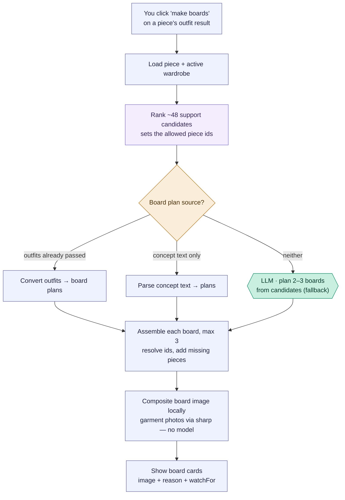

# Piece-concept boards — "Make visual boards"

From a piece's generated outfit result, you turn the outfit ideas into **visual
boards**. Despite the name, the board image is *not* AI-generated: it's a local
collage of your saved garment photos. The only place a model *might* be called is
a fallback text planner — and in the normal path it's skipped entirely.

Reading convention (see [use-my-wardrobe.md](use-my-wardrobe.md)): rectangles are
the app's own code, hexagons labelled `LLM ·` are model calls, diamonds are
decisions. **This flow has exactly one hexagon, and it usually doesn't run.**

## Overview (PM altitude)

Two things a PM should take away:

- **The board image is a local collage, not AI imagery.** Garment photos are
  tiled onto a labelled background with `sharp` — no image model, no rendering
  cost, near-instant. "Missing" pieces (ones you don't own) appear as labelled
  placeholders.
- **The model is barely involved.** The single `LLM ·` planner only runs when
  the request arrives with *neither* prior structured outfits *nor* concept text.
  In practice this flow is invoked from a piece's existing outfit result, so the
  plans come straight from those outfits and the model is skipped.

### Stage map

| Stage | What happens                              | Where                                                        |
| ----- | ----------------------------------------- | ------------------------------------------------------------ |
| A     | User clicks "boards" on an outfit result  | `generateVisualBoards` — `src/components/StylistChat.jsx:2777` |
| B–OUT | Server builds boards                      | `POST /generate-outfit-boards` — `routes/ai.js:2918`         |
| C     | Candidate ranking → allowed ids           | `selectCandidatesForOutfitGeneration(piece, all, 48, …)`     |
| P     | Plan source resolution (3-way)            | `boardPlanFromStructuredOutfits` / `structuredOutfitsFromGeneratedText` / `OUTFIT_BOARD_PLANNER_SYSTEM` |
| IMG   | Local board collage                       | `createOutfitBoardImage` (sharp) — `styling-engine/core.js:1906` |

Engineer notes:

- **Plan resolution is first-non-empty-wins** (`ai.js:2932`): (1)
  `boardPlanFromStructuredOutfits` converts already-generated outfits to board
  plans — deterministic, no model; (2) else `structuredOutfitsFromGeneratedText`
  parses concept text — also deterministic; (3) else the `askStylist` planner
  (`OUTFIT_BOARD_PLANNER_SYSTEM`) is the only model call. The frontend almost
  always passes `structuredOutfits`, so path (1) wins and the model is skipped.
- **Candidate ranking uses limit 48 here** (`ai.js:2926`) — vs 32 in the
  selected-piece composer, 90 images in whole-wardrobe. It builds `allowedIds`:
  a board may only reference the selected piece + these ranked supports.
- **Board shaping** (`ai.js:2960`): max 3 boards, the selected piece is
  force-included in each, max 5 pieces per board, and model-proposed
  `missingPieces` are deduped against owned pieces and rendered as placeholders
  (`missing: true`, no photo).
- **The image is pure `sharp`** (`core.js:1906`): an SVG header (label + reason)
  plus up to 5 garment tiles composited onto a fixed layout, written to
  `uploads/generated-boards/`. No model, no network.
