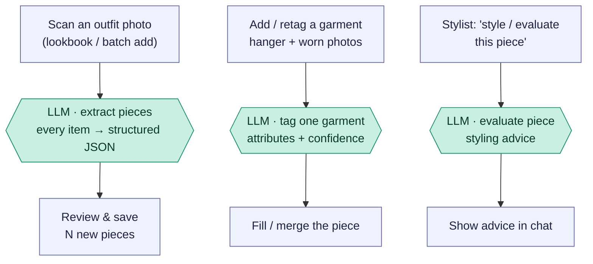

# Piece intake & tagging — photos → structured pieces

The *input* side of the wardrobe: turning photos into structured garment data.
Three flows, all single **text-model** calls with vision — extract several pieces
from one outfit photo, tag a single garment, or get styling advice on a piece.
Nothing here generates images; the model reads photos and returns structured JSON
(or prose).

Reading convention (see [use-my-wardrobe.md](use-my-wardrobe.md)): rectangles are
the app's own code, `LLM ·` hexagons are the text model (Claude, with vision),
diamonds are decisions.

## Overview (PM altitude)

Three separate flows share the "photo in, structure out" shape:

- **Extract pieces** — one outfit photo → *many* pieces. Used to bulk-add a whole
  look at once.
- **Tag one garment** — hanger + worn photos → *one* piece's attributes, calibrated
  against the existing wardrobe and any manual overrides.
- **Evaluate a piece** — the odd one out: styling *advice* (prose), not tagging.

## The endpoints

| Flow | Endpoint | Output |
| --- | --- | --- |
| Extract pieces | `/extract-pieces` | JSON array of pieces |
| Tag a garment | `/tag-piece`, `/tag-piece-existing/:id` | one piece's tags + confidence |
| Evaluate a piece | `/evaluate-piece` | styling prose |

### Stage map

| Stage | What happens | Where |
| --- | --- | --- |
| A | Scan an outfit photo | `OutfitLookbook.jsx:744`, `BatchAdd.jsx:1162` → `POST /extract-pieces` (`routes/ai.js:1841`) |
| B | Add / retag a garment | `PieceForm.jsx:428/430/485` → `/tag-piece` or `/tag-piece-existing/:id` (`routes/ai.js:1898`/`1998`) |
| C | Style / evaluate a piece | `StylistChat.jsx:3550` → `/evaluate-piece` (`routes/ai.js:2004`) |
| T | Tagger | `tagPieceWithProvider` (`routes/ai.js:1397`) |

## Engineer notes

- **Extract pieces** (`ai.js:1841`): one `askStylist(EXTRACT_PIECES_SYSTEM)` call
  with the photo and a large fixed JSON schema (name, category, colors from a
  controlled vocabulary, pattern, fabric, silhouette, formality, shoe-only heel /
  walk fields, …). Returns `{ pieces: [...] }`; the temp upload is deleted
  immediately.
- **Tag a garment** (`tagPieceWithProvider`, `ai.js:1397`): one vision call, but
  with two calibration tricks — an **anchor block** of low-detail reference
  thumbnails from existing wardrobe pieces so `formality` / `fabric_weight` stay
  consistent across the closet, and **ground-truth overrides** (user's manual
  field corrections) the model must align to. Hanger photo = literal garment
  truth; worn photo = fit/drape. `tag-piece-existing` reuses stored photos when
  none are uploaded and `applyTaggerResult`-merges into the piece; both compute a
  `tag_state` and per-field confidence.
- **Evaluate a piece** (`ai.js:2004`) has two sub-modes: a general `evaluate_piece`
  critique, and `STYLE_SELECTED_ITEM` (when the question is a "style this" ask),
  which composes outfit ideas anchored on the piece and then runs a **second
  critic pass** (`criticPassForSelectedItem`) — so that path is *two* model calls.
- All three are vision-in / structure-or-prose-out — **no image generation**, so
  they're on the fast/cheap end like the [evaluation flows](outfit-evaluation.md).
