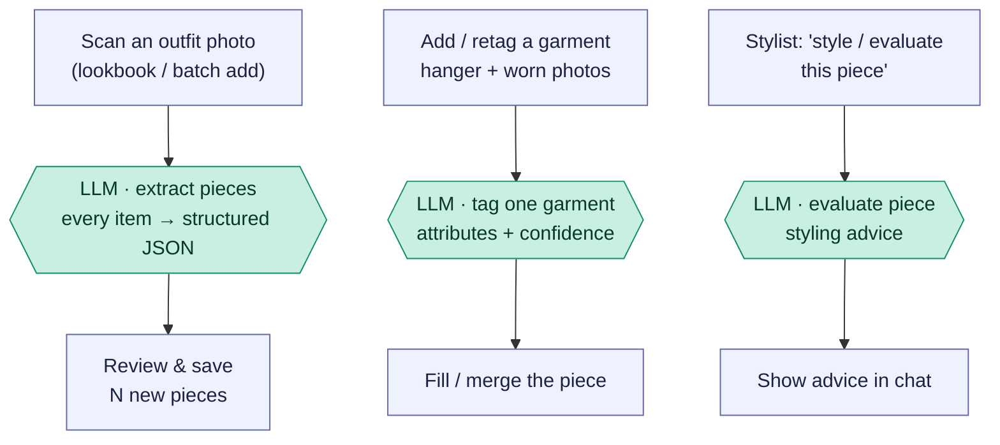

# Piece intake & tagging — photos → structured pieces

The *input* side of the wardrobe: turning photos into structured garment data.
Three flows, all single **text-model** calls with vision — extract several pieces
from one outfit photo, tag a single garment, or get styling advice on a piece.
Nothing here generates images; the model reads photos and returns structured JSON
(or prose).

Reading convention (see [use-my-wardrobe.md](use-my-wardrobe.md)): rectangles are
the app's own code, `LLM ·` hexagons are the text model (Claude, with vision),
diamonds are decisions.

## Overview (PM altitude)

Three separate flows share the "photo in, structure out" shape:

- **Extract pieces** — one outfit photo → *many* pieces. Used to bulk-add a whole
  look at once.
- **Tag one garment** — hanger + worn photos → *one* piece's attributes, calibrated
  against the existing wardrobe and any manual overrides.
- **Evaluate a piece** — the odd one out: styling *advice* (prose), not tagging.

## The endpoints

| Flow | Endpoint | Output |
| --- | --- | --- |
| Extract pieces | `/extract-pieces` | JSON array of pieces |
| Tag a garment | `/tag-piece`, `/tag-piece-existing/:id` | one piece's tags + confidence |
| Evaluate a piece | `/evaluate-piece` | styling prose |

### Stage map

| Stage | What happens | Where |
| --- | --- | --- |
| A | Scan an outfit photo | `OutfitLookbook.jsx:786` → `POST /extract-pieces` (`routes/ai.js:852`) |
| B | Add / retag a garment | `PieceForm.jsx:613`/`615` (both inside `handleTagThis`) → `/tag-piece` or `/tag-piece-existing/:id` (`routes/ai.js:916`/`1024`) |
| C | Style / evaluate a piece | `StylistChat.jsx:5155` → `/evaluate-piece` (`routes/ai.js:1030`) |
| T | Tagger | `tagPieceWithProvider` (`routes/ai.js:367`) |

## Engineer notes

- **Extract pieces** (`ai.js:852`): one `askStylist(EXTRACT_PIECES_SYSTEM)` call
  with the photo and a large fixed JSON schema (name, category, colors from a
  controlled vocabulary, pattern, fabric, silhouette, formality, shoe-only heel /
  walk fields, …). Returns `{ pieces: [...] }`; the temp upload is deleted
  immediately. This schema is a hand-maintained duplicate of the canonical tagger
  schema below it in the same file (not shared code) — see `garment-field-
  reference.md`'s "Known drift" section for which fields have drifted out of sync
  between the two.
- **Tag a garment** (`tagPieceWithProvider`, `ai.js:367`): one vision call, but
  with two calibration tricks — an **anchor block** of low-detail reference
  thumbnails from existing wardrobe pieces so `formality` / `fabric_weight` stay
  consistent across the closet, and **ground-truth overrides** (user's manual
  field corrections) the model must align to. Hanger photo = literal garment
  truth; worn photo = fit/drape. `tag-piece-existing` reuses stored photos when
  none are uploaded and `applyTaggerResult`-merges into the piece; both compute a
  `tag_state` and per-field confidence. **Logged as of 2026-08-15**: every call
  through `tagPieceWithProvider` (so `/tag-piece`, `/tag-piece-existing`, *and*
  the bulk importer's per-piece tagging in `routes/importer.js`, since all three
  share this one function) writes `[Tag Piece] RAW RESPONSE ...` and
  `[Tag Piece] Final normalized tags ...` to stdout — the same `console.log`
  pattern the Visual Composer and styling-chat tool loop already used
  everywhere, which this endpoint previously had none of. Added specifically
  because a real tagging gap that session (a belt's "horn-look buckle" visible
  only in free text, with no structured field to land in) required a live SQL
  query against the DB to diagnose instead of a log grep.
- **In PieceForm.jsx, tagging is always an explicit action, never automatic.**
  Both the "Fill details with AI" (new piece) and "Update details with AI" (edit
  piece) buttons call the same `handleTagThis`, which is the *only* thing that
  hits `/tag-piece`/`/tag-piece-existing`. **As of 2026-08-15**, selecting a worn
  photo no longer auto-fires a tag call the instant a file is chosen (it used to,
  via a now-removed `handleWornPhoto` that called `tag-piece[-existing]`
  immediately on file selection, before the piece was even saved — this was
  causing issues and was removed). Selecting a worn photo now behaves exactly
  like selecting a hanger photo: it just sets local file/preview state.
- **Evaluate a piece** (`ai.js:1030`) has two sub-modes: a general `evaluate_piece`
  critique, and `STYLE_SELECTED_ITEM` (when the question is a "style this" ask),
  which composes outfit ideas anchored on the piece and then runs a **second
  critic pass** (`criticPassForSelectedItem`) — so that path is *two* model calls.
- All three are vision-in / structure-or-prose-out — **no image generation**, so
  they're on the fast/cheap end like the [evaluation flows](outfit-evaluation.md).
