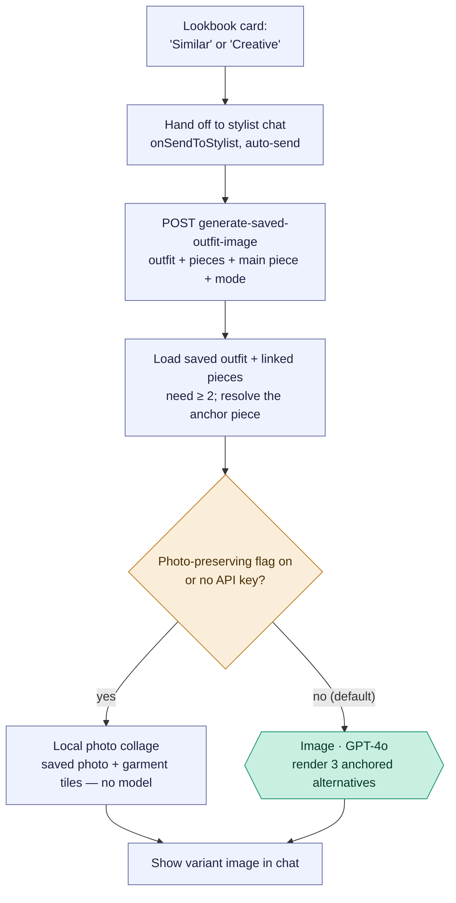

# Saved-outfit variants — "Similar" & "Creative"

On a saved outfit card in the Lookbook, the **Similar** and **Creative** buttons
generate alternative looks from that outfit's photo and its linked garments,
keeping the outfit's *main piece* as the anchor. They're the **same flow in two
modes** — the mode only changes the prompt. Two things are worth seeing here: the
buttons **hand off through the stylist chat** rather than calling the endpoint
directly, and the image step is **conditional** — real GPT-4o generation, or a
local photo collage, depending on a feature flag.

Reading convention (see [use-my-wardrobe.md](use-my-wardrobe.md)): rectangles are
the app's own code, a hexagon labelled `Image ·` is a call to the **image model**
(GPT-4o), diamonds are decisions.

## Overview (PM altitude)

Three takeaways for a PM:

- **Similar vs Creative is one flow, two prompts.** Both buttons run the identical
  pipeline; `variantMode` ("similar" / "creative") only swaps the instruction text
  the image model receives. No pipeline difference.
- **The buttons route through the chat.** They don't hit the endpoint directly —
  they hand the saved outfit to the stylist chat, which auto-sends and fires the
  image call. The result lands as a card in a chat thread.
- **The model call is conditional.** By default it's a GPT-4o render, but with the
  `PHOTO_PRESERVING_VISUALS` flag on (or no OpenAI key) it falls back to a local
  photo collage with *no model* — same trick as the piece-concept boards.

### Stage map

| Stage | What happens | Where |
| --- | --- | --- |
| A | Lookbook card "Similar" / "Creative" | `src/views/OutfitLookbook.jsx:1788` / `:1803` |
| B | Hand off to chat, auto-send | `onSendToStylist({ … imageGenerationMode, variantMode })` |
| C | Fire the image request | `StylistChat.jsx:3416` → `POST /api/ai/generate-saved-outfit-image` |
| C–OUT | Build the variant image | `routes/ai.js:3116` |
| D | Resolve pieces + anchor | linked pieces (≥ 2), `mainPieceId` |
| E/F/G | Render | `createSavedOutfitImage` — `styling-engine/core.js:2110` |

## Engineer notes

- **The anchor is the main piece.** The saved outfit's `main_piece_id` (the field
  added for this feature) is passed as `mainPieceId` and kept as the visible anchor
  across all three alternatives (`savedOutfitImagePrompt`, `core.js:2057`). If none
  is set, it falls back to the first top/dress.
- **Two render paths** (`createSavedOutfitImage`, `core.js:2110`):
  - **Default (GPT-4o):** `client.responses.create({ model: 'gpt-4o', tools:
    [{ type: 'image_generation' }] })`, fed the source outfit photo (reference
    only), up to 5 garment reference images, 2 identity/taste calibration
    references, and the anchored triptych prompt → returns 3 alternatives.
  - **Fallback (no model):** when `photoPreservingVisualsEnabled()` (env
    `PHOTO_PRESERVING_VISUALS=true`) or no `OPENAI_API_KEY` — a
    `createPhotoPreservingCollageImage` collage of the saved photo + garment tiles.
- **Guardrails at the endpoint** (`routes/ai.js:3116`): the outfit is re-loaded from
  the DB and merged, linked pieces are resolved (capped at 6), and it errors out if
  fewer than 2 pieces resolve.
- **Frontend handoff** (`OutfitLookbook.jsx:1788`): the buttons call
  `onSendToStylist({ …outfit, autoSend: true, imageGenerationMode: true,
  variantMode })`; the chat's `imageGenerationMode` branch (`StylistChat.jsx:3416`)
  builds the request and threads `mainPieceId` through.
