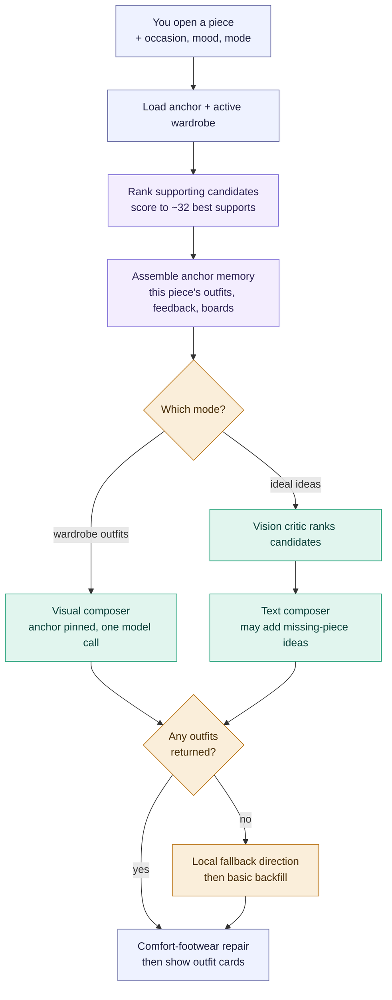

# Selected-piece composer — "Style this piece"

You open one garment and ask the stylist to build outfits around it. Unlike
[Use my wardrobe](use-my-wardrobe.md), the selected piece is the **anchor**: it
is pinned into every outfit, the candidate pool is pre-narrowed to its best
supporting pieces, and the flow branches on whether you want wardrobe-only
outfits or "ideal" ideas that may reach beyond what you own.

Color legend is the same as the rest of the atlas (see
[use-my-wardrobe.md](use-my-wardrobe.md)): indigo = app/ui, purple = wardrobe
rules, teal = model call, amber = validation/fallback.

## Overview (PM altitude)

Three things a PM should take away:

- **The anchor is non-negotiable.** The selected garment is pinned into every
  proposed outfit (it bypasses every roster gate), and the composer is told "the
  selected garment is the premise, not one option among many."
- **Two model paths, chosen by mode.** Wardrobe mode is a single vision call that
  composes from photos. "Ideal" mode first runs a vision *critic* to re-rank
  candidates, then a text composer that may suggest pieces you don't own yet.
- **This flow always returns something** — and unlike advisor mode, it *does*
  repair (see below).

### Stage map

| Stage | What happens                            | Where                                                             |
| ----- | --------------------------------------- | ----------------------------------------------------------------- |
| A     | User picks a piece + options            | `StylistChat.jsx` → `POST /api/ai/generate-outfits-for-piece`     |
| B–G   | Server composes outfits                 | `generateOutfitsForPieceInternal` — `routes/ai.js:2091`           |
| C     | Candidate ranking                       | `selectCandidatesForOutfitGeneration`                             |
| E     | Wardrobe-mode visual composer           | `composeSelectedPieceVisualWardrobeOutfits` — `routes/ai.js:1587` |
| V,E2  | Ideal-mode critic + text composer       | `rankSelectedPieceCandidatesWithVision`, `composeStructuredOutfitsForPiece` |

---

## How it differs from "Use my wardrobe"

Same roster builder (`buildVisualComposerRoster`), different framing:

| Aspect            | Use my wardrobe                    | Selected-piece composer                          |
| ----------------- | ---------------------------------- | ------------------------------------------------ |
| Input pool        | whole active wardrobe              | anchor + ~32 pre-ranked supports (`ai.js:2119`)  |
| Roster image cap  | 90                                 | 54 (`ai.js:1614`)                                |
| Anchor            | none                               | selected piece pinned in every outfit (`ai.js:1684`) |
| Memory            | lean (feedback + favorites)        | rich, garment-specific (outfits, gold feedback, saved boards, calibration) (`ai.js:2130`) |
| Modes             | one (advisor)                      | three: wardrobe / ideal directions / ideal-only (`ai.js:2114`) |
| Repair            | **no** (advisor mode)              | **yes** — `applyComfortFootwearRepair` (`ai.js:2226`) |
| Fallback          | local backfill or diagnostic cards | local fallback direction → basic backfill (always non-empty) (`ai.js:2200`) |

Engineer notes:

- **Mode detection** (`ai.js:2114`) is flag- *and* text-driven: `idealMode` /
  `idealOnlyMode` come from the request booleans or regexes on the question
  ("ideal", "missing", "not in my wardrobe", …). This picks the branch at `M`.
- **Wardrobe path** (`composeSelectedPieceVisualWardrobeOutfits`): builds the
  roster from `[anchor, ...supports]`, shows the anchor photo at `high` detail
  and supports at adaptive detail, and calls the model once with the
  `WHOLE_WARDROBE_VISUAL_COMPOSER_SYSTEM` prompt plus a **SELECTED-ANCHOR
  CONTRACT** and the occasion/activity profiles inlined as rules-as-data
  (`ai.js:1720`).
- **Ideal path**: `rankSelectedPieceCandidatesWithVision` (20s timeout, soft
  fallback on error) re-orders candidates, then `composeStructuredOutfitsForPiece`
  composes and may propose missing pieces.
- **Repair is real here.** After composition, `applyComfortFootwearRepair`
  swaps in comfortable footwear when a comfort constraint (all-day walking /
  hiking) is active (`ai.js:2225`) — the deliberate no-repair rule only applies
  to the whole-wardrobe advisor flow.
- **Always non-empty**: 0 model outfits → `buildLocalFallbackOutfitDirections`;
  still 0 → a hand-built basic backfill using the anchor + top supports
  (`ai.js:2200`).
