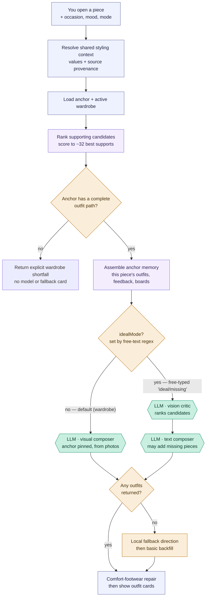

# Selected-piece composer — "Style this piece"

**Status:** Active
**Last verified:** 2026-08-25

You open one garment and ask the stylist to build outfits around it. Unlike
[Use my wardrobe](use-my-wardrobe.md), the selected piece is the **anchor**: it
is pinned into every outfit and the candidate pool is pre-narrowed to its best
supporting pieces. The main path composes **wardrobe** outfits; a secondary
`idealMode` path re-ranks candidates and may suggest pieces you don't own.

**[2026-08-25] Response contract:** Every delivered direction carries the shared versioned
`result` envelope with its accepted/annotated/rejected meaning and `selected_piece` provenance.
The existing card fields and fallback behavior are unchanged.

Same reading convention as the rest of the atlas (see
[use-my-wardrobe.md](use-my-wardrobe.md)): **rectangles are the app's own code,
hexagons labelled `LLM ·` are calls to the AI model, diamonds are decisions.**

> **Routing note.** The piece "ask stylist" panel has two toggles:
> **"Use my wardrobe"** → this flow's wardrobe path; **"Explore additions"** →
> a *different* flow, [editorial ideal additions](editorial-ideal-additions.md)
> (family C), **not** the ideal branch below. This flow's `idealMode` branch is
> reached only when a free-typed question trips the server-side `ideal/missing`
> regex *without* matching the frontend's editorial regex — an edge path, not a
> button. (The `idealMode` here can still hit the model twice: vision critic,
> then text composer.)

## Overview (PM altitude)

Three things a PM should take away:

- **The anchor is non-negotiable.** The selected garment is pinned into every
  proposed outfit (it bypasses every roster gate), and the composer is told "the
  selected garment is the premise, not one option among many."
- **Two model paths.** The default is a single vision call that composes wardrobe
  outfits from photos. A secondary `idealMode` path (free-text only, see the
  routing note) first runs a vision *critic* to re-rank candidates, then a text
  composer that may suggest pieces you don't own. The **"Explore additions"
  button does not use this path** — it routes to
  [editorial ideal additions](editorial-ideal-additions.md).
- **This flow returns cards only from viable supply.** Unlike advisor mode, it does repair ordinary
  model failures. A structurally incomplete gated roster is different: it returns an explicit
  shortfall before the model call and does not fabricate a fallback card.

### Stage map

| Stage | What happens                            | Where                                                             |
| ----- | --------------------------------------- | ----------------------------------------------------------------- |
| A     | User picks a piece + options            | `StylistChat.jsx` → `POST /api/ai/generate-outfits-for-piece`     |
| B–G   | Server resolves context and composes outfits | `generateOutfitsForPieceInternal` — `routes/ai.js`             |
| X     | Normalize values, choose field authority, build profiles and weather | `resolveStylingContext` — `styling-engine/stylingContext.js` |
| C     | Shared automatic-use findings, then anchor-specific candidate ranking | `selectAutomaticUseCandidatesForOutfitGeneration` |
| E     | Wardrobe-mode visual composer           | `composeSelectedPieceVisualWardrobeOutfits` — `routes/ai.js:1587` |
| V,E2  | Ideal-mode critic + text composer       | `rankSelectedPieceCandidatesWithVision`, `composeStructuredOutfitsForPiece` |

---

## How it differs from "Use my wardrobe"

Same finite-pool authority (`evaluateVisualComposerPiecePool`), different framing:

| Aspect            | Use my wardrobe                    | Selected-piece composer                          |
| ----------------- | ---------------------------------- | ------------------------------------------------ |
| Input pool        | whole active wardrobe              | anchor + ~32 pre-ranked supports (`ai.js:2119`)  |
| Roster image cap  | 90                                 | 54 (`ai.js:1614`)                                |
| Anchor            | none                               | selected piece pinned in every outfit (`ai.js:1684`) |
| Memory            | lean (feedback + favorites)        | rich, garment-specific (outfits, gold feedback, saved boards, calibration) (`ai.js:2130`) |
| Modes             | one (advisor)                      | three: wardrobe / ideal directions / ideal-only (`ai.js:2114`) |
| Repair            | **no** (advisor mode)              | **yes** — `applyComfortFootwearRepair` (`ai.js:2226`) |
| Fallback          | validated local backfill or explicit shortfall | validated local direction → validated basic backfill (`generateOutfitsForPieceInternal`) |

Engineer notes:

- **Shared context authority** (`resolveStylingContext`): selected-piece composition now uses the
  same field-specific precedence, normalized occasion/activity profiles, and physical-weather
  authority as whole-wardrobe composition. Current-season requests can use live weather from the
  saved home location. Explicit hypothetical seasons stay hypothetical. Response debug records the
  chosen source and ignored conflicts for each field.

- **Shared eligibility authority** (`evaluateVisualComposerPiecePool`): the model sees the bounded
  eligible photo roster. Local fallback and comfort repair receive a recovery projection from the
  same findings. Presentation/capacity omissions may remain usable, but a weather, register,
  activity, footwear, metadata, or other validity exclusion cannot return through fallback. When
  the selected anchor is itself footwear, the full wardrobe is evaluated through the same authority
  before choosing a comfort substitute.

- **Shared support eligibility** (`selectAutomaticUseCandidatesForOutfitGeneration`): supporting
  pieces are evaluated once by `evaluateAutomaticUsePiecePool`; the existing anchor-specific score
  and category quotas consume those decisions instead of re-running the hard gate. Blocked rows
  retain the same score/reason representation for parity, while the later visual pool remains the
  binding finite roster. Piece concept-board planning uses the same adapter with its larger limit.

- **Shared bounded structural coverage** (`buildCoveredCandidateSet`): the selected quota result
  and final visual roster must retain a complete path around the pinned anchor. For a dependent
  anchor that path includes its required coverage base. If no such path survives the hard gates,
  the wardrobe branch stops before the visual composer and returns the coverage report; local and
  absolute backfill are reserved for provider/model-output failure after viable supply existed.

- **Mode detection** (`ai.js:2114`): `idealMode` / `idealOnlyMode` come from the
  request booleans *or* a regex on the question ("ideal", "missing", "not in my
  wardrobe", …). In practice the booleans are unreachable from the UI — the only
  toggle that sets them ("Explore additions") *also* sets `editorialVisualMode`,
  which routes to `/editorial-directions-preview` instead
  ([editorial-ideal-additions.md](editorial-ideal-additions.md)) and never calls
  this endpoint. So the ideal branch here is effectively **text-driven only**, and
  its regex differs from the frontend's editorial regex (`StylistChat.jsx:3254`) —
  routing can hinge on exact wording.
- **Wardrobe path** (`composeSelectedPieceVisualWardrobeOutfits`): builds the
  roster from `[anchor, ...supports]`, shows the anchor photo at `high` detail
  and supports at adaptive detail, and calls the model once with the
  `WHOLE_WARDROBE_VISUAL_COMPOSER_SYSTEM` prompt plus a **SELECTED-ANCHOR
  CONTRACT** and the occasion/activity profiles inlined as rules-as-data
  (`ai.js:1720`).
- **Ideal path**: `rankSelectedPieceCandidatesWithVision` (20s timeout, soft
  fallback on error) re-orders candidates, then `composeStructuredOutfitsForPiece`
  composes and may propose missing pieces.
- **Repair is real here.** After composition, `applyComfortFootwearRepair`
  swaps in comfortable footwear when a comfort constraint (all-day walking /
  hiking) is active (`ai.js:2225`) — the deliberate no-repair rule only applies
  to the whole-wardrobe advisor flow.
- **Fallback after viable supply**: 0 model outfits → `buildLocalFallbackOutfitDirections`;
  still 0 → a hand-built basic backfill using the anchor + recovery-safe supports. Neither fallback
  can reopen a validity-excluded piece. Since 2026-08-25 both use `validatedFallback`: the local
  directions must preserve the anchor and pass category structure plus required-base validation;
  the absolute candidate is checked against those same hard facts before it can become a card. If
  it fails, the response carries a machine-readable recovery shortfall instead of preserving the
  old “always non-empty” behavior. Comfort shoe swaps use `validatedSubstitute` and validate the
  exact mutated outfit before returning it.

### Recorded follow-up — malformed/truncated composer JSON

`thread_1787624360787` reached the model's 2,000-output-token ceiling, returned malformed JSON, and
then correctly used the local fallback. The eligibility consolidation worked—the fallback did not
reintroduce the excluded lounge/athletic shoes—but the paid composer call produced no usable model
outfits. Treat response sizing, truncation detection, and bounded local JSON recovery as a separate
reliability investigation; do not weaken eligibility or mix that repair into an architecture slice.
