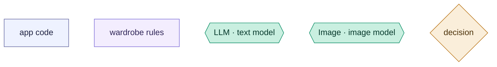
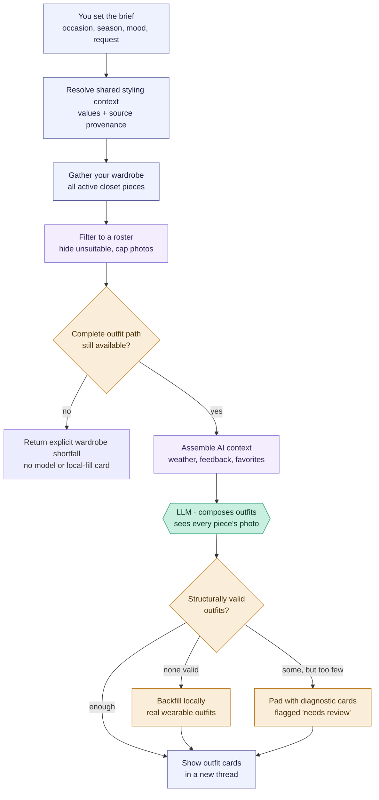
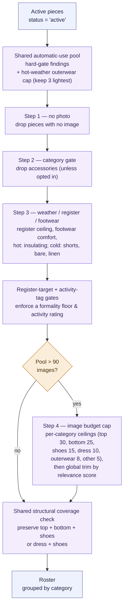
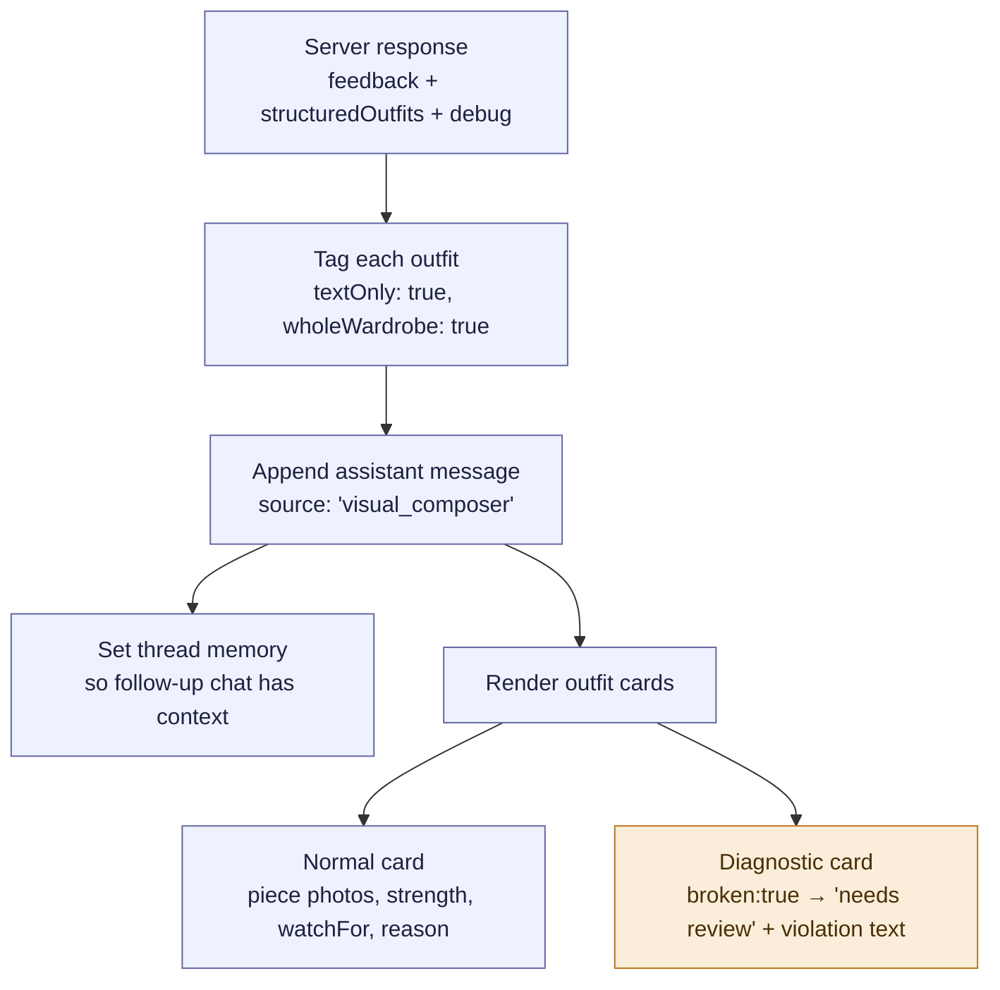

# Visual Composer — "Use my wardrobe"

How the "Use my wardrobe" outfit generator works, end to end. This is the
model-facing flow: you give a brief, the app filters your closet, one model call
composes outfits from photos, and the results are validated before display.

**[2026-08-25] Projection and response contract:** The composer's category-core instruction is
serialized by the same module that owns mechanical category validation. Returned normal,
advisor-annotated, and diagnostic cards all carry the shared versioned `result` envelope and
`whole_wardrobe_visual` provenance; the legacy fields used by the current card UI remain intact.

**How to read the diagrams — shape and color tell you who does the work:**

- **Rectangles** — the app's own code (indigo = plumbing & ui, purple = product / wardrobe rules).
- **Hexagons** — a call to a model: `LLM ·` = the text model (Claude), `Image ·` = the image model (GPT-4o). The only places a model is involved.
- **Diamonds** — decisions; the amber fill also marks validation & fallback steps.

The one thing to remember: **a model is called only at the hexagons.**
Everything else — filtering, gating, backfill, rendering — is the app's code.

## Overview (PM altitude)

Two things worth knowing at this altitude:

- There is **exactly one model call** (stage E). No tools, no multi-turn — the
  model gets one shot with a photo of every rostered piece. When the gated
  roster has no complete core plus shoes, there are zero calls: the response
  states the wardrobe shortfall before thumbnail preparation.
- **Nothing is "repaired."** In advisor mode the app never swaps pieces to fix a
  broken outfit. Invalid outfits are dropped; then the app either backfills with
  locally-generated real outfits (only when the model produced *zero* valid ones)
  or pads the remaining slots with diagnostic "needs review" cards.
- **Backfill is validator-bound, 2026-08-25.** `validatedFallback` now enumerates the locally ranked
  candidates and immediately runs each through `locallyGateWholeWardrobeOutfits` with the same
  advisor policy before it can enter the fill set. The caller still owns ranking, diversity, count,
  and whether an explicitly rejected diagnostic card is displayed; the shared recovery primitive
  owns only the rule that an ordinary recovered card cannot bypass the primary hard gate.

> **Weather-location correction, 2026-08-19:** the Visual Composer header exposed the saved
> weather location, but `POST /generate-wardrobe-outfits-visual` did not read it; "Current season"
> therefore used only the season/request text heuristic. The endpoint now resolves today's live
> forecast from the saved home location and passes the exact numeric profile into composition.
> Explicit Spring/Summer/Fall/Winter/Very hot/Very cold selections remain hypothetical briefs and
> deliberately do not fetch or get overridden by today's local weather. This behavior now belongs
> to `resolveStylingContext` (`styling-engine/stylingContext.js`), shared with selected-piece
> composition. Response debug includes the chosen source and any conflicting evidence.

> **Shared-composer scope, 2026-08-19:** garment wear facts and explicit renderer
> `styling_instructions` apply here as well as bounded freeform. The composer judges the relevant
> part of a numeric range: an evening request near a cooler low should include a removable
> arrival/departure layer when the roster supports one, even when dinner itself is indoors.
> Image labels also carry authoritative `opacity` and explicit `needs_base` values; visual texture
> cannot make an opaque, independently wearable garment sheer or introduce an unverified base.
> Multi-option Visual Composer runs receive comparison-set variety guidance. Saved-outfit
> formula-similar variants explicitly disable it; adjacent exploration retains it.

### Stage map

| Stage | What happens                        | Where                                                             |
| ----- | ----------------------------------- | ----------------------------------------------------------------- |
| A     | User fills the brief, hits generate | `generateWholeWardrobeOutfits` — `src/components/StylistChat.jsx`  |
| X     | Normalize values, choose field authority, build profiles and weather | `resolveStylingContext` — `styling-engine/stylingContext.js` |
| B–H   | Server builds and validates outfits | `generateWholeWardrobeOutfitsVisualInternal` — `routes/ai.js`     |
| C     | Roster construction (deep dive)     | `buildVisualComposerRoster` — `styling-engine/rules.js`           |
| E     | The model call                      | `askStylistWithUsage` with `WHOLE_WARDROBE_VISUAL_COMPOSER_SYSTEM`|
| I     | Cards rendered back in the thread    | `generateWholeWardrobeOutfits` render path — `StylistChat.jsx`    |

---

## Stage 3 deep dive — "Filter to a roster"

Two shared projections run back to back. First `evaluateAutomaticUsePiecePool` applies the hard
gate, the explicit saved-Main bypass, and the hot-weather outerwear capacity policy (three lightest).
Then
`evaluateVisualComposerPiecePool` (`styling-engine/eligibility.js`) owns the finite pool and delegates
the existing gate mechanics to `buildVisualComposerRoster`. It returns typed validity,
presentation, and capacity findings plus the final roster (≤ 90 photos, below Claude's 100-image
limit).

Engineer notes:

- **One suppression result.** Whole-wardrobe generation no longer assembles
  `filterWholeWardrobePiecesForGeneration` locally. It consumes typed hard-gate/capacity findings
  from `evaluateAutomaticUsePiecePool`; the older filter remains a compatibility adapter for
  plan/capsule/recovery consumers not yet migrated.

- **Selected-piece bypass.** Every gate checks `isSelected(p)` first — a pinned
  piece skips every exclusion (photo, category, weather, register, cap). This
  path is shared with the selected-piece composer.
- **Register ceiling** (`resolveRegisterCeiling`) is a formality cap derived from
  occasion + mood + activity + free text. A piece whose formality rank exceeds
  the ceiling is excluded with `register: <formality> exceeds <ceiling> ceiling`
  (`rules.js:2109`). Missing formality metadata → excluded *and* a metadata todo
  is filed (`ensureMetadataTodo`, `rules.js:2068`).
- **Weather branch** (`rules.js:2313`) splits hot / cold / neutral. Hot drops
  insulating fibers and heavy pieces and caps outerwear to the 3 lightest; cold
  drops shorts, sleeveless/bare, and lightweight linen bottoms.
- **The cap is category-aware, not just a global trim** (`rules.js:2417`).
  Ceilings are scaled down proportionally if their sum exceeds `maxImages`, each
  category is sorted by `comparePieces` (relevance score, then recency, then id),
  and anything over its ceiling is excluded as `roster cap: category limit`. A
  final global trim (`rules.js:2651`) handles the rare case where per-category
  limits still overflow.
- **Structural supply is checked after those presentation caps**
  (`buildCoveredCandidateSet`). If eligible supply and capacity permit, the roster exchanges a
  lower-priority redundant piece for the missing core/shoe path. If they do not, debug reports the
  structural gap and the endpoint returns before the composer instead of making a paid call from
  an impossible roster.
- **Everything excluded is recorded** in `excluded[]` with a reason and counted
  in `debug.excludedCounts` — this is what powers the diagnostic cards in stage 7
  and the `[Visual Composer Roster]` server log.
- **Disposition is explicit.** Validity findings bind primary composition and ordinary recovery;
  presentation and capacity findings describe why a piece was absent from the photo roster without
  pretending it is physically or contextually invalid.
- **Per-piece prompt lines carry register hints.** Each roster line sent to the
  model (`ID {id}: {name}`) is appended with `; fabric: {fabric_category}` and
  `; reads_as: {reads_as}` when present (`composerPieceLineSuffix`, `routes/ai.js`,
  shared with the selected-piece composer). This is additive text next to the
  untouched photo — no gate, no roster change — so the model can see the register
  facts the tagger already recorded (e.g. "sporty casual pants") instead of
  composing from name + photo alone (spec 30).

---

## Stage 7 deep dive — "Show outfit cards"

The server responds with `{ feedback, structuredOutfits, debug }`. The frontend
(`generateWholeWardrobeOutfits`, `src/components/StylistChat.jsx:3150`) turns that
into an assistant message and renders one card per outfit.

Engineer notes:

- **`textOnly: true` matters.** These cards show the *individual piece photos*
  plus text (strength, watchFor, reason) — there is no rendered "worn outfit"
  image for whole-wardrobe results (`StylistChat.jsx:3160`). The card component
  keys off `wholeWardrobe` / `previewOnly` to pick this layout
  (`canRenderStructuredOutfit`, `StylistChat.jsx:2008`).
- **Diagnostic cards are real messages, not errors.** A card with `broken: true`
  / `diagnosticOnly: true` renders with a "needs review" strength and the
  violation text the server attached (`buildBrokenModelCard` /
  `buildBrokenDiagnosticCard`, `routes/ai.js`). To a PM this is "what the user
  sees when the model underperforms."
- **Clash review has an executable trigger.** A second visual critic is called only when
  `wholeWardrobeOutfitVisualReviewFindings` sees at least two structured pattern signals. Legacy
  free-text `do_not_pair_rules` remain composer guidance and cannot activate or decide this paid
  rejection path.
- **Thread memory is set here** (`setThreadMemory`, `StylistChat.jsx:3173`) so a
  follow-up like "swap the shoes on #2" has the generated outfits as context.
- **`data.debug`** is stored on the message and drives the roster / selection
  debug panel — every exclusion reason from stage 3 is available here.

---

## Status

Documented: "Use my wardrobe" (this flow). Other model-facing flows
(selected-piece composer, ideal suggestions, stylist chat, trip planning) are not
yet mapped — add them as sibling files under `docs/flows/`.
