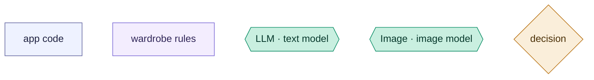
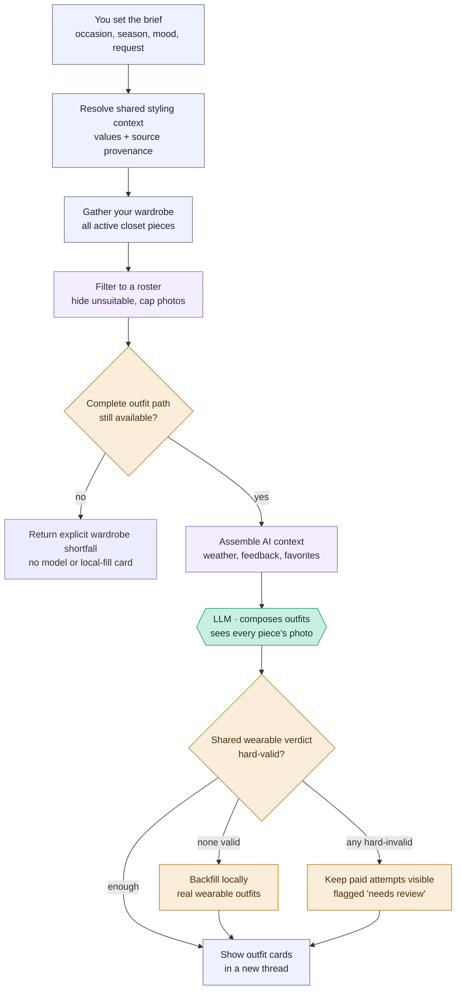
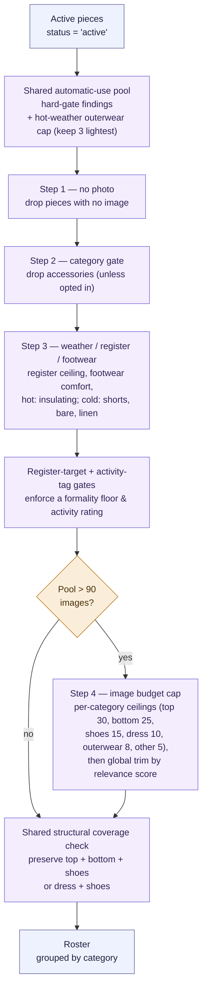
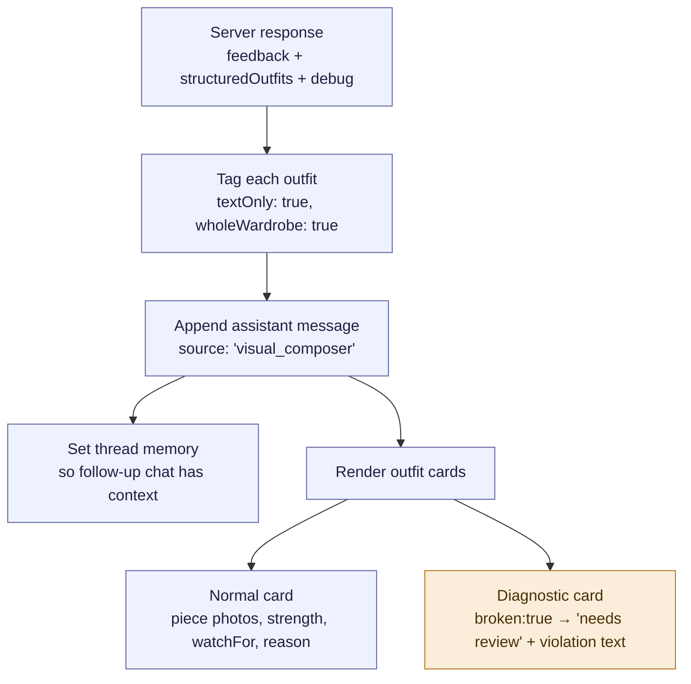

# Visual Composer — "Use my wardrobe"

How the "Use my wardrobe" outfit generator works, end to end. This is the
model-facing flow: you give a brief, the app filters your closet, one model call
composes outfits from photos, and the results are validated before display.

**[2026-08-25] Projection and response contract:** The composer's category-core instruction is
serialized by the same module that owns mechanical category validation. Returned normal,
advisor-annotated, and diagnostic cards all carry the shared versioned `result` envelope and
`whole_wardrobe_visual` provenance; the legacy fields used by the current card UI remain intact.

**How to read the diagrams — shape and color tell you who does the work:**

- **Rectangles** — the app's own code (indigo = plumbing & ui, purple = product / wardrobe rules).
- **Hexagons** — a call to a model: `LLM ·` = the text model (Claude), `Image ·` = the image model (GPT-4o). The only places a model is involved.
- **Diamonds** — decisions; the amber fill also marks validation & fallback steps.

The one thing to remember: **a model is called only at the hexagons.**
Everything else — filtering, gating, backfill, rendering — is the app's code.

## Overview (PM altitude)

Two things worth knowing at this altitude:

- **One composition call, plus at most one conditional repair call** (2026-09-13). Stage E is still
  a single shot with a photo of every rostered piece, no tools and no multi-turn. When the gated
  roster has no complete core plus shoes, there are zero calls: the response states the wardrobe
  shortfall before thumbnail preparation. A **second** call happens only when the delivered set
  contains a card missing a removable layer the conditions require AND at least one shown layer is
  **mechanically viable on that specific card** — see the missing-layer repair below.
- **Pieces are never swapped to fix a broken outfit.** In advisor mode a hard-invalid attempt does
  not count as valid, paid attempts stay visible as diagnostic Needs review cards, and local
  backfill fills only the valid-card shortfall without weakening a hard finding to satisfy count.
- **The one exception is the missing-layer repair (2026-09-13).** A card the evaluator says has
  nothing removable to put on can have ONE layer ADDED — never a piece swapped, removed, or
  recomposed. It runs on the final valid-card set, after local backfill and before diagnostic cards
  are appended; diagnostic cards are never repair targets. Candidates come from the RECOVERY-ELIGIBLE
  layer pool — every hard-eligible layer, including those the roster cap omitted for presentation —
  not from what the composer happened to be shown; the cap is an image budget, not an eligibility
  boundary. On a current-branch replay of the thread_1789288270913 conditions, 25 of 33 hard-eligible
  layers are weather-qualifying while the composer shows 7 — so inheriting the cap would hide 18 of
  them from the repair. (The live run itself offered seven candidates including the navy puffer; two
  of the absent coats were register-excluded by the code active then, two were cap-cut.) This follows PR 315's trip bench and PR 316's complete sparse
  catalog: a later stage gets the full eligible set, not the first stage's shortlist. Candidates are
  then screened per card through the complete evaluator before the call, so a layer that merely suits
  the weather is not offered to a card it cannot physically work on. The resulting card is validated whole against three typed
  conditions — the original finding gone, no new hard finding, no new weather or construction
  deficiency (an inability-to-judge finding is not a deficiency). Each candidate is listed with what
  the COMPLETED outfit reads as at the cold end with that layer on — on target, one level over/under
  (acceptable), substantially off, or unknown — plus the warm end where candidates differ. That is
  the endpoint evaluator's existing ranking evidence surfaced, not a new authority: adjacency stays
  acceptable, and the model may still choose it for a styling reason, knowing the tradeoff. The call
  is a stylist call like
  any other: the repair prompt interpolates the ratified Style Constitution, and each card travels
  with its own `reason`, styling instructions and watch-for, the triggering finding verbatim, and
  the turn's request and mood — a card's idea cannot be preserved against words the repair never
  saw. Garment photographs are sent once each and referenced by ID per card, so a candidate shared
  across cards is not billed per card. If the model declines or the repair is rejected, the card
  ships unchanged with its own advisory and the run returns
  `coolLayerSetDisclosure`, one set-level sentence naming how many cards still lack a layer — now
  **appended to the response prose**, so it is stored and visible rather than living only in debug
  (the nested `/ask` path gets the same sentence through the tool result and does not read the
  prose, so it cannot double up). The engine never adds a garment on its own and never drops a card.
- **Each candidate also states what it would LEAVE on the card (2026-09-13).** The endpoint verdict
  alone let live thread_1789341140366 repair a card with an adjacent layer, clear the missing-layer
  finding, and ship a card still reading "a warm or midweight layer is recommended" that eleven
  on-target candidates would have cleared. Candidate lines now say either "clears every weather
  note" or what the card would still say, the accounting splits `repairedCleanCount` from
  `repairsRetainingAdvice`, and a repair that keeps a note standing while a clearing candidate was
  offered must state the visual `tradeoff` — an unexplained one is not taken and the card keeps its
  own note. Adjacent candidates are never gated.
- **A decline must show its work.** It names the candidates it weighed in `consideredLayerIds`,
  including at least one of the strongest for that card, and gives the visual relationship that
  fails. Naming one arbitrary id does not license dismissing the bench; unsupported declines are
  recorded as such in `layerRepair.declines`. The card still ships as composed either way.
- **Repaired combinations are visually reviewed.** The clash critic runs before the repair, on the
  composer's own cards, so it never saw the combinations the repair created (live run:
  `reviewedCount: 0`). A second, subset-scoped review now runs on the repaired cards only; a
  rejected repair RESTORES the original card with its weather advisory and rejoins the set
  disclosure. Never recursive, never a silent drop.
- **The critic is conservative (2026-09-13).** It answers per card with `reject`, `note`, or nothing.
  Only a clear failure grounded in the photographs — prints visibly fighting, a garment plainly wrong
  in its place — is a reject; colour harmony, uncertainty and anything a reasonable stylist could
  dispute are notes, which attach a Visual note and change nothing else. Anything that is not
  literally `reject` is read as a note. The critic no longer receives taste-suppression feedback,
  which primed it to reject: live thread_1789346300319 restored a conventional navy-stripe /
  olive-cargo / grey-cardigan repair on a tone-harmony opinion.
- **Repair accounting describes what ships.** `acceptedRepairCount` / `acceptedCleanCount` are fixed
  when repairs pass validation; `deliveredRepairCount` / `deliveredCleanCount` are recomputed after
  the repaired-card critic has restored anything.
- **The disclosure counts ready outfits only** — "1 of the 4 ready outfits has…". Diagnostic cards
  are excluded from its numerator and denominator.
- **Diagnostic cards are evidence, and stay visible during development.** A structurally invalid model
  card keeps its original fields verbatim — including prose that does not describe its pieces — is
  marked broken/diagnostic, and carries every structural finding in `structuralFindings` (previously
  only the first; thread_1789346300319's spliced card recorded "more than one bottom" while the
  evaluator had also found `missing_top_or_dress`). It is excluded only from ready-outfit counts,
  weather-repair targets and the disclosure denominator. Production hiding policy is a later decision.
- **Atomic structured composer output (2026-09-13).** The composer answers under a
  provider-enforced schema (`askStylistStructuredWithUsage`, `COMPOSER_OUTFIT_SLOTS_SCHEMA` in
  `styling-engine/composerSlots.js`) with six ID slots per card — `base_top_id`, `bottom_id`,
  `dress_id`, `middle_layer_id`, `outer_layer_id`, `shoes_id` — each an integer or null. There is no
  `pieces[]` array, no garment name and no free role: names resolve from the wardrobe, each slot
  states its role, and `normalizeWholeWardrobeOutfitObject(..., { deriveMissingRoles: false })`
  never fills one in. `resolveComposerSlotOutfit` checks what the schema cannot (category per slot,
  top+bottom or dress, shoes present, duplicates, IDs outside the roster) and the shared
  `evaluateWearableOutfit` still runs on every card. A card with any finding — including an empty
  `shoes_id` — is kept as a diagnostic card with `modelSlots` (the slots exactly as returned) and all
  of its findings; there is no gap flag and no text placeholder. Name-fallback resolution of stale
  IDs is gone. Atomicity is owned by this contract, not by prompt prose. The requested card count is
  in the schema (`minItems`/`maxItems` = `limit`; provider-enforced by OpenAI strict mode and Gemini,
  guidance only for an Anthropic forced tool) and checked locally on every provider as
  `debug.finalSelection.outfitCountCheck`. Ready cards are de-duplicated by garment set; diagnostic
  cards by slot signature (`modelSlots`), falling back to card index, so a malformed slot assignment
  of a ready card's garments stays visible beside it.
- **No partial-card local backfill.** Local backfill stays a last resort for a composer that returned
  nothing; a failed stylist card is not replaced by the deterministic engine.
- **Register is a preference below a stated dress code (2026-09-13).** An occasion word ("casual
  outfits") sets the app's own default ceiling; one rank above it stays eligible and is ranked down
  by a −6 relevance advisory, while two ranks above still excludes. A ceiling the wearer STATED
  keeps hard authority. Capability outranks register at the roster boundary: inside the cold-coat
  reserve the endpoint evaluator's ranking distance is the primary key and register only separates
  coats that answer the day comparably. See docs/engine-behaviour-map.md for the measured
  before/after.
- **Backfill is validator-bound, 2026-08-25.** `validatedFallback` now enumerates the locally ranked
  candidates and immediately runs each through `locallyGateWholeWardrobeOutfits` with the same
  advisor policy before it can enter the fill set. The caller still owns ranking, diversity, count,
  and whether an explicitly rejected diagnostic card is displayed; the shared recovery primitive
  owns only the rule that an ordinary recovered card cannot bypass the primary hard gate.

> **Weather-location correction, 2026-08-19:** the Visual Composer header exposed the saved
> weather location, but `POST /generate-wardrobe-outfits-visual` did not read it; "Current season"
> therefore used only the season/request text heuristic. The endpoint now resolves today's live
> forecast from the saved home location and passes the exact numeric profile into composition.
> Explicit Spring/Summer/Fall/Winter/Very hot/Very cold selections remain hypothetical briefs and
> deliberately do not fetch or get overridden by today's local weather. This behavior now belongs
> to `resolveStylingContext` (`styling-engine/stylingContext.js`), shared with selected-piece
> composition. Response debug includes the chosen source and any conflicting evidence.

> **Shared-composer scope, 2026-08-19:** garment wear facts and explicit renderer
> `styling_instructions` apply here as well as bounded freeform. The composer judges the relevant
> part of a numeric range: an evening request near a cooler low should include a removable
> arrival/departure layer when the roster supports one, even when dinner itself is indoors.
> Image labels also carry authoritative `opacity` and explicit `needs_base` values; visual texture
> cannot make an opaque, independently wearable garment sheer or introduce an unverified base.
> Multi-option Visual Composer runs receive comparison-set variety guidance. Saved-outfit
> formula-similar variants explicitly disable it; adjacent exploration retains it.

### Stage map

| Stage | What happens                        | Where                                                             |
| ----- | ----------------------------------- | ----------------------------------------------------------------- |
| A     | User fills the brief, hits generate | `generateWholeWardrobeOutfits` — `src/components/StylistChat.jsx`  |
| X     | Normalize values, choose field authority, build profiles and weather | `resolveStylingContext` — `styling-engine/stylingContext.js` |
| B–H   | Server builds and validates outfits | `generateWholeWardrobeOutfitsVisualInternal` — `routes/ai.js`     |
| C     | Roster construction (deep dive)     | `buildVisualComposerRoster` — `styling-engine/rules.js`           |
| E     | The model call                      | `askStylistWithUsage` with `WHOLE_WARDROBE_VISUAL_COMPOSER_SYSTEM`|
| I     | Cards rendered back in the thread    | `generateWholeWardrobeOutfits` render path — `StylistChat.jsx`    |

---

## Stage 3 deep dive — "Filter to a roster"

Two shared projections run back to back. First `evaluateAutomaticUsePiecePool` applies the hard
gate, the explicit saved-Main bypass, and the hot-weather outerwear capacity policy (three lightest).
Then
`evaluateVisualComposerPiecePool` (`styling-engine/eligibility.js`) owns the finite pool and delegates
the existing gate mechanics to `buildVisualComposerRoster`. It returns typed validity,
presentation, and capacity findings plus the final roster (≤ 90 photos, below Claude's 100-image
limit).

Engineer notes:

- **One suppression result.** Whole-wardrobe generation consumes typed hard-gate/capacity findings
  from `evaluateAutomaticUsePiecePool`. Slice 7 (2026-08-25) deleted the older compatibility
  response adapter after plan, capsule, recovery, tests, and tracked diagnostics migrated.

- **Selected-piece bypass.** Every gate checks `isSelected(p)` first — a pinned
  piece skips every exclusion (photo, category, weather, register, cap). This
  path is shared with the selected-piece composer.
- **Register ceiling** (`resolveRegisterCeiling`) is a formality cap derived from
  occasion + mood + activity + free text. A piece whose formality rank exceeds
  the ceiling is excluded with `register: <formality> exceeds <ceiling> ceiling`
  (`rules.js:2109`). Missing formality metadata → excluded *and* a metadata todo
  is filed (`ensureMetadataTodo`, `rules.js:2068`).
- **Weather branch** (`rules.js:2313`) splits hot / cold / neutral. Hot drops
  insulating fibers and heavy pieces and caps outerwear to the 3 lightest; cold
  drops shorts, sleeveless/bare, and lightweight linen bottoms.
- **The cap is category-aware, not just a global trim** (`rules.js:2417`).
  Ceilings are scaled down proportionally if their sum exceeds `maxImages`, each
  category is sorted by `comparePieces` (relevance score, then recency, then id),
  and anything over its ceiling is excluded as `roster cap: category limit`. A
  final global trim (`rules.js:2651`) handles the rare case where per-category
  limits still overflow.
- **Structural supply is checked after those presentation caps**
  (`buildCoveredCandidateSet`). If eligible supply and capacity permit, the roster exchanges a
  lower-priority redundant piece for the missing core/shoe path. If they do not, debug reports the
  structural gap and the endpoint returns before the composer instead of making a paid call from
  an impossible roster.
- **Everything excluded is recorded** in `excluded[]` with a reason and counted
  in `debug.excludedCounts` — this is what powers the diagnostic cards in stage 7
  and the `[Visual Composer Roster]` server log.
- **Disposition is explicit.** Validity findings bind primary composition and ordinary recovery;
  presentation and capacity findings describe why a piece was absent from the photo roster without
  pretending it is physically or contextually invalid.
- **Per-piece prompt lines carry the shared recorded facts.** **[amended 2026-09-15]** Each roster line sent to
  the model is the shared garment fact line (`sharedGarmentEvidenceLine`, `styling-engine/garmentEvidenceLine.js`,
  also used by the selected-piece and repair composers and trip composition): category, fabric, fibre, whole-garment
  weight/stretch/fit, silhouette, length, hem, opacity, base-layer need, sleeves (`unknown` when unrecorded), neckline,
  construction, colours, pattern, formality and season, with `?` on low-confidence tags. The fact conventions and the
  owner's saved records (stored rules, rejections, edited descriptions) are stated once after the roster. The earlier
  `composerPieceLineSuffix` line (spec 30: fabric plus the tagger `reads_as`, later derived warmth and tagger do-not-pair)
  was removed; tagger impressions and pairing cautions are not stylist instructions. This is still text next to the
  untouched photo — no gate, no roster change.

---

## Stage 7 deep dive — "Show outfit cards"

The server responds with `{ feedback, structuredOutfits, debug }`. The frontend
(`generateWholeWardrobeOutfits`, `src/components/StylistChat.jsx:3150`) turns that
into an assistant message and renders one card per outfit.

Engineer notes:

- **`textOnly: true` matters.** These cards show the *individual piece photos*
  plus text (strength, watchFor, reason) — there is no rendered "worn outfit"
  image for whole-wardrobe results (`StylistChat.jsx:3160`). The card component
  keys off `wholeWardrobe` / `previewOnly` to pick this layout
  (`canRenderStructuredOutfit`, `StylistChat.jsx:2008`).
- **Diagnostic cards are real messages, not errors.** A card with `broken: true`
  / `diagnosticOnly: true` renders with a "needs review" strength and the
  violation text the server attached (`buildBrokenModelCard` /
  `buildBrokenDiagnosticCard`, `routes/ai.js`). To a PM this is "what the user
  sees when the model underperforms."
- **One hard verdict, 2026-08-25.** `evaluateWearableOutfit` supplies category structure and
  required-base findings to the advisor gate. Flow-specific advisory annotations remain local;
  hard validity and its reason do not.
- **Clash review has an executable trigger.** A second visual critic is called only when
  `wholeWardrobeOutfitVisualReviewFindings` sees at least two structured pattern signals. Legacy
  free-text `do_not_pair_rules` remain composer guidance and cannot activate or decide this paid
  rejection path.
- **Thread memory is set here** (`setThreadMemory`, `StylistChat.jsx:3173`) so a
  follow-up like "swap the shoes on #2" has the generated outfits as context.
- **`data.debug`** is stored on the message and drives the roster / selection
  debug panel — every exclusion reason from stage 3 is available here.

---

## Status

Documented: "Use my wardrobe" (this flow). Other model-facing flows
(selected-piece composer, ideal suggestions, stylist chat, trip planning) are not
yet mapped — add them as sibling files under `docs/flows/`.
