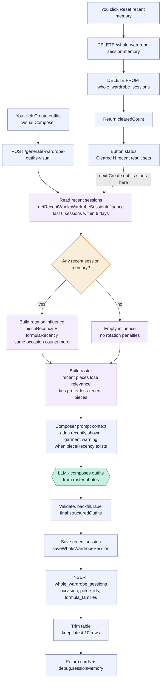

# Visual Composer - resettable recent memory

How the short-lived "recent memory" behind the Visual Composer **Reset recent
memory** button works. This is not saved stylist learning, outfit feedback,
calibration memory, or the frontend thread memory used for follow-up chat. It is
only the server-side rotation memory for recently shown whole-wardrobe results.

User-facing summary: when the app generates whole-wardrobe outfit cards, the
garments shown on those cards are put "off the shelf" briefly. They are still in
the closet and can still appear if they are clearly best, but the next generated
sets will de-prioritize them so the app does not keep repeating the same pieces.



## What Gets Stored

`whole_wardrobe_sessions` stores one row per whole-wardrobe generation:

| Column | Meaning |
| ------ | ------- |
| `created_at` | Unix timestamp used for the 6-day cutoff |
| `occasion` | The occasion requested for the generation |
| `piece_ids` | Unique IDs from the returned outfits |
| `formula_families` | Unique formula families from the returned outfits |

The row is written after the server has produced the final returned cards, so
diagnostic or locally filled cards can also contribute their pieces/formulas if
they are part of `structuredOutfits`.

## User Flows That Add Items

These are the app flows that can add garment IDs to this temporary recent-memory
table:

| User action | Endpoint / path | What is saved |
| ----------- | --------------- | ------------- |
| Visual Composer "Use my wardrobe" / "Create outfits" | `POST /generate-wardrobe-outfits-visual` | Garment IDs and formula families from returned whole-wardrobe cards |
| Lookbook saved outfit "Similar" wardrobe variants, plus adjacent follow-up variants | `POST /generate-saved-outfit-variants` | Garment IDs and formula families from the returned variant cards |

The shared implementation is `generateWholeWardrobeOutfitsVisualInternal`; any
flow that routes through it writes the same recent-memory row.

The Lookbook "Creative" action is different: it calls
`POST /generate-saved-outfit-image` to make image/board alternatives and does not
write this recent garment-ID memory.

## How It Influences The Next Run

- `getRecentWholeWardrobeSessionInfluence({ occasion, daysCutoff: 6 })` reads up
  to the last 6 sessions newer than 6 days.
- Same-occasion sessions are weighted at full strength; other occasions still
  count, but at 55%.
- Newer sessions count more than older sessions, with a floor so older recent
  rows still matter.
- Piece IDs become `pieceRecency` penalties. These reduce roster relevance and
  break ties toward less recently shown garments.
- Formula families become `formulaRecency` penalties. These lower local
  candidate scores when the same outfit formula was just shown.
- If any recent pieces are present, the composer prompt includes a plain-text
  warning: recently shown garments should be avoided unless clearly best.

## What Reset Clears

The **Reset recent memory** button appears in both Visual Composer entry panels
and calls `resetWholeWardrobeSessionMemory` in `StylistChat.jsx`. That sends:

```http
DELETE /api/ai/whole-wardrobe-session-memory
```

The route deletes every row in `whole_wardrobe_sessions` and returns
`clearedCount`. The UI reports either `Cleared N recent result sets.` or
`Recent outfit memory is already clear.`

Next to the button, the UI also shows a count like `12 items resting`. That count
comes from:

```http
GET /api/ai/whole-wardrobe-session-memory
```

It counts unique garment IDs in the active recent-memory window. This is the
PM/user signal that some pieces may feel temporarily unavailable because the user
has been playing with whole-wardrobe generation for a while.

This does **not** clear:

- Saved outfit feedback.
- Confirmed / favorite outfit memory.
- Saved board or calibration memory.
- The current frontend `threadMemory` that lets follow-up chat understand cards
  already shown in the open conversation.

## Code Map

| Stage | Where |
| ----- | ----- |
| Button handler | `resetWholeWardrobeSessionMemory` - `src/components/StylistChat.jsx` |
| Reset route | `DELETE /whole-wardrobe-session-memory` - `routes/ai.js` |
| Count route | `GET /whole-wardrobe-session-memory` - `routes/ai.js` |
| Table schema | `whole_wardrobe_sessions` - `db.js` |
| Read recent influence | `getRecentWholeWardrobeSessionInfluence` - `styling-engine/rules.js` |
| Apply piece recency | `buildVisualComposerRoster` relevance/tie-breakers - `styling-engine/rules.js` |
| Apply formula recency | `scoreWholeWardrobeCandidate` - `styling-engine/rules.js` |
| Save new session | `saveWholeWardrobeSession` - `styling-engine/rules.js` |
| Debug response | `debug.sessionMemory` - `routes/ai.js` |
