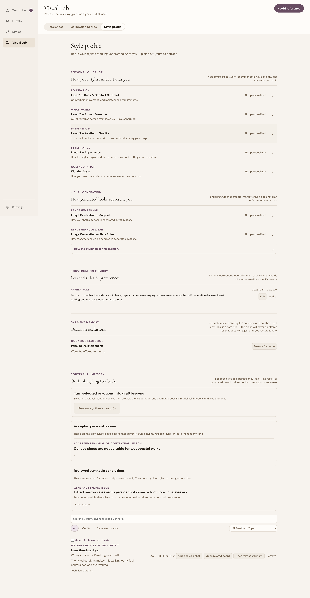
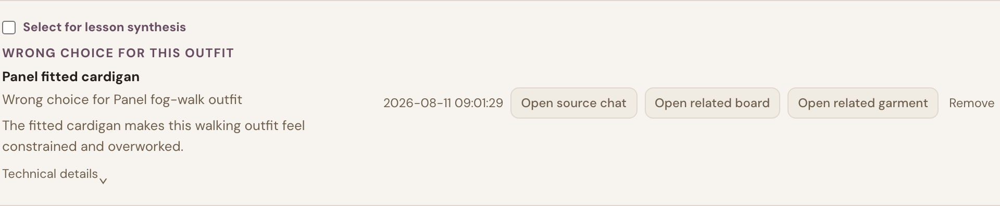
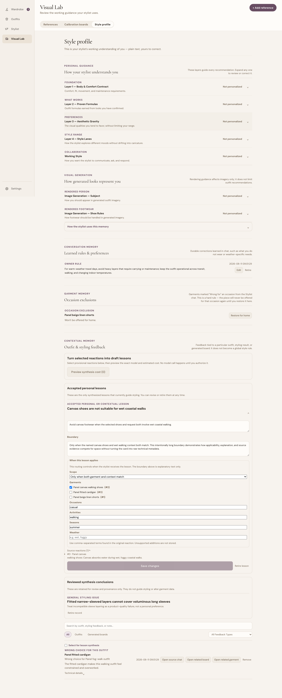
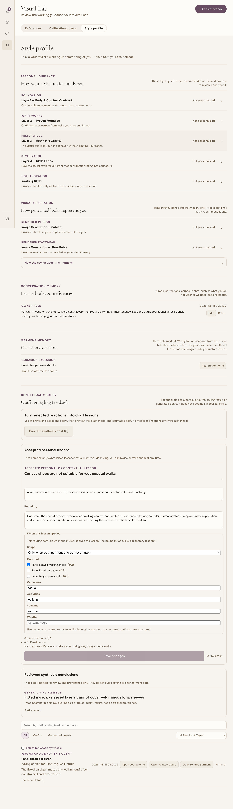
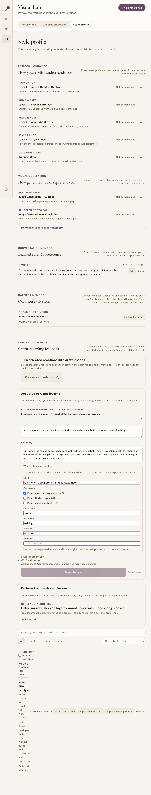
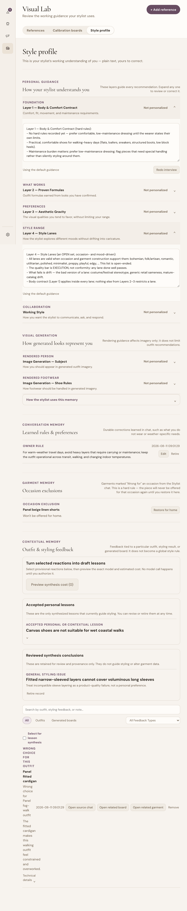
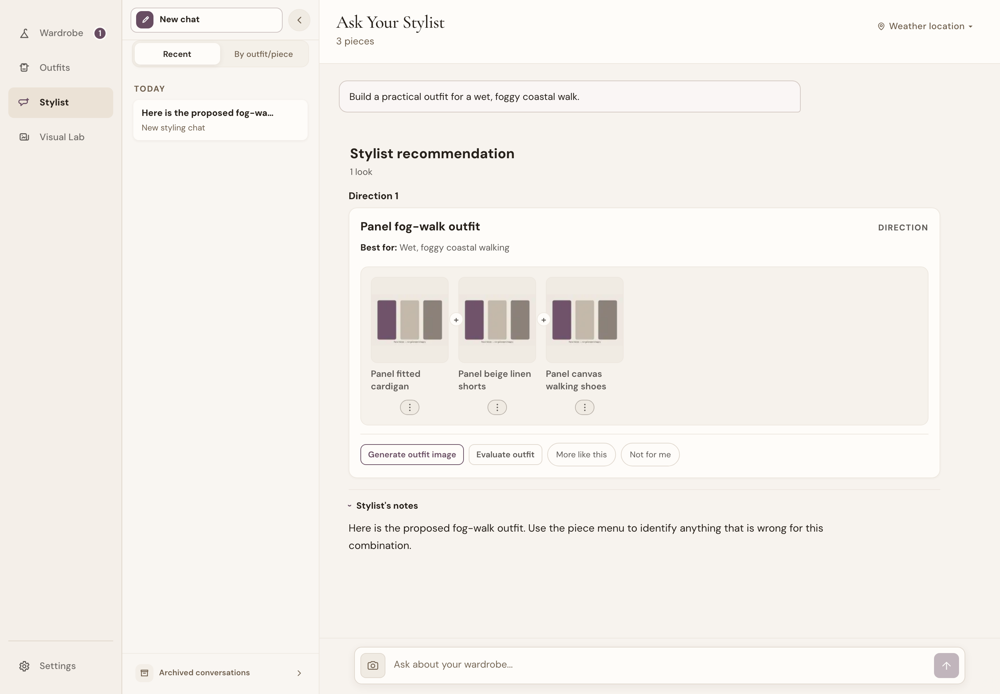
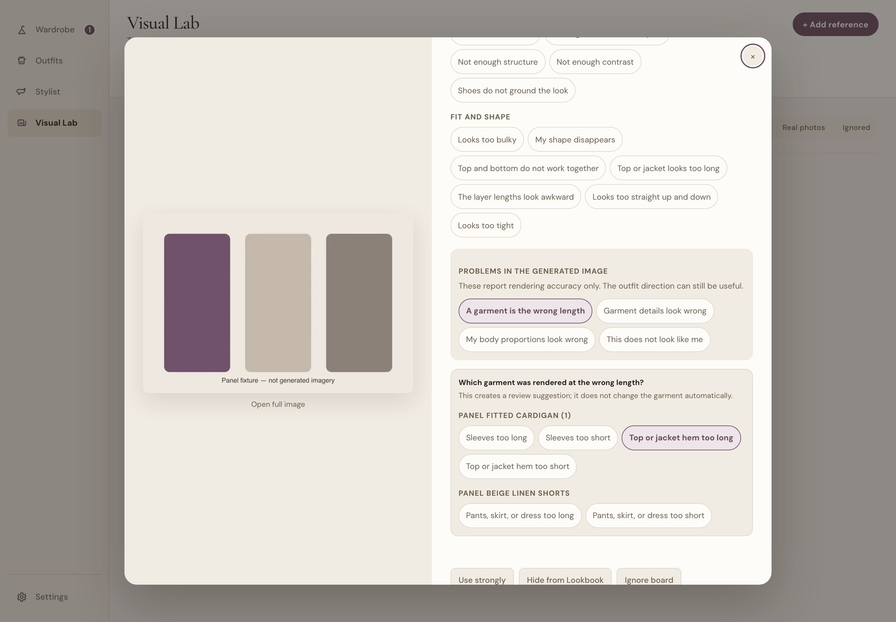
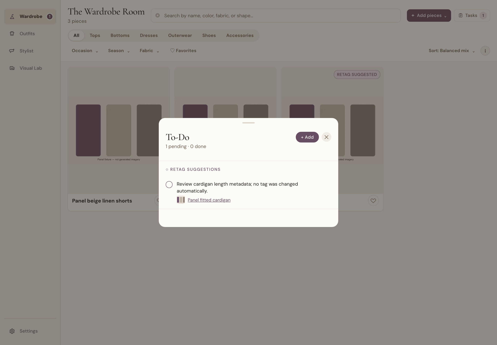
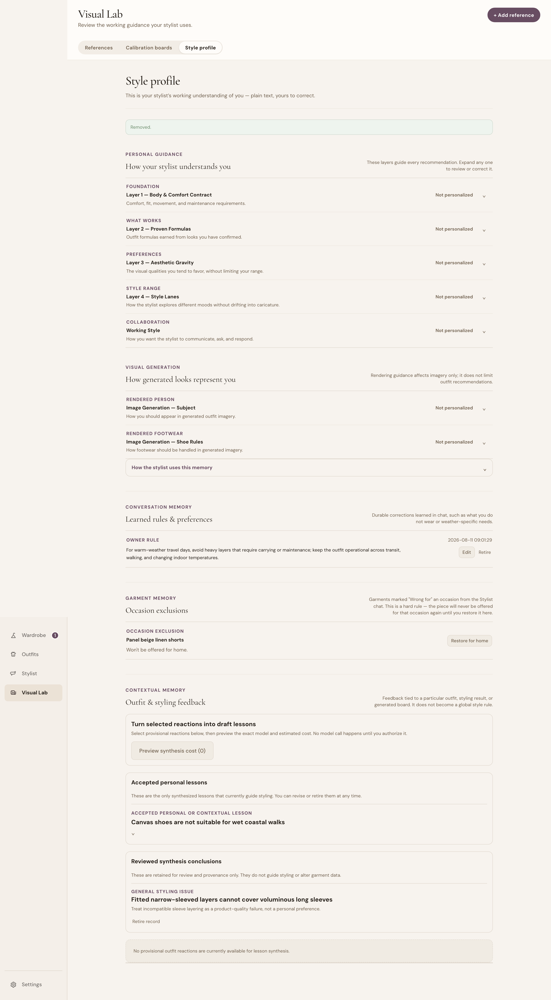

# Item 13 panel packet — feedback memory and review direction

**Status: PANEL COMPLETE. Owner preflight, reproducible evidence and the Mode B review are complete. Owner rulings are recorded in `item13-panel-findings.md`; the replacement UI remains unimplemented.**

Generated from the machine-readable manifest and the ratified panel sources. The generator copies the shared app context, evidence rules, failure warnings, output contract, and settled-ground exclusion lists verbatim. Re-run `node scratch/build_item13_feedback_panel_packet.js` after changing a source.

Source fingerprints:

- manifest: `8e476ebb52d0d153`
- expert panel brief: `674f0f00c003ecb0`
- UI handoff: `aa034bf62648672b`

## Review boundary

**Mode:** Mode B — constrained direction review

**Question:** What information architecture and interaction model should let an owner understand, review, correct, and undo the settled feedback authorities without turning Style Profile into a database browser?

This is not a review of whether feedback routing should exist, a styling-quality audit, or permission to add more model calls. Items 11 and 12 have settled backend behaviour. The panel is deciding how an owner should understand and operate those behaviours alongside the existing Style Profile.

The panel is explicitly **not** being told that a missing screen is a defect. Two capabilities are backend-only because the mandatory panel must precede their material UI design. Reviewers are asked to recommend their owner-facing home and workflow using the documented behaviour below.

**Current positive-feedback boundary:** Today, Works, Signature, and Almost preserve the reaction as visible and organizational provenance, but they do not teach the stylist or enter synthesis while a non-reinforcing destination remains unresolved.

## Presenter comprehension gate

Before this packet may be sent, the presenter must be able to answer every row of the authority trace without guessing:

1. Which user action created it?
2. Which record is canonical and which records are projections or provenance?
3. Does it gate, score, enter a prompt, guide rendering, create a task, or merely display?
4. What exact context activates it?
5. What action removes its behavioural authority?

Any answer inferred from a timestamp, label, or screenshot fails preflight. The manifest names source files and behavioral tests for each row. `node scratch/check_item13_feedback_panel_packet.js` checks packet/manifest consistency and proof-file presence, then runs the linked tests. It does not semantically prove arbitrary English claims in the manifest.

## Complete surface inventory

| Surface | Packet status | Why |
| --- | --- | --- |
| Originating outfit card and per-piece menu | included as capture context | Shows the difference between one-outfit feedback and a durable occasion exclusion. It is not being visually redesigned in this review. |
| Visual Lab saved board feedback | included as capture context | Shows the canonical saved-board writer and optional reason field. |
| Lookbook generated outfit feedback | included as capture context | Uses the same canonical saved-board feedback path and must not appear to be a separate memory authority. |
| Style Profile — memory legend | included current UI | Current page-level explanation of authority levels. |
| Style Profile — Learned rules & preferences | included current UI | Global prompt guidance and verified garment-rule receipts. |
| Style Profile — Occasion exclusions | included current UI | Existing structured piece-by-occasion hard gates and their restore action. |
| Style Profile — Outfit & styling feedback | included current UI | Provisional evidence, paid synthesis authorization, draft review, accepted lessons, and provenance records currently share this section. |
| Wardrobe Tasks — renderer/metadata review | included as existing item-11 precedent | Wrong-length feedback already demonstrates review before garment truth changes. |
| Product-quality findings | backend-only; direction review required | The durable queue and evidence snapshots exist, but no owner-facing review surface exists yet. Reviewers must recommend a home and workflow, not critique nonexistent styling. |
| Structured owner constraints | backend-only; direction review required | The hard-gate store, suppression reasons, and retirement endpoint exist, but no proposal/review surface exists yet. |
| Calibration boards | excluded from redesign; included in system context | Working renderer/taste reference rotation is a separate established system. Reviewers may identify navigation confusion but must not redesign calibration semantics. |
| Thread state and recency memory | excluded | They are runtime context and diversity mechanisms, not owner-feedback records managed on Style Profile. |

An omitted surface must be added to the manifest or explicitly excluded there before review. Silence does not mean complete.

## Documented authority trace, backed by linked behavioral tests

| Example | Owner action | Canonical store | Documented reader/effect | Scope | Undo | Behavior tests |
| --- | --- | --- | --- | --- | --- | --- |
| Global owner rule | States a durable correction in Stylist chat without selecting a garment | stylist_feedback: owner_rule/message | getOwnerRuleNotes: Standing prompt guidance on styling requests; not a deterministic gate | Global until retired | Edit or Retire in Learned rules & preferences | `test/owner_rules.test.js`, `test/activeMemoryProjection.test.js` |
| Garment occasion exclusion | Chooses Wrong for <occasion> from a garment menu | pieces.occasion_exclusions | wholeWardrobePieceTrustDecision: Hard eligibility gate before roster/composition for the matching occasion or plan slot | One garment × one occasion | Restore for <occasion> in Occasion exclusions | `test/occasion_exclusion.test.js` |
| Wrong choice for this outfit | Marks one garment wrong for the displayed outfit and may add a verbatim reason | stylist_feedback with version-2 feedbackEvidence | getProvisionalWrongChoiceMemory and exact-context delivery: Provisional bounded context inside an already-requested styling call; no score or standing dislike | Named garment plus recorded outfit/context | Remove reaction; optionally authorize synthesis separately | `test/activeMemoryProjection.test.js`, `test/savedBoardMemorySemantics.test.js` |
| Accepted personal/contextual lesson | Authorizes synthesis, reviews scope, and accepts a proposal | feedback_synthesis_drafts | getAcceptedFeedbackSynthesisMemory: Bounded prompt guidance only when structured applicability matches | Owner-reviewed piece/context selector | Edit applicability/text or retire lesson | `test/feedbackSynthesis.test.js`, `test/savedBoardMemorySemantics.test.js` |
| Generated-image problem report | Reports an inaccurate generated depiction such as wrong garment length | stylist_feedback image-fidelity report; optional retag-suggestion todo | getSavedBoardRendererMemory and Tasks review: Piece-scoped textual fidelity reminder when that garment is rendered again; the rejected generated image is never reused; metadata changes remain reviewable and are not silently applied | Generated imagery for the identified garment; never styling selection | Clear the report in the originating image-feedback controls; resolve any linked metadata-review task separately | `test/activeMemoryProjection.test.js`, `test/savedBoardMemorySemantics.test.js` |
| General product-quality finding | Accepts a general-failure synthesis result or explicitly confirms a no-cost report | product_quality_findings with evidence_snapshot | Product review queue only: No styling prompt, score, gate, or metadata change until explicitly resolved to a product destination | Product issue with durable source evidence | Dismiss, or resolve with shared_rule/model_instruction/garment_metadata/renderer/no_change | `test/productQualityFindings.test.js` |
| Structured owner constraint | Explicitly confirms a structured prohibition derived from an owner rule | owner_constraints; linked prose rule archived | wholeWardrobePieceTrustDecision: Hard pre-roster and per-slot gate with an observable suppression reason | Piece/category/material × occasion/activity/season/weather | Retire constraint | `test/ownerConstraints.test.js` |

### Important separations reviewers must preserve

- An owner rule is standing prompt guidance. It is not automatically a hard gate.
- An occasion exclusion and an owner constraint are deterministic eligibility gates.
- A wrong-choice reaction is provisional context. It is not a garment dislike or a score.
- An accepted personal/contextual lesson is bounded prompt guidance only when structured applicability matches.
- A generated-image report can add a textual fidelity reminder only when the identified garment is rendered again. It never supplies the rejected image as a reference and never affects styling selection.
- A product-quality finding changes nothing until a human resolves it to a named product destination.
- Works, Signature, and Almost currently carry no styling or synthesis authority; their unresolved future destination is part of the product boundary, not a shipped learning mechanism.
- Mirrored receipts and source links are not additional authority.

## Fresh evidence set required before reviewer dispatch

The final packet must include current, freshly created evidence for all of the following states. Test records must be created in an isolated sandbox with mock AI enabled; none may come from the owner's legacy testing account.

1. Populated Style Profile showing one owner rule, one occasion exclusion, one unprocessed provisional reaction, and one accepted scoped lesson whose processed source is collapsed under provenance.
2. The precise empty state for reactions eligible for lesson synthesis; it must not imply that no renderer or other feedback exists elsewhere.
3. A long owner rule and a long synthesis boundary at 1440px, 1024px, and 768px.
4. One active structured owner constraint shown as matching one context/slot and not another.
5. One open product-quality finding with its durable evidence snapshot, followed by its resolved state.
6. Source navigation from a reaction to its actual source, with related garment/board links labelled related rather than source; plus the generated-image problem report in its originating image-feedback controls and its separate metadata-review task.
7. Undo: restore occasion exclusion, retire owner constraint, retire accepted lesson, and dismiss or resolve a product finding.
8. Error/conflict: stale garment-rule receipt or unsupported applicability edit, shown without losing the record.

Until surfaces 4 and 5 exist, they are **direction artifacts**, not fake screenshots. Their records and behavioral traces are included; the panel must propose how they should be surfaced. A later craft verification uses the implemented UI.

## Current UI evidence — functional behavior, not a design endorsement

The screenshots below are generated from the isolated fixture by `node scratch/capture_item13_panel_evidence.js`. They show the current implementation honestly. Reviewers must return a concrete replacement information architecture, screen-level wireframe, responsive interaction model, card patterns, progressive disclosure, user-facing terminology and action hierarchy—not merely critique these screens.

### 01 style profile populated 1440

Current Style Profile at 1440px. Routing works, but the dense administrative hierarchy, terminology and interaction model are evidence of the UX problem—not a proposed design direction.

### 02 provisional reaction actions 1440

An unprocessed reaction exposes one true source (chat), related board and garment links, synthesis selection and removal.

### 03 accepted lesson expanded 1440

Accepted lesson at 1440px: editable guidance and boundary, with structured applicability as the actual routing control.

### 03 accepted lesson expanded 1024

The same accepted-lesson workflow at 1024px.

### 03 accepted lesson expanded 768

The same workflow at 768px. No textarea clips, while the narrow reaction layout demonstrates why responsive redesign is required.

### 04 constitution layers 768

Long constitution layers at 768px after clipping cleanup; the capture script asserts no populated textarea overflows.

### 05 source chat populated 1440

The actual source chat: request, outfit card, garments and the instruction that led to the per-piece reaction.

### 06 renderer control active 1440

Wrong-length generated-image problem selected at its originating board, including the field-specific cardigan detail and no-silent-retag copy. The rejected generated image is evidence only and is never reused as a future reference.

### 07 wardrobe tasks retag 1440

Separate metadata-review task created from the wrong-length report; no garment tag changed automatically.

### 08 empty synthesis state 1440

Precise empty state: no provisional reactions are eligible for lesson synthesis. It does not claim that no other feedback exists.

## Propositions to attack or defend

1. Style Profile should separate active styling authority, product repair work, and historical provenance instead of presenting them as one chronological kind of memory.
2. Every managed record should lead with what it changes, where it applies, and how to undo it; storage labels and raw provenance belong behind disclosure.
3. A hard owner constraint should be understandable through per-context eligibility, not only through prose that asks the model to remember it.
4. General styling/model failures belong in a product-quality work queue with inspectable evidence and an explicit resolution destination, never in personal style memory.
5. Provisional outfit reactions should remain visible on Style Profile only while they support a real owner action such as synthesis, inspection, or removal; processed provenance should be collapsed.
6. Managing, correcting, retiring, and resolving feedback must remain free; only the already-explicit synthesis action may authorize a paid model call.
7. The UI should project canonical meaning across chat, Visual Lab, Lookbook, garment records, and Tasks without presenting mirrored receipts as separate learned rules.
8. Backend stores and engine terminology should not determine the page hierarchy; the hierarchy should follow the owner's decisions: teach, constrain, repair, inspect, and undo.

For every proposition, return: a position; the strongest counterargument; what would have to be observably true for the position to be wrong; and a concrete recommendation. Do not propose a new paid call without identifying who authorizes it, when cost is shown, and why existing stored evidence is insufficient.

## Required reviewers

1. **Fashion-product / styling competence:** whether the distinctions help a non-stylist teach the product without needing fashion vocabulary, and whether evidence remains useful for real garment/outfit decisions.
2. **Human↔model interaction design:** capture, review, scope, authority, provenance, correction, and undo across the complete loop.
3. **Cost and product-economics honesty:** free versus paid boundaries, token/prompt implications, and whether the interface creates pressure to synthesize records that should simply be managed locally.

This is a direction review. Bugs, stale copy, contrast measurements, and missing ARIA are removed in preflight rather than spending panel tokens.

---

## Part 1 — The app (shared context, given to every reviewer)

**What it is.** A wardrobe and personal-styling workspace. A person catalogs the clothes they
actually own, saves outfits, and works with an AI stylist that evaluates outfits, styles a
selected garment, proposes directions from the wardrobe, and renders visual outfit boards. A
learning memory accumulates what the owner says works and doesn't, and feeds it back into later
styling.

**Who it's for.** One person dressing themselves from a real closet — not a shopper, not a
retailer, not a content creator. The owner already has taste; the product's job is to help them
apply it faster and more consistently to the clothes they own. It is a working tool used
repeatedly, not a showcase visited once.

**The core loop.** Catalog garments → get styling proposals or critique → judge them → the
judgment persists as memory → later proposals reflect it. Every surface either feeds that loop
or gets out of its way. A surface that collects a signal the loop never uses is decoration; a
surface that makes judging harder is a regression regardless of how it looks.

**Planning, not just single outfits.** A large part of freeform stylist chat is multi-event and
multi-day planning: a wedding weekend, a four-day trip, a work week, a seasonal capsule. The
output is a **plan** — sectioned by event or day, one look per section, carrying explicit
*coverage* (which events are dressed), *conditions* (weather, indoor vs. outdoor, per event), and
*repeats* (which pieces recur across days, or an assertion that none do). Packing economy is part
of the job: wearing the same sunglasses on three of four days is a correct answer, not a variety
failure. The stylist may also spend a conversational turn asking a clarifying question — where
the event is, so it can pull a live forecast — before producing anything. None of this is a
separate wizard or mode; it emerges from ordinary conversation in the same chat that critiques a
single outfit.

**The four product areas.**

- **Wardrobe** — the garment inventory and garment detail/edit. Recognition and comparison.
- **Lookbook** — saved outfits (owner truth) and generated outfits (stylist hypotheses). These
  two are deliberately different kinds of record and must not borrow each other's language.
- **Stylist** — chat-based styling: critique, style-a-piece, whole-wardrobe directions, visual
  boards. The most novel and least conventional surface in the app.
- **Visual Lab** — calibration: reference photos, saved boards, and the feedback that teaches
  the renderer and the stylist.

**Economic shape — this is a product constraint, not an implementation detail.** Model calls cost
real money and the owner brings their own API key. Text styling is cheap; image rendering is
roughly $0.07 per board. Every paid action is labelled and opt-in, and the product deliberately
offers free ways to evaluate a direction before paying to render it. Any recommendation that adds
model calls, or that moves a decision behind a paid render, has to justify the spend.

**Deliberately not.** Not a shopping app, not a trend feed, not an editorial portfolio, not a
moodboard tool, not an analytics dashboard about clothes. Outfit imagery is evidence, not
decoration. The product optimizes for lived personal style over trend optimization — see
`AGENTS.md`'s *Product Goal* and *Styling Principles*, which are handed to reviewers in full for
any surface where styling quality is in scope.

**Ratified visual direction.** Warm, quiet, contemporary, functional over decorative. Muted
aubergine accent for actions and state, never washing large regions. Cormorant Garamond for short
identity text only; DM Sans for everything read or worked with. A 12px floor for meaningful UI,
15px for sustained reading. Images lead where visual comparison is the task. These are decisions,
not defaults — a reviewer may argue one is wrong, but must argue it explicitly rather than
recommend a generic modernization that silently reverts it.

**Technical shape,** for reviewers who need it: React 18 + Vite frontend, Express + SQLite
backend, per-user database, authenticated multi-user web app, local image processing, Anthropic
or OpenAI models via the owner's own key.

---

---

## Part 4 — Evidence rules

**Data pre-flight, mandatory.** Any surface that renders stored data gets **freshly generated
data**, or that surface is excluded from the review. Threads, boards, and outfits created before
a recent fix will reproduce bugs that are already fixed, and the panel will spend its budget
rediscovering them. Check generation dates against the most recent relevant change before
handing anything over. Building deliberate scenarios costs real model spend — that is an argument
for doing it once, carefully, not for skipping it.

**Exclusion list, verbatim.** Copy both the *Resolved, not open* list and the *Deliberately not
built / by design* list from [`ui-v1-design-handoff.md`](ui-v1-design-handoff.md)'s **Outstanding
issues** section directly into the packet. Do not paraphrase either. The first section exists
precisely so a panel targets real gaps, and paraphrasing it once already inverted it; the second
exists because that same list of decided things said nothing about absences that look like bugs
but are intentional or simply unbuilt — a gap that let four such non-defects get independently
rediscovered and reported as bugs four times in one working session before anyone wrote them down.

**Rulings come with rationale, and are challengeable.** A reviewer may argue a ratified decision
is wrong; they must say so explicitly and give the reasoning, not smuggle a reversal into a
recommendation. A ruling re-flagged without a new argument is out of scope; a ruling re-flagged
because circumstances changed is a legitimate finding.

**States.** Populated, empty, long-content, error, and the narrow viewport — for every surface,
in both modes.

**Clear the session recency memory before generating evidence.** Whole-wardrobe generation keeps a
recency memory that skips recently used pieces — it both penalises them in scoring and reorders the
roster. It is easy to miss: the only sign is one line in the composer footer, *"Skipping N recently
used pieces"*. In one observed state that was **10 of 23 pieces**, so the stylist was composing
from 13 and every artifact generated in that state understates the wardrobe's range.

Reviewers judging variety, repetition or "why does the same garment keep appearing" against a warm
memory are judging an artificially narrow pool, and nothing in the artifact tells them so. Clear it
first — **Include them again** in the composer footer, or
`DELETE /api/ai/whole-wardrobe-session-memory`.

**The exception:** if the artifact exists to demonstrate the rotation mechanism itself, leave the
memory warm — and say so in the packet, with the skip count at the time of generation. An
unexplained warm memory is a confound; a declared one is evidence.

**Surface inventory, mandatory.** Before assembling a packet, list every surface the feature spans
— not just the one the question is about. For the Stylist that is: the chat thread, the per-piece
`…` menu, Settings → *Learned rules & preferences*, Visual Lab → *Calibration boards* and *Style
profile*, and the Lookbook entry points. Include each, or state in the packet that it was excluded
and why. Stage 1 shipped without four of those and a reviewer concluded a capability did not exist
when it did. A reviewer can only reason about what is in front of them, and a gap in the packet
reads to them as a gap in the product.

---

---

## Part 4b — How the implementing agent gets this wrong

Recorded from the Stage 1 run (2026-07-25/26). Every item below actually happened, most of them
more than once, and each produced either a false finding in a packet or a false correction to a
real one. Read this before assembling a packet and before synthesising results.

**1. Measuring one store and concluding a feature is broken.** The single most repeated error.
Board feedback lives in *two* stores — `stylist_feedback` (chat) and `saved_boards.payload`
(Visual Lab). Counting the second alone showed no writes for three days and produced a filed
regression against a feature that was being written to that same morning. Earlier in the same
session the same mistake produced "4 of 243 boards carry reason chips", which became the evidence
base for a whole proposition. **Before counting anything, read how the surface that displays it
persists it, and state which store you measured.** An empty table is not evidence of absence.

**2. Treating absence as defect.** Four separate times an absence was reported as a bug and turned
out to be deliberate or simply never built (garment IDs in prose; "city stroll" implying walking
shoes; one shoe carrying most of a capsule; plans not absorbing revisions). A fifth came from a
reviewer: *"nowhere can the owner see, edit or delete what the stylist has learned"* — there is a
Settings surface with Edit and Retire that the packet did not include. **Check the by-design list,
then check whether the thing has a different home, before writing the word "missing".**

**3. Shipping a packet that omits surfaces the feature spans.** Stage 1's packet transcribed chat
threads and nothing else — no Settings, no per-piece `…` menu, no owner-rule mechanism. Three
reviewers then reasoned about a teaching loop with its main capture channel and its entire
management UI invisible, and produced one dead finding and one inverted one. **Enumerate every
surface the feature touches and either include it or say explicitly that it was excluded.**

**4. Inferring causation from timestamp proximity.** An owner rule dated the same day as a
conversation was asserted to have come from that conversation. `context_id` was empty; the link did
not exist and could not be checked. The owner then supplied the actual sequence, which was
different in a way that mattered — the rule was captured on a second, differently-phrased attempt,
not the first. **If the link is not in the data, say so instead of inferring it.**

**5. Over-correcting when a premise is challenged.** Told that the `~$0.07` labels are owner-facing
instrumentation rather than user-facing pricing, the whole cost finding was discarded — when only
the honesty-to-users half died and the instrumentation half was, if anything, more useful. **When
a premise is corrected, isolate which half of the conclusion it kills.**

**6. Building an argument on an unvalidated metric.** Related to 1, but distinct and worth its own
line: a number was produced, not checked against the UI that renders the same data, and then used
to carry a proposition. **Validate any metric against the surface that displays it before reasoning
from it.**

The common root: reaching for a query before understanding the model. The corrective is cheap —
read the write path and the read path of the surface in question first, every time.

---

## Part 5 — Output contract

Mode A reviewers return **blocking issues**, **important refinements**, and **what is already
working**, separately, each with its user-task consequence.

Mode B reviewers return a **position per proposition**, each with its counter-argument and its
falsification condition, plus any product bet they think is missing from the list.

Where a proposition carries an **open redesign question** (marked as such in its text), answer it
with a concrete recommendation and the reasoning behind it — not only a position on the existing
behaviour. Those are the places the owner has already decided the current shape is wrong and wants
outside judgment on what replaces it, drawn from practice rather than from this codebase.

The implementing agent synthesizes agreement, reports genuine disagreement to Yuna rather than
resolving it silently, and records the owner-reviewed outcome in
[`ui-v1-design-handoff.md`](ui-v1-design-handoff.md). Nothing is described as ratified until Yuna
has reviewed the result.

---

---

## Settled ground — copied verbatim, never paraphrased

**Resolved, not open:**
- "Recommended design direction" feedback, points #3 and #4 (visual-thesis line, strength-label
  rename) — implemented, see entry above. Points #1, #6, #7 were already satisfied by
  pre-existing code or this session's earlier E3 work. Point #5 (telemetry/vocabulary
  disclosure) confirmed mostly already done, with the one named term (`artistic_minimal`)
  confirmed clean of any client-side leak.
- E3 (editorial shop-the-gap silhouette comparison) — implemented (free `visualPrompt` text +
  compare-silhouettes strip).
- **Garment IDs in stylist prose** ("The tan leather tote (ID 12)…") — owner ruling 2026-07-25:
  **deliberate and requested**, not an internals leak. The IDs are there so a recommendation that
  exposes a mistagged garment leads straight to the record that needs fixing — and because garment
  names collide constantly, especially auto-tagger-written ones, so the ID is what makes a
  recommendation point at one unambiguous record. Not a defect, so it belongs on every future
  exclusion list. **But the presentation is open:** the owner invites panels to propose
  alternatives, provided they actually solve garment disambiguation rather than just hiding the
  number.
- A4 (cost-bearing actions on broken/"needs review" cards) — owner ruling: leave as-is, cards
  are usually fine, the engine is what's broken. Not a bug.
- E4b (comparison-sheet illegible baked-in captions) — owner ruling: leave alone, it's the image
  model not complying with an already-correct "no text" instruction, not a fixable prompt bug.
- PR B follow-on (post-render board taxonomy unification) — implemented, then partially
  superseded by the message-level feedback removal above; what remains (three new shared
  reasons, crud.js sync correctness) is ratified.
- Message-level feedback under plain text — removed entirely, ratified.
- Diagnostic-card disclaimer specificity + double-card dedup broadening — implemented, ratified.
- E1 (critique buries the answer) — implemented, ratified: the actionable answer now leads the
  collapsed "Full structured read" details instead of trailing the diagnostic dump.
- E9 (unstable "N looks" counts) — implemented. Root cause: two independent, disagreeing
  counting rules for the same data. The in-chat header (`StylistChat.jsx`'s
  `lookCount = visible.length || outfits.length`) already excluded `diagnosticOnly` cards; the
  thread-rail sidebar subtitle (`threadGrouping.js`'s `getThreadOutcomeSummary`) counted
  `memory.latestOutfits.length` raw, diagnostic cards included — so a thread with any lingering
  diagnostic card showed a different count in the sidebar than in the chat itself. Confirmed via
  `git blame`/diff review that PR 174 (E1) didn't touch this — different function, different
  file, no overlap. Fix: `getThreadOutcomeSummary` now filters `diagnosticOnly` outfits before
  counting/deriving themes, with the same empty-set fallback (count everything if the filtered
  set is empty) the header already uses, so an all-diagnostic thread still shows a real number
  instead of falling through to the no-outfits branch. Verified via two new precise assertions
  in `test/threadRail.test.js` (mixed diagnostic+real, and all-diagnostic) using the actual
  function's real output, not hand-derived expected strings. `npm run build` passed; full
  relevant suite passed with no new failures. Live-verified in a freshly-restarted mocked
  sandbox that the sidebar renders normally with no regressions for ordinary threads — the
  specific mixed-diagnostic scenario itself wasn't reproduced live, since (like the PR A-follow-
  on dedup fix) that requires an uncontrollable real model response the mock can't produce; the
  unit test's use of real function output is the verification for that part.
- E10 (lossy thread-rail subtitles) — implemented. Root cause: critique, similar-variants,
  creative-alternatives, adjacent-variants, and comparison threads all share
  `activeContext.type === 'outfit'` and `thread.kind === 'outfit_critique'`, and
  `getThreadDisplayTitle`/`getThreadOutcomeSummary` (the flat "Recent" list — the default rail
  view) both collapsed every one of them to the same generic `"<name> critique"` title /
  `"Outfit critique"` subtitle regardless of which action it actually was. The differentiation
  logic already existed and worked correctly — `outfitSubjectActionTitle`, pattern-matching the
  turn's prompt/title/source text for creative/adjacent/similar/comparison/critique keywords —
  but was only wired into `getThreadSubjectChildTitle` (the "By outfit/piece" clustered view's
  child rows), not the default flat list. Fix: both flat-list functions now call
  `outfitSubjectActionTitle`, falling back to the old generic text only if it can't tell (empty
  prompt/title/source). Added `SHORT_OUTFIT_ACTION_LABELS` so the title's terse
  `"<name> · <action>"` suffix convention (already established for Similar/Creative at thread-
  creation time in `StylistChat.jsx`'s `send()`) extends to the two actions that convention never
  labeled (comparison, adjacent variants); the subtitle uses the full descriptive form directly
  since it reads naturally as a standalone summary line. Verified via 8 new precise assertions in
  `test/threadRail.test.js` (four action categories × title + subtitle) using real function
  output. `npm run build` passed; full relevant suite passed with no new failures. Live-verified
  in a freshly-restarted mocked sandbox against real existing threads: confirmed genuinely
  differentiated output across both the flat list (`"Boston bench · Critique"` / `"Outfit
  critique"`, `"Whole-wardrobe comparison sheet · Compari…"` / `"Outfit comparison"`, `"with my
  camera · Creative"` / `"Creative alternatives"` — previously all identical) and the clustered
  view (no regression: `getThreadSubjectChildTitle`'s internal call to `getThreadDisplayTitle`
  still correctly separates "Outfit critique" and "Creative alternatives" as distinct child rows
  under the same "with my camera" subject).

**Deliberately not built / by design — not defects, do not re-file:**

This list exists because the *Resolved, not open* list above only covers things that were built
and then decided; it says nothing about absences that look like bugs but are either intentional
behaviour or simply never built. That gap let the same four non-defects get independently
rediscovered and reported as bugs four times in one working session (2026-07-25) before anyone
wrote them down in one place. If a panel or a future session finds an absence that isn't on this
list, that is a real finding — but check here first.

- **"City stroll" implying comfortable walking shoes.** Owner ruling 2026-07-25: by design. A slot
  described as a city stroll should get walking-suitable footwear; the inference already fires
  only on the `smart_casual_outing` slot whose `bestFor` names it, not on the other four slots.
  Full trace in `docs/stylist-bugfix-spec.md`.
- **One shoe carrying 7 of 8 looks in a 14-piece capsule.** Diagnosed, not a variety failure: the
  budget buys exactly 3 shoe slots (`capsuleQuotas`), one of which the register-floor guarantee
  spends on an evening-capable shoe. Correct behaviour given the current shoe-quota math. The
  underlying "is 3 shoe slots the right number for a 14-piece capsule" question is still open —
  see item 2 above (plan outfit cap) — but the 7-of-8 distribution itself is not a bug.
- **Plans not absorbing their own revisions.** Never built. Ask a plan for a change and the
  revision arrives as a separate `proposed` card beside the plan rather than folding in — a second
  cost of the same gap is that a revised plan gets progressively harder to find in the thread rail
  the more it's refined, since the rail summarises from only the latest turn's outfits. Judge
  whether the merge *should* exist; its absence is not itself a defect to report. Full detail in
  `docs/stylist-bugfix-spec.md`.
- **Garment IDs in stylist prose** — also listed under *Resolved, not open* above; repeated here
  because it is the paradigm case (an absence-of-obfuscation that reads as an internals leak but is
  a deliberate, requested disambiguation mechanism).
